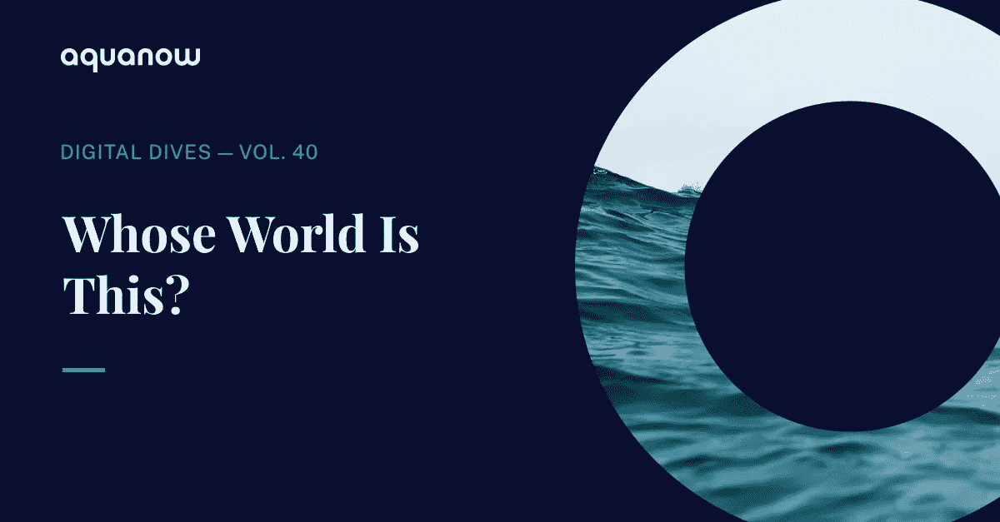
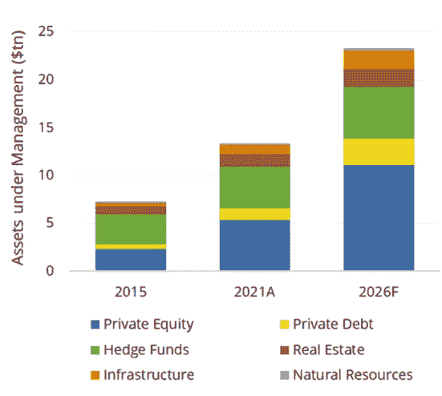
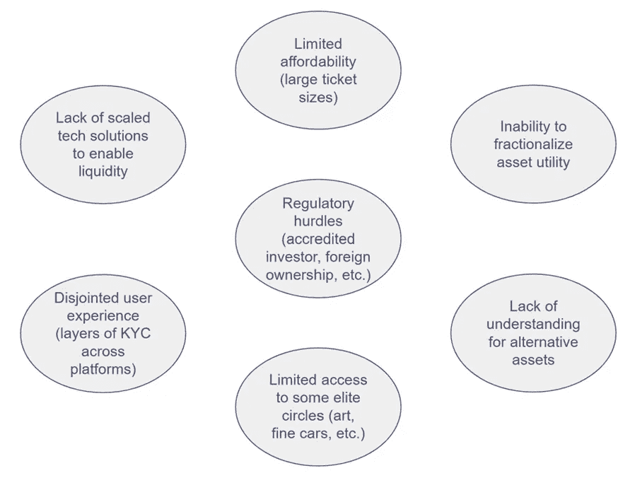
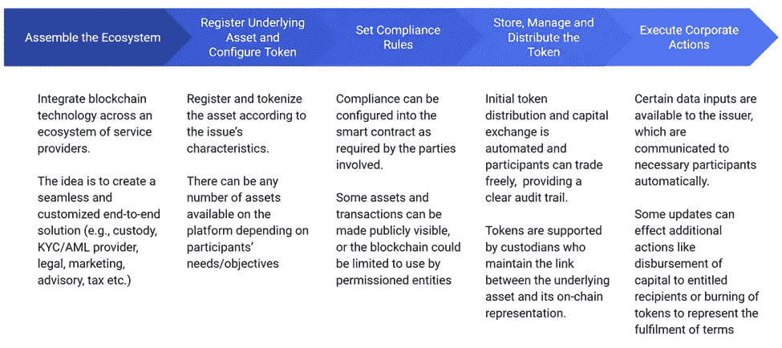
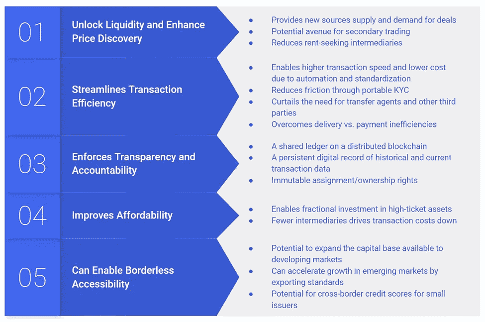
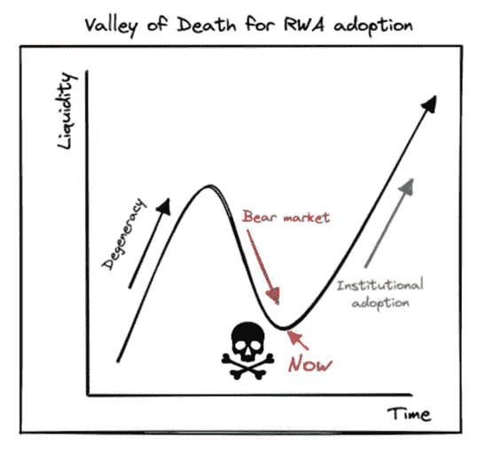
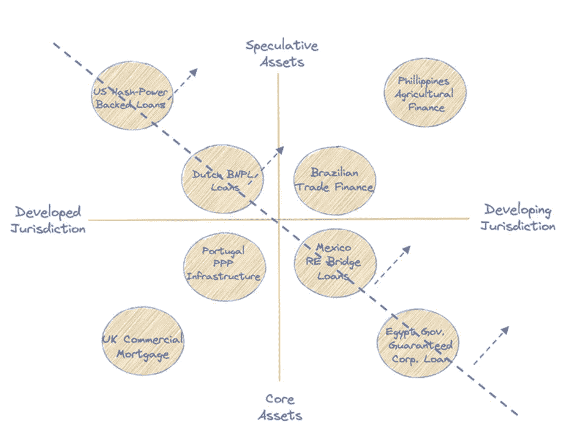

# Aquanow 数字潜水:这是谁的世界？第 40 卷

> 原文：<https://medium.com/coinmonks/aquanow-digital-dives-whose-world-is-this-vol-40-4ab3704a4737?source=collection_archive---------17----------------------->

当 BNY 梅隆银行在 10 月份公布其数字资产托管解决方案的监管批准时，首席执行官(Robin Vince)小心翼翼地强调，该公司对这一部门的愿景超越了加密货币。重要的是，他强调，BNY 将建立解决方案，为现实世界的资产表示数字化链。该战略得到了[市场研究](https://www.bnymellon.com/us/en/insights/all-insights/digital-asset-survey.html)的支持，该研究发现，97%的机构投资者认为“*令牌化将彻底改变资产管理*”并且“*对行业有益*”此外，尽管 2022 年市场疲软，88%的受访者计划继续他们的相关项目。嗯……在最近的崩溃之前……

近年来，另类资产的投资组合配置迅速增加。可投资领域的这一子集包括气候资产、贸易融资(保理、商业现金垫款、供应链融资等。)、基于收入的金融(SaaS、电子商务等)。)新兴市场消费者和企业融资、版税、法律结算融资等。

[*来源*](https://www.preqin.com/insights/2022-preqin-global-alternatives-reports)

[这些领域的投资倾向较高有几个原因](https://www.cfainstitute.org/en/membership/professional-development/refresher-readings/asset-allocation-alternative-investments)。最重要的动机是 ***寻找多样化的回报来源*** 。然而，其他一些常见的原因是传统收益来源的低利率，另类基金经理赚取的更多管理费，以及私募基金标记其持股时波动性较低的潜力。最后一点特别重要——替代品通常不会在二级市场上交易。因此， ***一旦投资者承诺，其资本就受相关合同中规定的规则和影响投资的经济力量的支配。***

以下是某些资产仍然缺乏流动性的一些主要原因:

另类投资的一个重要特征是，它们通常只留给合格的投资者。否则，他们的最低承诺足够高和/或理解资产的复杂程度足以阻止零售分配。虽然保护人民很重要，但有足够的免费教育让感兴趣的人了解如何评估非传统机会。我一般不太喜欢个人对自己的投资组合进行独家监督，但即使是大多数顾问也会因为缺乏流动性而被排除在配置替代资产之外。 ***如果该行业负责任地向更广泛的投资者提供渠道，那么更多的资本将可用于资助增长项目，融资成本将会降低*** 。

好吧，所以另类投资有一些有趣的属性可以纳入投资组合，但许多都被排除在外。将这些投资符号化将如何消除上述障碍？ [波士顿咨询公司最近发表了一篇论文](https://www.bcg.com/publications/2022/relevance-of-on-chain-asset-tokenization) : *“加密冬天”中链上资产令牌化的相关性*。根据他们的研究，我总结了表示链上资产的关键步骤:

第一阶段是*而不是*琐碎的。然而，根据 BNY·梅隆和其他传统金融家的评论， ***很明显，有一些团体正在尝试与上述*** 类似的过程。此外，DeFi 社区继续推出有趣的创新，这些创新也代表了区块链的真实资产。一些最基本的例子包括抵押稳定币或由贵金属支持的代币。与众不同的是，MakerDAO 已经签署了一项合作协议，用亨廷顿谷银行提供的[公司贷款来担保他们的稳定币(DAI)。最后，甚至像摩根大通、SBI 数字资产控股公司、星展银行、渣打银行和汇丰银行这样的重量级公司也透露，他们使用多边形区块链和 Aave 结算了一笔多方外汇交易。不过，大多数实验都是在拥有专有智能合约的许可区块链进行的。](https://www.globenewswire.com/en/news-release/2022/08/19/2501764/0/en/HV-Bancorp-Inc-Participates-First-Commercial-Loan-to-the-MakerDAO-Protocol-and-the-DAI-Stable-Coin.html)

大型金融机构已经从替代产品中获得收入，它们主导着外汇和固定收益等流动性市场，那么**和*为什么要承担额外的复杂性来标记这些资产呢？*** 下表提供了潜在的好处:

网上投资合同的数字表示有明显的优势。然而，获得这些收益的相关风险很大。监管机构的批准至关重要，但除了政策之外，还需要在基础设施方面进行大量投资，以获得好处。 ***典型的风险规避型企业如何证明与建立这些新平台相关的风险和成本是合理的？***

事实上，一些概念验证确实无法扩展。[澳大利亚证券交易所(Australian Securities Exchange)被告知重新设计一个旨在将区块链技术引入股票交易结算的项目](https://www.itnews.com.au/news/accenture-report-could-end-asxs-blockchain-vision-587915)。这导致了 2 . 45 亿至 2 . 55 亿美元的税前费用和另外 18 个月的开发工作。然而，对这一主题充满热情的研究人员会在一开始就警告 ASX 不要这样做。

Teej Ragsdale、Jack Chong 和 Makund Venkatakrishnan 出版了这本关于现实世界资产的[虚幻初级读本](https://docsend.com/view/u53utyp2j4ycg7r6)，这是任何对该主题感兴趣的人的必读之作*。他们提供了以下内容作为路线图，说明他们如何估计令牌化的现实世界资产将会激增。*

下面是一些非流动性资产的例子，这些资产可能从流动性中获得最大收益，因此最有可能在早期采用令牌化:

与克莱顿·克里斯滕森的颠覆性创新者、**和*不同，令牌化的效率对于通常服务水平低下的群体*和**(投机性资产和发展中司法管辖区)最为明显。成熟和高流动性的资产类别不需要采用这种技术。这对少数高度积极的参与者来说更重要，因为 ***将资产从非流动性转移到二级交易释放了被困价值*** 。此外，适当的基础设施得到了监管机构的批准。最后，股票和可交易债务证券的利润率已经很低，因此分配大量资本来改造这些部门并不太有吸引力。 ***区块链支持非流动性资产交易和结算的方式，激励其使用，因为有更大的比例奖励*** 。后来，纳入已经流动的资产可能也是有意义的。

下一次我们将继续这个话题，更深入地了解正在进行的具体项目。

Nas 的“ [*世界是你的*](https://www.youtube.com/watch?v=e5PnuIRnJW8) ”是他的突破性专辑 Illmatic 中粉丝最喜欢的歌曲，其中大多数歌曲从市中心年轻人的角度提供了生动的意象。我以前曾将嘻哈音乐和数字资产相提并论，这里也值得关注一下。说唱音乐遭到诋毁，许多人试图取消它。坦白地说，几个嘻哈巨星做了一些可怕的事情，玷污了运动的积极面，但它仍然与一个小的亚文化产生了共鸣，并最终获得了主流地位。有些人讨厌说唱音乐，纯粹的地下小团体仍然存在。缩小后，它给了一个服务不足的社区一个声音，从此催化了积极的社会行动。我并不是说将现实世界的资产符号化将会如此深刻，但它确实…押韵，不是吗？

然而，我是温和的，赚钱的风格，滚动犯规

*多才多艺、粘人的野生金童*

*蜗居在烂苹果里，你被擒*

*或者被魔鬼的套索抓住，拉屎是件麻烦事*

> 交易新手？尝试[加密交易机器人](/coinmonks/crypto-trading-bot-c2ffce8acb2a)或[复制交易](/coinmonks/top-10-crypto-copy-trading-platforms-for-beginners-d0c37c7d698c)