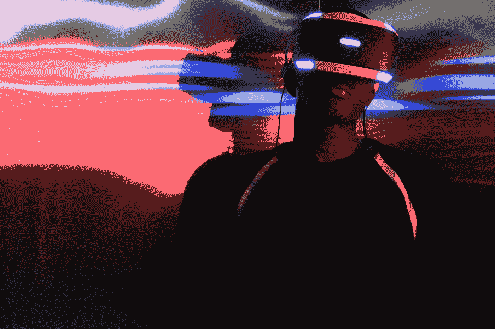
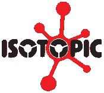

# AR & VR NFTs:它们是什么，它们是如何工作的？

> 原文：<https://medium.com/coinmonks/ar-vr-nfts-what-are-they-and-how-do-they-work-6d59d2ef2ea9?source=collection_archive---------68----------------------->

增强现实是一项已经存在了几年的技术，它开启了通过数字方面增强现实世界体验的可能性。使用 AR 可以在真实环境中放置的东西几乎没有限制，从小物品和植物到纪念碑，整个建筑，甚至城市。

另一方面，虚拟现实使用头戴式显示器提供了一种完全独特的体验，让用户感觉完全处于完全数字化的环境中。这并不意味着这种环境应该以数字方式创建，但它也可以以 360 度视频的形式出现，允许用户以与真实世界非常相似的方式体验位置或事件。你有没有想过火星上的生活会是什么样子，或者在一个充满龙和宝藏的幻想世界里会是什么样子？嗯，没有什么是不可能的了。你不仅可以看到这些遥远和不可能的土地，还可以互动，充分体验身临其境的感觉。

# 它们有可能结合吗？

[增强现实和虚拟现实技术](Augmented%20Reality%20and%20Virtual%20Reality%20technologies)在过去几年里已经征服了世界，但它们在区块链世界的存在仍然非常短暂。然而，对这些技术的极大兴趣，特别是结合了区块链和 NFT 的优势，是随着后者的进步而自然出现的。现在可以创建虚拟世界，其中所有物品都是真正独特的，可以使用 AR 技术与真实环境结合起来观看，甚至可以使用虚拟现实潜入完全沉浸式的世界。VR 头戴设备可以在几秒钟内将用户传送到任何真实或虚拟的位置，只需戴上头戴式显示器。随着技术的进步和 HMD 的普及，探索虚拟环境和潜入一个全新的世界变得越来越容易。

新一代头戴显示器(HMD)和 AR 眼镜的开发可以为使用区块链技术创造新的基础和新的可能性。即将推出的苹果 AR 眼镜就是一个很好的例子，它有望通过与智能手机设备同步并将内容通过眼镜带到用户面前，将增强现实技术部署到用户的日常生活中。另一个据传将集成到 AR 智能眼镜中的有趣功能是根据人们的视力进行调整的能力。

另一方面， [VR 可以为用户创造完全独特的数字存在](https://isotopic.io/)，不仅延伸到他的外表，还延伸到环境。可以养异国宠物，可以拥有虚拟财产，甚至可以统治整个城市和国家。随着当今技术的融合，出现的可能性似乎只受到使用者和创造者的幻想和愿望的限制，完全改变了我们世界中可能的规则和体验。

文章由来自[同位素](https://isotopic.io/)的珍妮·李斯撰写

[**同位素**](https://isotopic.io) **是区块链支持的软件分发服务，托管整合了 NFTs 和加密货币的游戏和应用。**

> 交易新手？在[最佳加密交易](/coinmonks/crypto-exchange-dd2f9d6f3769)上尝试[加密交易机器人](/coinmonks/crypto-trading-bot-c2ffce8acb2a)或[复制交易](/coinmonks/top-10-crypto-copy-trading-platforms-for-beginners-d0c37c7d698c)