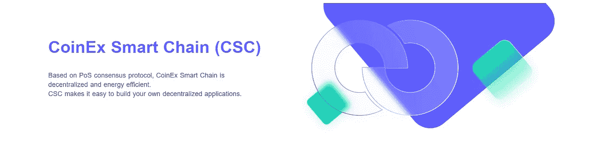
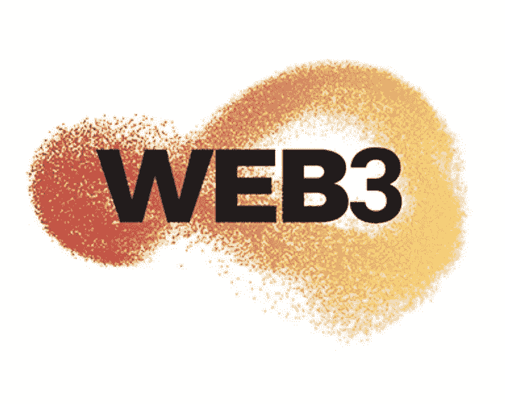
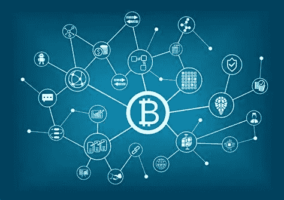
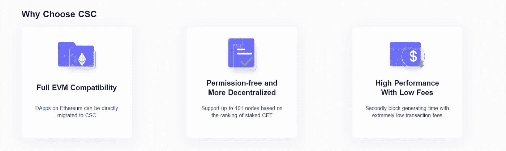
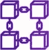
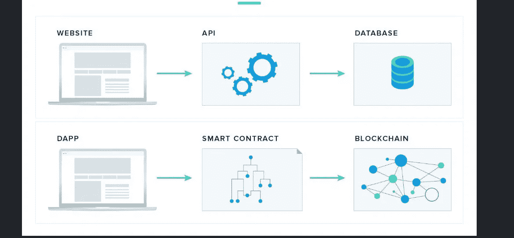
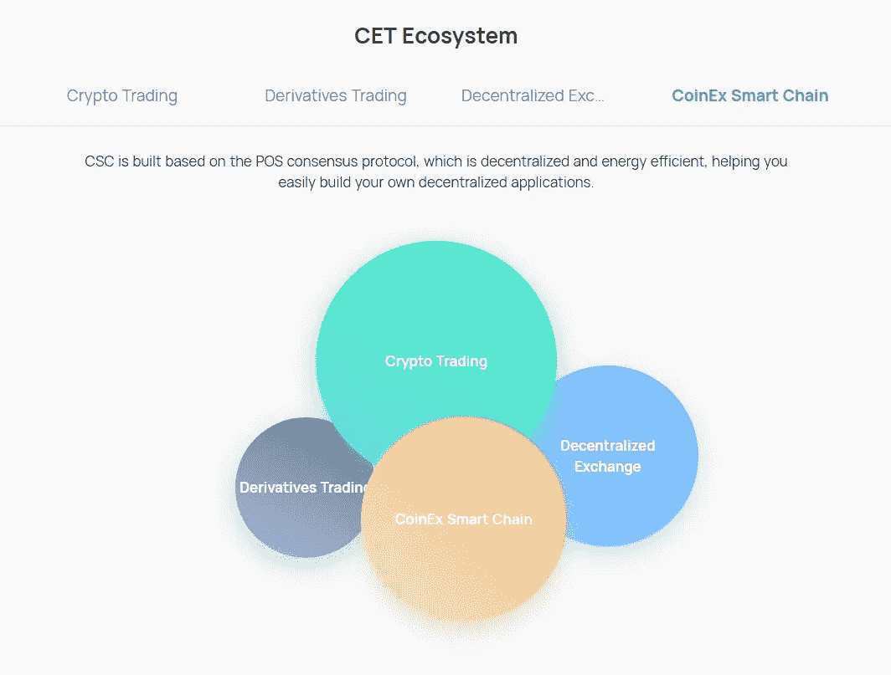
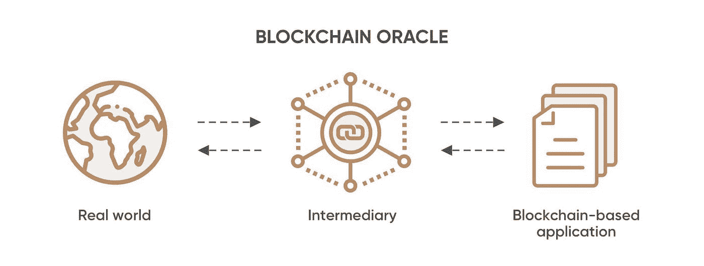
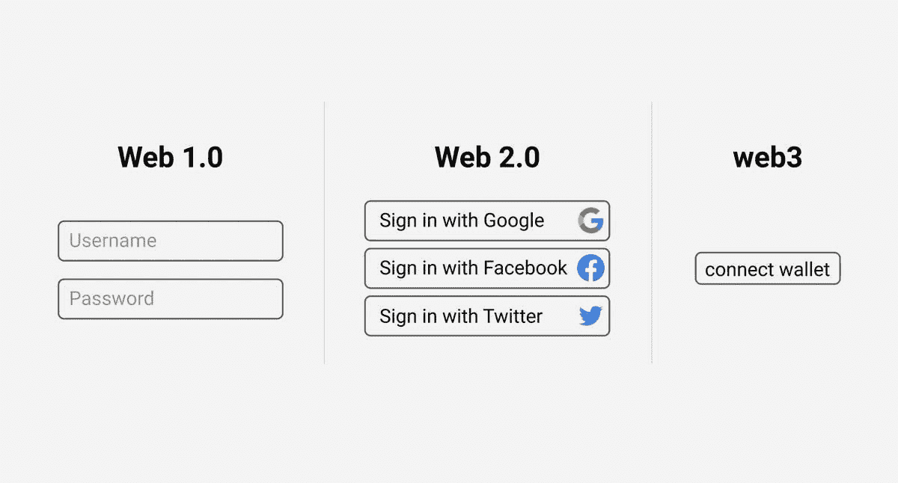

# Web3 和 CSC 的体系结构

> 原文：<https://medium.com/coinmonks/architectonics-of-web3-and-csc-7d08fc00123e?source=collection_archive---------43----------------------->

CoinEx Smart Chain 致力于为构建 Web3 应用程序提供最佳的开发者体验。在过去的几个月里，CSC 对其开源开发者工具和 CSC 生态系统进行了重大升级，只是为了让开发者更容易开发区块链。

毫无疑问，随着主流行业开始认识到 Web3 的潜力，Web3 是今天讨论的最热门的话题之一。然而，有一个角度似乎没有得到太多的关注，那就是 Web3 架构。人们认为，Web3 将会颠覆当前的互联网架构，并像 CSC 一样用区块链取而代之，从而解决这个过程中存在的许多问题。然而，作为第一步，我们需要阐明 Web3 是由什么组成的。

## 什么是 Web3

一种进化。其目的是构建项目和应用程序，让用户控制他们的数据和行动，用开放协议取代 Web2 中形成的当前集中垄断，因为每个行动都可以通过利用区块链技术和密码术来验证，因此不需要太多信任。

在 Web3 中，*一切都是相连的。真空中不存在任何东西，Web3 也不例外。*

## 为什么要分权？

**容错**——分散式系统不太可能发生意外故障，因为它们依赖于许多不太可能发生的独立组件。

**抗攻击性** —分散式系统的攻击、破坏或操纵成本更高，因为它们缺乏敏感的中心点，而这些中心点的攻击成本远低于周围系统的经济规模。

**抵制合谋** —分散系统中的参与者很难合谋以牺牲其他参与者的利益的方式行事，而企业和政府的领导层则以有利于自己的方式合谋，但始终会伤害不太协调的公民、客户、员工和公众。

# Web3 的组件

## 区块链

区块链是交易的数字分类账，由对等网络节点维护。该分类帐还跟踪链上数据，如帐户余额、智能合同代码等。

**CSC : CoinEx 智能链— CSC 是一个高度分散的高能效公共链，用于运行智能合同和存储数字货币。** CSC 让您轻松构建自己的分散式应用程序。除了更短的块生成时间和更低的交易费用，CSC 还完全兼容以太坊虚拟机(EVM)和协议，同时支持高性能交易。

## [CSC 特性](https://docs.coinex.org/#/en-us/introduction?id=csc-features)

*   去中心化:无需许可，任何人都可以通过 CET 成为验证者。
*   EVM 兼容性:完全兼容以太坊虚拟机(EVM)，这意味着以太坊上几乎所有的 DApps、生态系统组件和工具都可以直接迁移到`CSC`上，或者做很小的改动。
*   高性能:600+ TPS，3s 块时间。

区块链是去中心化 web 的关键基础设施，因为它们促进了智能合同的存储和执行。

## 智能合同

智能合同指的是在区块链上运行的软件程序。

**智能合同——智能合同是两个人之间以计算机代码形式达成的协议**。它们在区块链上运行，因此存储在公共数据库中，不能更改。

智能合约中发生的交易由区块链处理，这意味着它们可以在没有第三方的情况下自动发送。*这意味着没有人可以依靠！*

只有当协议中的条件得到满足时，交易才会发生，因为没有第三方，所以不存在信任问题。

在 Web3 的上下文中，智能合同充当应用程序的后端。智能合约定义应用程序逻辑，并控制应用程序的整体功能。

## 非同质化通证

**NFTs** —不可替代的代币是一种将任何事物表示为资产的方式。这些由智能合同提供支持，将所有权交给内容创建者，并创建一个清晰的监管链。

## 代币——加密货币

加密货币是一种数字货币，旨在通过计算机网络作为交易媒介，不依赖于任何中央机构，如政府或银行，来支持或维护它。

*   **CET — CoinEx Token** 作为一种增值服务和特权方案，是 CoinEx 智能链的原生令牌。

CSC 上的 CET 运行方式与 ETH 在以太坊上的运行方式相同，其主要功能有:

1.  作为对验证者的整体奖励

2.向 CSC 支付传输和合同调用的天然气费用

3.支付在 CSC 上部署智能合同的交易费用

4.委托给选定的验证者

## 分散应用

**Dapp** —分散式应用是在分布式节点上运行的应用。

## 节点

区块链本质上是一个由全球分布的计算机(节点)支持的 p2p 网络。每个节点验证事务，验证网络状态，并存储区块链的历史记录。更重要的是，节点可以解析链上数据，也可以将数据发送到区块链。

对于要连接到区块链(并与智能合约交互)的 dapp，它必须连接到一个节点。通常，这里有不同的选择:

*   运行一个节点
*   连接到公共节点
*   使用节点提供程序

每个节点运行一个客户端软件，该软件只是一个支持与区块链数据交互的协议。

## 技术原语

节点、智能合约和区块链大多构成了区块链应用程序的底层结构。然而，还存在另一层关键基础设施。这包括分散的文件存储、数据馈送和身份管理。

*   **分散存储**

在 Web2 中，99.9%的应用程序数据存储在中央数据库中。以 Twitter 这样的 Web2 应用程序为例。用户生成的数据——推文、视频、图片、赞和账户信息——必须存储在某个地方。

但是由于许多原因，集中式数据存储是有问题的。它助长了对用户数据的不当和未经授权的利用，暴露了个人信息被窃取的风险，并带来了审查的风险。

由于 Web3 旨在纠正这些问题，它需要一个替代的存储系统。区块链具有内在的安全性、不可信任性和透明性，是存储信息的理想选择。然而，对块大小的限制使得在链上存储大量数据不切实际。

这就是分散存储网络发挥作用的地方。分散式存储平台通过对等网络分发文件，确保信息的安全性和不变性。与传统数据库不同，分散存储服务更难关闭，更难保护隐私和控制个人信息。

因此，Web3 apps 通过集成分散存储解决方案解决了数据管理问题:

*IPFS——分散存储:由于在区块链上存储图像本身成本高昂，通常，每个* ***合同都使用 URI 链接到存储在 IPFS 协议上的资产:协议+ CID(资产散列)。***

*   **数据馈送**

Dapps 很棒，但它们在现实世界中的功能往往有限。这是因为支持这些应用程序的智能合约只能访问链上数据(如账户余额)。

例如，建立一个分散的预测市场会很困难，因为 dapp 不能提取关于事件结果的信息。

为了解决这个问题，区块链的开发人员使用了“神谕”——从不同来源收集真实世界信息并将其输入智能合约的实体。这允许智能合约基于它们接收的输入来执行。

使用前面的例子，您可以看到为什么数据馈送(即 oracles)对区块链应用程序很重要。通过集成到像 Chainlink 这样的 oracle 服务中，预测 dapp 可以根据用户预测的准确性奖励或惩罚他们。

*   **身份管理**

使用应用程序需要证明我们的身份和使用服务的许可。在 Web2 中，身份管理是集中的——第三方服务要求您提供个人信息以换取访问权。

在 Web3 中，身份管理是分散的。认证不是要求用户交出个人信息，而是通过密钥来完成。要使用 dapp，用户只需连接他们的钱包或使用基于钱包的 ID 服务，如 SpruceID。

## 前端库

每个应用程序都有一个前端，一个用户可以激活应用程序功能的界面。前端也被称为用户界面(UI ),它决定了当你与不同的元素交互时会发生什么

许多 Web3 应用程序的前端构建方式与 Web2 应用程序相似。例如，许多区块链开发者使用基于 JavaScript 的框架，如 React.js，来构建他们的 dapp 前端。

主要区别在于 Web3 中的前端应用程序如何与后端通信。因为 Web3 应用程序建立在一个新颖的架构(区块链)上，它们需要不同的通信协议。

## 通信端点

为了与区块链交互，大多数 dapps 使用更新的通信端点，例如 ethers.js 和 web3.js 库。这些库帮助前端应用程序与区块链接口并执行读/写事务。这允许用户通过使用应用程序的前端来触发智能合约功能。

## 钱包

虽然您可以从 dapp 浏览器轻松读取区块链数据，但发送交易需要用私钥签名。因此，钱包对于与区块链应用程序的交互至关重要。

调用智能合约功能需要向负责执行交易的矿工支付费用。钱包允许用户存储和发送加密货币，使其成为智能合约互动的必要条件。

## 结束注释

这个列表绝非详尽无遗 Web3 的前景是千变万化的，新工具总是层出不穷。然而，本文中讨论的组件构成了 Web3 开发的核心基础设施

CSC 有一个生态系统，致力于使向 Web3 的过渡平稳而简单，因为它有许多增值服务，旨在帮助用户交互和使用智能合同以及有关 web3 的一切。

> 交易新手？试试[加密交易机器人](/coinmonks/crypto-trading-bot-c2ffce8acb2a)或者[复制交易](/coinmonks/top-10-crypto-copy-trading-platforms-for-beginners-d0c37c7d698c)