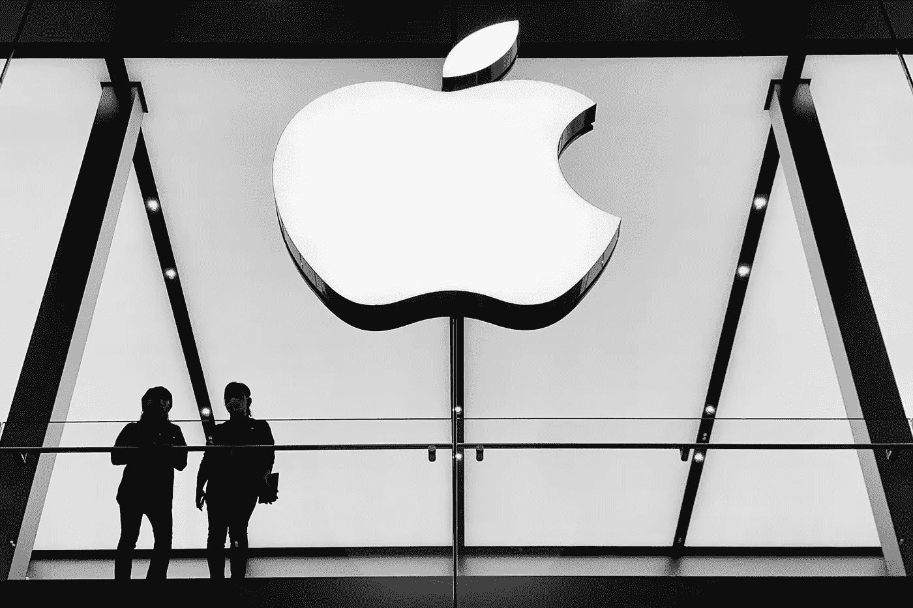

# 苹果(AAPL)和特斯拉(TSLA)是好的投资吗？

> 原文：<https://medium.com/coinmonks/are-apple-aapl-and-tesla-a-good-investment-d6816bc8ab45?source=collection_archive---------1----------------------->

# 苹果公司(AAPL)

Source photo [silhouette of people standing near wall photo — Free Chengdu Image on Unsplash](https://unsplash.com/photos/7DOU5NlNIcE)

投资苹果(纳斯达克股票代码:AAPL)股票通常是有利可图的。过去一年，由于科技公司整体表现不佳，AAPL 股市相对平淡。这只股票的预期市盈率为 22.9 倍，我认为这很有吸引力，预示着一个坚实的积累机会。