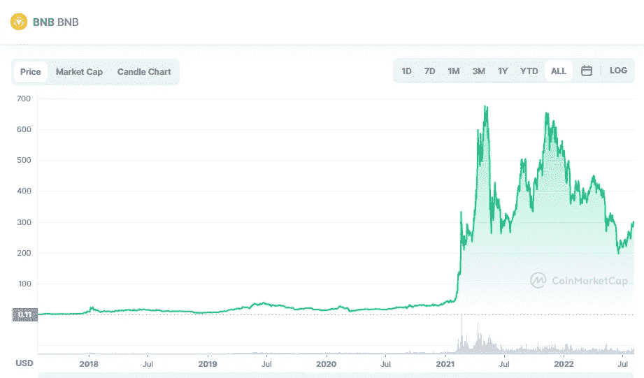

# 币安硬币(BNB)和 Uniswap (UNI)是一个好的投资吗？

> 原文：<https://medium.com/coinmonks/are-binance-coin-bnb-and-uniswap-uni-a-good-investement-382022cdb7?source=collection_archive---------25----------------------->

# 币安硬币(BNB)

Source photo [BNB price today, BNB to USD live, marketcap and chart | CoinMarketCap](https://coinmarketcap.com/currencies/bnb/)

币安发行的代币作为世界上最大和最具流动性的加密货币交易所的公用代币。币安智能链本机令牌也称为 BNB (BSC)。2017 年推出的 BNB 硬币在 2021 年底达到了 690 美元的高点，比其 ICO 价格上涨了 46 万多。