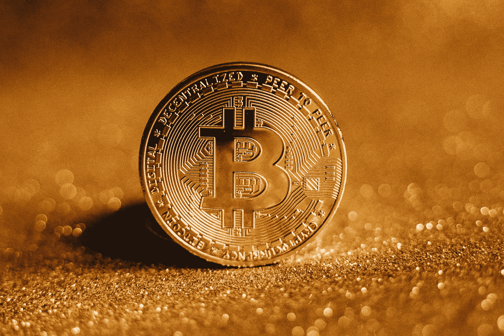

# 比特币在 2023 年是一个好的投资吗？

> 原文：<https://medium.com/coinmonks/are-bitcoin-a-good-investement-in-2023-f8556f1490f1?source=collection_archive---------30----------------------->

Source photo [Close-up Photo of a Gold Coin · Free Stock Photo (pexels.com)](https://www.pexels.com/photo/close-up-photo-of-a-gold-coin-6765363/)

在当前的加密货币市场中，比特币是回报最高、最可靠的选择之一。比特币的价格自诞生以来一直在稳步上涨，即使考虑到它的几次牛市和负市周期。

在 2009 年比特币问世之前，知道加密货币的人就更少了。这意味着早期用户可以以…的价格购买比特币