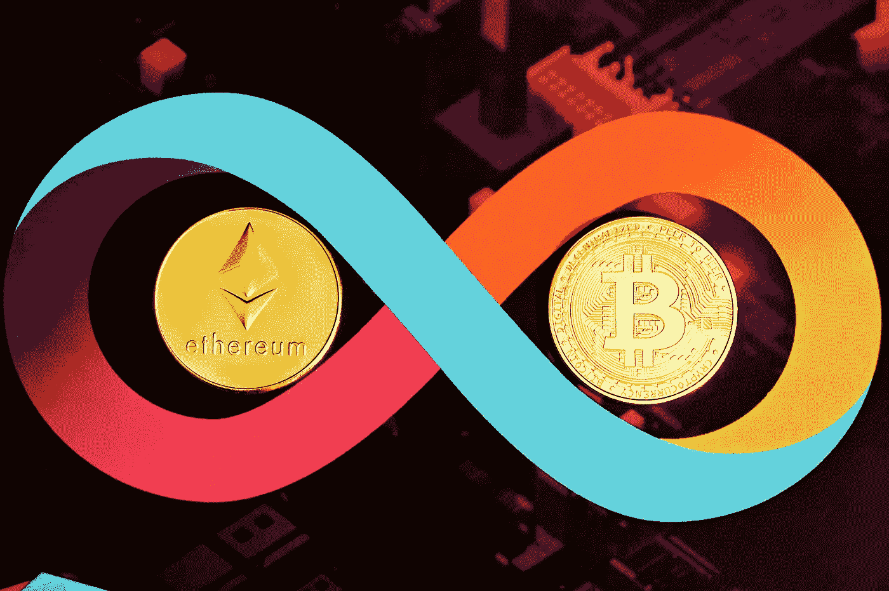

# 7 月 1 日的今天，比特币(BTC)和以太坊(ETH)是一个好买卖吗？

> 原文：<https://medium.com/coinmonks/are-bitcoin-btc-and-ethereum-eth-a-good-buy-today-1st-of-july-fc09c6a622f5?source=collection_archive---------44----------------------->

Source photo Unsplash.com

# 比特币(BTC)

上周，比特币(BTC 兑美元)几乎没有跌破 20，000 美元大关。甚至一度跌破 1.9 万美元大关。在撰写本文时，价格约为 21，000 美元。宏观经济指标继续显示出恶化的迹象。没有证据表明通货膨胀正在下降。同样，没有迹象表明…