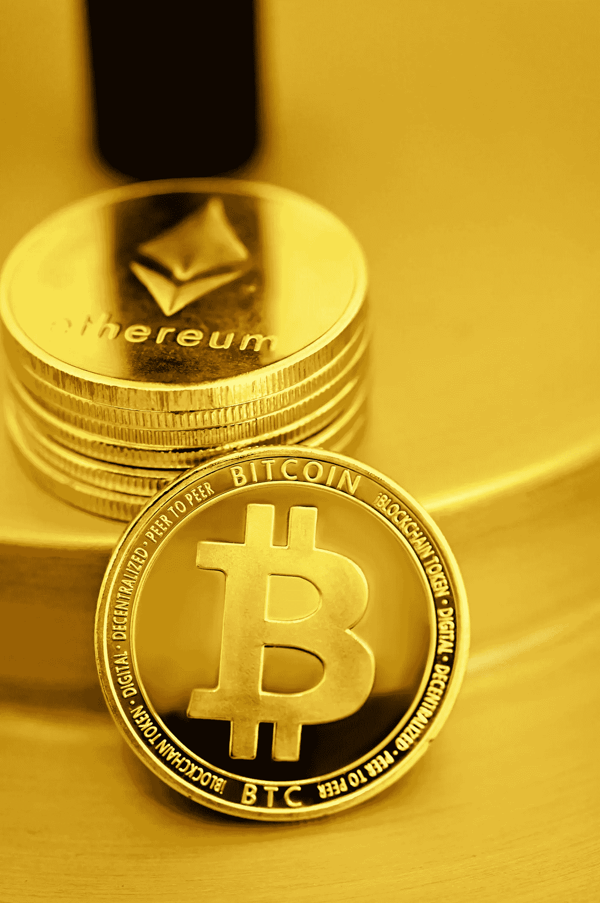

# 比特币(BTC)和以太坊(ETH)是好的投资吗？

> 原文：<https://medium.com/coinmonks/are-bitcoin-btc-and-ethereum-eth-a-good-investment-today-9th-of-july-af0aa4fe69e1?source=collection_archive---------9----------------------->

Source photo Unsplash.com

# 比特币(BTC)

根据 Coinmarketcap.com 的数据，截至 7 月 9 日，比特币(BTC-美元)是最受欢迎的加密货币，尽管它今年已经损失了约 55%的价值。BTC 代币的价格为 21，797 美元，在过去 30 天里下跌了近 28.73%。许多个人都在出售，以摆脱加密市场，而且…