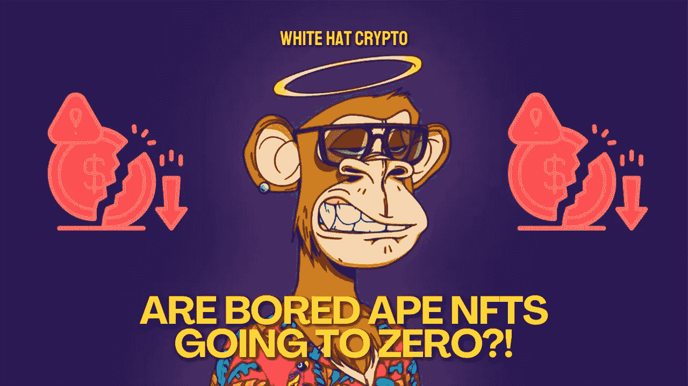

# 无聊的猿 NFTs 会归零吗？！👀

> 原文：<https://medium.com/coinmonks/are-bored-ape-nfts-going-to-zero-d3c09ca6f885?source=collection_archive---------37----------------------->

很多无聊的猿 NFT 都有被清算的风险！

许多用借来的钱收购的无聊的 Ape 游艇俱乐部 NFT 正处于被迫清算的边缘，这引发了人们对未来进一步清算的担忧。

一个允许用户用他们的 NFTs 借以太网(ETH)的 P2P 借贷服务 BendDAO 遇到了一个问题。顾客通常可以借用 NFT 藏品底价(T2)的 30%到 40%，或者最少的金额在公开市场上购买一件藏品，以 NFT 作为担保。

最近几个月，地板价格已经下跌，以至于 272 只本道贷款的无聊猿猴中有 45 只现在处于该平台的“危险区域”，当用作抵押品的 NFT 即将被拍卖时就会出现这种情况。

**换句话说，价值 530 万美元的无聊猿人面临被清算的风险！**

本道在 NFT 爱好者中很有名，因此任何大甩卖都可能很大。与奔岛有关的 272 只百无聊赖的猿，占整个收藏的 2.72%。

重大清算事件可能会对其他 NFT 贷款公司产生影响，随着 NFT 行业越来越受欢迎，这些公司在过去一年变得越来越重要。此外,《无聊的猿》是最著名的 NFT 收藏之一，如果不是最重要的话，因此该领域的经常性清算可能会产生深远的影响。

> “NFT 地板价格的短期波动是正常的，”本道在一份声明中说。“对蓝筹股非功能性交易的共识不是一天形成的，也不会在短时间内瓦解。”

大多数无聊的 ape 持有者面临着被清算的风险，他们在几个月前购买了他们的 Ape，当时底价在 125 ETH 左右。作为更大的 NFT 崩溃的一部分，它随后下降到大约 70 ETH。那些用无聊的猿猴做抵押的收藏者可以通过简单的偿还贷款加利息的方式将非功能性昆虫从网站上移除。

一些问题源于 NFT 交易的机制，即当 ETH 相对于美元的价格变化时，底价也会变化。尽管 ETH 最近从 1000 美元上涨到 2000 美元以上，但像 BendDAO 这样的贷款服务仍然以最初借出的令牌进行评级，导致某些无聊的猿类以比被收购时更高的美元利率出售。

随着越来越多的高价 NFT 以清算活动的形式“出售”，收藏家们开始以更低的价格浏览橱窗。在本道拍卖的 NFT 上的出价必须在藏品底价的 **5%以内**，不管藏品有多诱人。

这篇文章中提供的内容不是赞助的，据我所知是正确的。这篇文章不是金融建议，我们不对针对这篇文章采取的任何行动负责！

请随时查看我们的社交平台，了解每日加密更新，或通过以下渠道联系我们:

[YouTube](https://www.youtube.com/channel/UCjfinzatswbVaRd89zn5kJQ/featured)

[推特](https://twitter.com/whitehatcrypto)

[Instagram](https://instagram.com/white.hatcrypto?igshid=YmMyMTA2M2Y=)

[Gmail](http://cryptowhitehat@gmail.com/)

信息来源:Eli Tan，硬币台

> 交易新手？尝试[加密交易机器人](/coinmonks/crypto-trading-bot-c2ffce8acb2a)或[复制交易](/coinmonks/top-10-crypto-copy-trading-platforms-for-beginners-d0c37c7d698c)