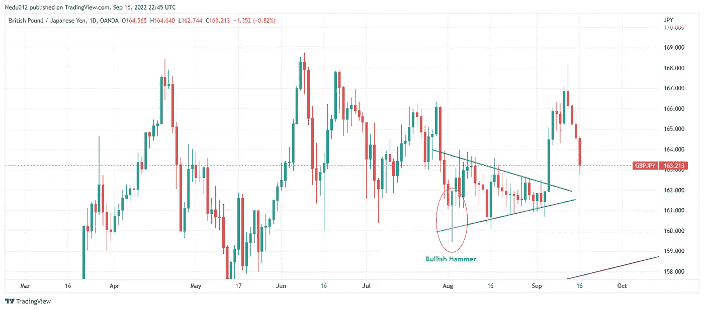
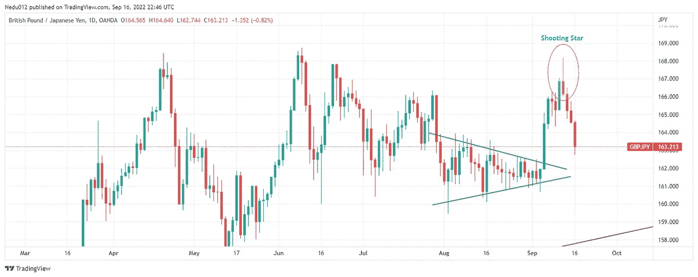
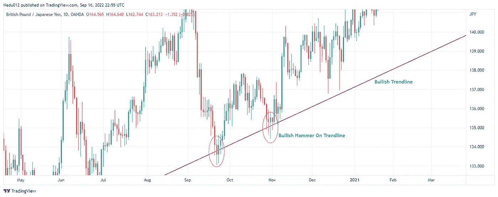

# 烛台图案靠谱吗？

> 原文：<https://medium.com/coinmonks/are-candlestick-patterns-reliable-a06dcdda1b0c?source=collection_archive---------27----------------------->

Image by [Liquiditytradeideas](https://liquiditytradeideas.com)

烛台图案可靠吗？你是金融界的新手吗？新手交易者还是投资者？想知道烛台模式对于外汇、加密货币或股票等的交易和投资是否可靠。如果是这样的话，那么你就可以享受一下了。

在这篇博文中，我们将详细解释什么是烛台模式，一些广泛使用的烛台模式，使用烛台模式的好处，将烛台模式与技术指标结合起来，以及在交易或投资时使用烛台模式的技巧等。

# 介绍

烛台模式是可靠的信号，可以帮助你预测商品、证券或货币对的未来价格。当一种证券的价格高于或低于某一点时，就会形成烛台模式。这种形态经常重复出现，它出现的价格被称为烛台水平。

 [## 对于交易来说技术分析就够了吗？-流动性交易理念

### 对于交易来说技术分析就够了吗？刚接触交易或对金融市场的概念感到困惑…

liquiditytradeideas.com](https://liquiditytradeideas.com/is-technical-analysis-enough-for-trading/) 

# 什么是烛台？

蜡烛图是交易员和投资者在[技术分析](https://liquiditytradeideas.com/is-technical-analysis-enough-for-trading/)中使用的一种价格图表，它显示金融市场中某一特定时期某一证券的最高价、最低价、开盘价和收盘价。

它是价格行为的图形表示，由一条垂直线和两条水平线组成。当价格移动到顶部横线之上时，它被认为是“高”，当它移动到底部横线之下时，它被认为是“低”

# 烛台图案是什么？

烛台模式是交易者和投资者通常使用的一种模式，是你识别价格变化和预测金融市场中证券未来事件的方法。

# 有哪些常见的烛台图案？

蜡烛图是一种图形分析，可以帮助交易者和投资者识别市场金融市场中的潜在机会和风险。烛台模式可以通过它们的外观来识别，即一组三个或更多的条形，形成一条直立或波浪线。

 [## 外汇交易是好是坏？-流动性交易理念

### 外汇交易是好是坏？当然，像任何活动一样，外汇交易几乎没有什么风险…

liquiditytradeideas.com](https://liquiditytradeideas.com/is-forex-trading-good-or-bad/) 

金融市场上[交易和投资](https://liquiditytradeideas.com/which-is-more-profitable-trading-or-investing/)中最常见的五种烛台图案包括陀螺、锤子、吊人、晨星和暮星等。烛台模式可以是看涨，看跌，或继续烛台模式。

*   锤子是蜡烛图中的一种价格模式，当一种证券的交易价格明显低于其开盘价时出现，但在该期间内反弹，以接近开盘价的价格收盘。

Bullish Hammer by [Chikwem Chinedu Ogugua](https://liquiditytradeideas.com/participant/admin/): [Liquiditytradeideas](https://liquiditytradeideas.com)

*   **旋转陀螺:**一种烛台模式，有一个短的真实主体，垂直居中在长长的上下阴影之间。这种模式代表了金融市场对该资产未来走向的犹豫不决。这意味着买方和卖方都无法控制市场。
*   **吊人**:这是单根蜡烛棍的图案。因为是反转形态，所以在形态出现之前，一定有什么东西在为它服务。市场不需要处于上升趋势，但在形态出现之前必须有一个可识别的价格上涨。

# 烛台模式和图表模式有什么区别？

蜡烛图和图表模式之间有一些关键的区别。烛台模式通常被视为沿特定方向移动的线条或圆圈，而图表模式更多地是关于数据本身中存在的模式。

烛台模式的相关性持续很短的时间，而图表模式可以持续更长的时间。蜡烛图也可能更不稳定，这意味着它们可能变化很快，经常与趋势相反。相比之下，图表模式更稳定，可以持续更长时间。

1.  你可以看到市场上正在发生的事情，并根据这些信息做出更好的决策。
2.  你可以看到市场的走向，并据此计划你的交易。
3.  你可以看到市场对不同因素的反应，并利用这些信息做出更好的决策。
4.  你可以看到市场对最近消息的反应，并利用这些信息做出明智的投资决策。
5.  你可以看到市场上正在发生的事情，并可以利用这些信息来预测未来的趋势。

 [## 外汇交易中的资金管理。-流动性交易理念

### 外汇交易中的资金管理！刚开始交易，还是在资金管理方面苦苦挣扎？外汇交易员需要…

liquiditytradeideas.com](https://liquiditytradeideas.com/money-management-in-forex-trading/) 

# 外汇、加密货币和股票交易的烛台模式

而烛台模式是一个强大的工具，可以帮助你在金融市场赚钱。它广泛用于外汇、加密货币和股票市场交易。价格运动的烛台模式通常被认为是看涨、看跌或延续模式。

# 用烛台模式交易有什么好处？

谈到交易和投资，烛台模式被认为是阅读和分析市场数据的好工具。然而，用烛台模式交易有很多好处。以下是几个例子:

# 用烛台模式交易有什么风险

虽然在烛台模式的帮助下，交易和投资可以非常有利可图，但仍然存在一些相关的风险。

首先，蜡烛图是一种技术分析工具，这意味着它主要由技术分析师使用，而不是所有的投资者，当你交易、投资或仅仅依赖他们提供的信息时，它仅限于一些市场事实。

第二，烛台模式不是金融市场将会发生什么万无一失，相反，它表明了在一个特定的时间和过去正在发生什么。

一些交易者和投资者声称，当你保持简单的交易策略时，你更容易盈利和成功，如果你只依赖烛台模式，你的交易资本肯定会损失。

# 如何在交易中运用烛台模式？

Shooting Star Chart by [Chikwem Chinedu Ogugua](https://liquiditytradeideas.com/participant/admin/) on [Tradingview](https://tradingview.com/)

蜡烛图是技术分析的一种类型，它使用长短蜡烛图来显示一种证券的趋势。烛台模式可以用来识别可能的销售或购买机会。

除了识别潜在的买卖机会，它们还可以用来识别证券可能的阻力和支撑位。

 [## 下降通道是看涨还是看跌？

### 下降通道是看涨还是看跌？你是金融世界的新手吗，对一个下降的…

liquiditytradeideas.com](https://liquiditytradeideas.com/is-a-descending-channel-bullish-or-bearish/) 

# 烛台模式和基本面分析

基本面分析这个词对你来说是陌生还是熟悉？在金融界，在对一项资产是否应该投资做出最终决定之前，职业交易员和投资者会进行三种主要类型的分析。

基本面分析、技术分析和情绪分析被认为是金融市场中最常用的三种分析方法，基本面是最重要的。

要想利用烛台模式成为一名成功的 T2 交易者或投资者，明智的做法是加入或者我应该说注意到关于你打算交易或投资的证券的金融新闻。

# 烛台模式和技术指标

烛台模式是观察市场趋势的有用方法。它们帮助你识别市场中潜在的买卖机会，并能给你一个市场走向的好主意。

烛台图案并不总是容易被发现。然而，正确的交易指标可能会使他们容易被发现，并可能导致理解设置的困难。

当使用烛台和技术指标进行交易或投资时，对交易或技术指标有很好的理解会让你保持优势。

# 烛台模式交易和趋势线

如果你对技术分析感兴趣，你会喜欢这条建议，因为它可以帮助你发现烛台潜在的价格趋势。不幸的是，这不是每个人都能得到的小费。

蜡烛线和趋势线可以在三种不同的市场条件下交易:牛市，盘整期间，熊市。

*   看涨市场:当在看涨市场趋势线上发现烛台模式时，你应该认为它是好的，然后向下到一个较低的时间框架，寻找一个公平的价格，买入市场，甚至增加你的盈利头寸。

Bullish Hammer on Trendline by [Chikwem Chinedu Ogugua](https://liquiditytradeideas.com/participant/admin/): [Liquiditytradeideas](https://liquiditytradeideas.com)

*   **盘整市场**:这是一种证券价格在一个区间内交易的情况(区间市场)。这里，当看涨形态在区间的支撑位形成时买入，当你在区间的阻力位发现反转形态时卖出。
*   **熊市:**与看涨趋势线相反，如果在看跌趋势线上发现晚上的星星烛台模式，这仅仅意味着证券可能会继续出售，作为一个聪明的交易者或投资者，你会向下移动到一个较低的时间框架，并以合理的价格出售。

然而，有一些烛台模式是如此的显眼，以至于你几乎足够聪明去发现它们自己的趋势线。

交易烛台时，务必要对某项指标进行额外确认，如[相对强度指数(RSI)](https://liquiditytradeideas.com/top-10-powerful-trading-indicators/#relative-strength-index-trading-indicators) 等。

# 那么，烛台图案靠谱吗？

这个问题没有唯一的答案，因为答案取决于具体的烛台模式和个人交易者或投资者的交易风格。

寻找快速赚钱的方法？烛台模式可以非常有利可图。毕竟，没有策略的交易和投资能多赚多少钱？问题是，你对自己的策略了解多少？

交易和投资策略是一份文件，记录了你交易或投资证券的注意事项，为什么你应该交易、投资或留在市场上，以及每次交易或投资所冒的风险。

 [## 交易和投资哪个更赚钱？

### 交易和投资哪个更赚钱？交易和投资是一个长期争论的问题。那里…

liquiditytradeideas.com](https://liquiditytradeideas.com/which-is-more-profitable-trading-or-investing/) 

# 使用烛台图案的提示

一些可能对你有帮助的一般提示包括，除了技术指标[之外，使用蜡烛图](https://liquiditytradeideas.com/trading-indicators-explained/)工具，如移动平均线收敛背离、热图和情绪指标，来识别其他交易者和投资者对资产状态的反应。

# 结论

虽然一些烛台模式比其他模式更可靠，但没有明确的方法来解释烛台模式。最终，由个人交易者或投资者来决定一个特定的烛台模式是否可靠。

有许多情况下，你会使用烛台模式，以赚取利润或避免损失。你能做的最重要的事情是理解并正确使用这些模式。如果你这样做了，你会在市场上获得很多成功。

烛台图案靠谱吗？我们很乐意听到你的意见。关于这个话题，你有什么要分享的或要问的问题吗？

请在[讨论论坛](https://liquiditytradeideas.com/community/)或下面的评论中分享你的想法和经验，让我们知道你的想法，我们期待阅读并回答你的问题！

*原载于 2022 年 9 月 17 日*[*【https://liquiditytradeideas.com】*](https://liquiditytradeideas.com/are-candlestick-patterns-reliable/)*。*

# 来自 LiquidityTradeIdeas 的消息

感谢您成为我们社区的一员！在你离开之前:

*   👏为故事鼓掌，跟着作者走👉
*   📰在 [**中查看更多内容**](https://liquiditytradeideas.com/)
*   **📈**加入我们关于外汇、加密和股票的 [**论坛**](https://liquiditytradeideas.com/community/)
*   **📚发现 [**最佳交易&投资电子书**](https://liquiditytradeideas.com/trading-e-books/)**

> **交易新手？尝试[加密交易机器人](/coinmonks/crypto-trading-bot-c2ffce8acb2a)或[复制交易](/coinmonks/top-10-crypto-copy-trading-platforms-for-beginners-d0c37c7d698c)**