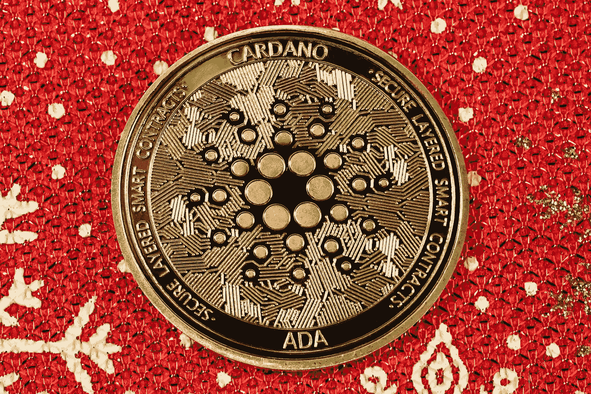

# 卡尔达诺(ADA)和 DogeCoin(DOGE)是 2023 年的好投资吗？

> 原文：<https://medium.com/coinmonks/are-cardano-ada-and-dogecoin-doge-a-good-investment-for-2023-9774c7d17291?source=collection_archive---------15----------------------->

# 卡尔达诺

Source photo [Free Cryptocurrency Image on Unsplash](https://unsplash.com/photos/gBhnOVyTZqc)

Cardano 是一家有前途的企业，可能会受益于 2023 年即将到来的加密货币热潮。《福布斯》将其描述为“一个渴望成为‘区块链互联网’的区块链平台。”以太坊的创建者之一 Charles Hoskinson 开始了这项工作，他的意图是建立一个更有弹性、可伸缩和…