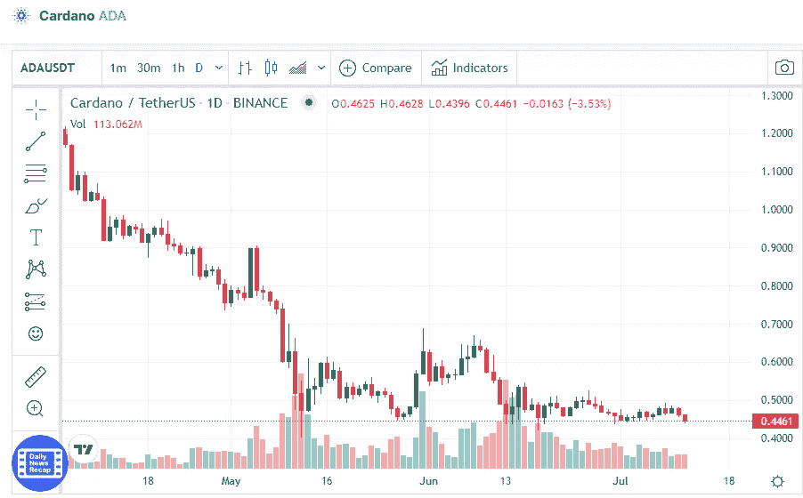

# 本周卡达诺(ADA)和以太坊(ETH)是否是好的投资？

> 原文：<https://medium.com/coinmonks/are-cardano-ada-and-ethereum-eth-a-good-investment-this-week-c4efd01be286?source=collection_archive---------45----------------------->

# 卡尔达诺

Source photo [Cardano price today, ADA to USD live, marketcap and chart | CoinMarketCap](https://coinmarketcap.com/currencies/cardano/)

这是最著名的区块链之一。投资者喜欢 Cardano，因为它为开发者提供了一个很好的基础。

在撰写本文时，一个 Cardano 本地令牌 ADA 的值是$0.4461。这比一周前下降了 2.17%。