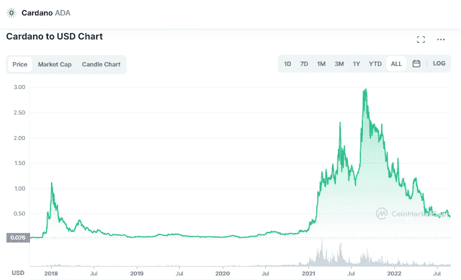

# 卡尔达诺(ADA)和波尔卡多特(dot)是好的投资吗？

> 原文：<https://medium.com/coinmonks/are-cardano-ada-and-polkadot-dot-a-good-investment-b1e79ca327a2?source=collection_archive---------25----------------------->

# 卡尔达诺

Source photo [Cardano price today, ADA to USD live, marketcap and chart | CoinMarketCap](https://coinmarketcap.com/currencies/cardano/)

我认为，Cardano (ADA-USD)是加密货币市场中最被低估的资产之一，其生态系统应该得到投资者的认真考虑。

这在一定程度上是因为 Cardano 最近的表现优于其竞争对手。提高开发人员对这款智能区块链的兴趣…