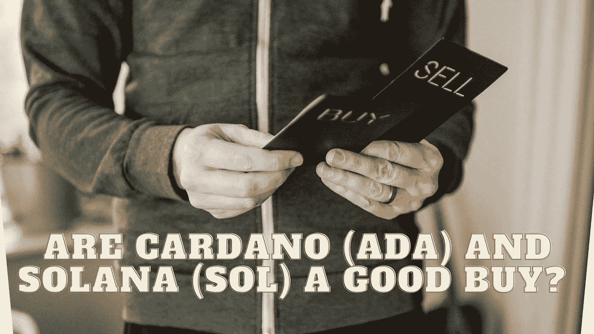

# 卡尔达诺(ADA)和索拉纳(SOL)是不是很划算？

> 原文：<https://medium.com/coinmonks/are-cardano-ada-and-solana-sol-a-good-buy-b1c96e842cd8?source=collection_archive---------9----------------------->

Source photo Unsplash.com

# 索拉纳

在 2021 年初的 NFT 繁荣期间，加密货币 Solana (SOL)因其网络的可扩展性、高吞吐量和革命性的历史证明(PoH)共识过程而成为以太坊的竞争对手。

Solana 在 2021 年的快速增长是因为需要一个能够实现低成本、高能效交易的网络…