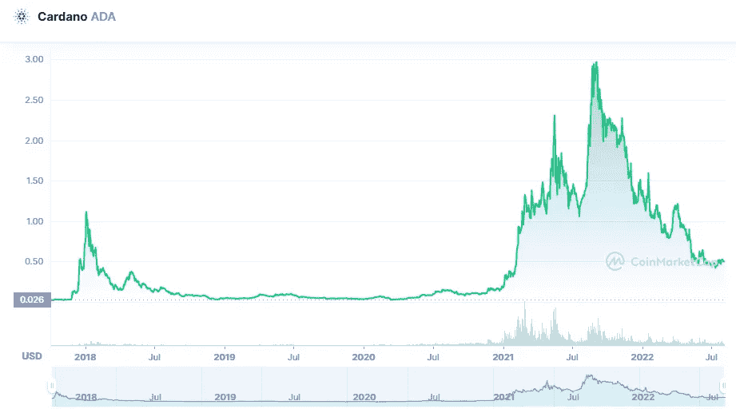

# 卡尔达诺(ADA)和索拉纳(SOL)是好的投资吗？

> 原文：<https://medium.com/coinmonks/are-cardano-ada-and-solana-sol-a-good-investment-4747178b7d8c?source=collection_archive---------20----------------------->

# 卡尔达诺

Source photo [Cardano price today, ADA to USD live, marketcap and chart | CoinMarketCap](https://coinmarketcap.com/currencies/cardano/)

卡尔达诺的同行研究方法集成加密项目和程序，使其成为当今世界上最安全的智能合同区块链。和大多数竞争对手一样，以太坊目前正致力于在其网络中加入更多面向未来的加密技术..例如，有 dApps 和 DeFi 货币以及算法…