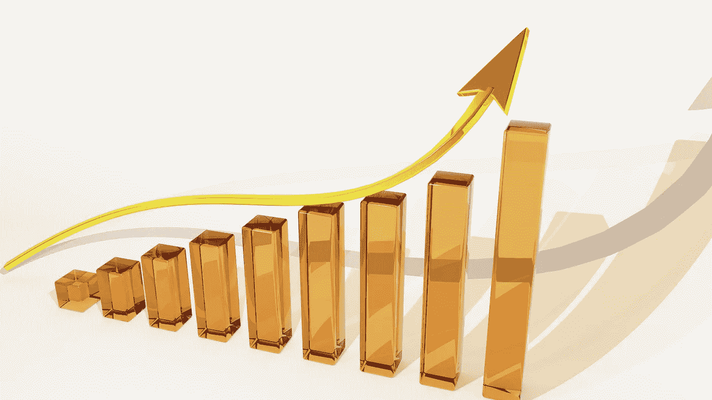

# 卡尔达诺(ADA)、多边形(MATIC)、分散地(MANA)是好的投资吗？

> 原文：<https://medium.com/coinmonks/are-cardano-ada-polygon-matic-and-decentraland-mana-a-good-investment-859de645bc77?source=collection_archive---------18----------------------->

Source photo [Graph Growth Finance — Free image on Pixabay](https://pixabay.com/illustrations/graph-growth-finance-profits-163509/)

# 卡尔达诺

以太坊(Ethereum)和 BitShares 的创始人查尔斯·霍斯金森(Charles Hoskinson)在 IOHK(输入输出香港)监督了 Cardano 的开发。它可以作为自己的主网，因为它集中于区块链技术。