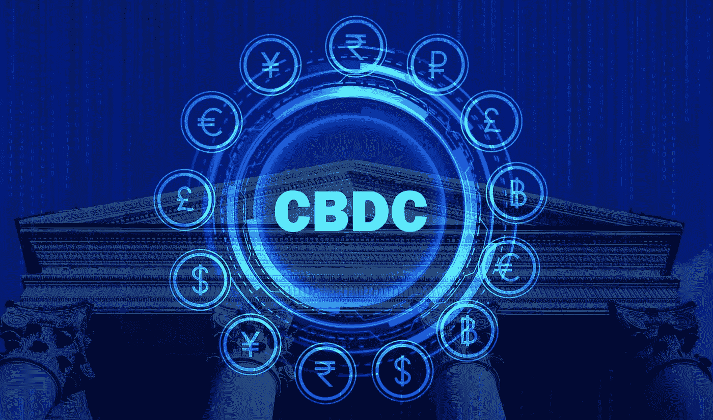

# CBDCs 是对 Crypto 的威胁吗？

> 原文：<https://medium.com/coinmonks/are-cbdcs-a-threat-to-crypto-96a954bb2813?source=collection_archive---------40----------------------->

非常好的加密读者，这篇文章会有点令人毛骨悚然，在这篇文章中，我们将谈论政府打算通过创造自己的数字货币来实现对大众的政治和社会经济控制的伟大伎俩，这些中央银行，它们真的像看起来那样危险吗？让我们来了解一下！

> 什么是 CBDC？