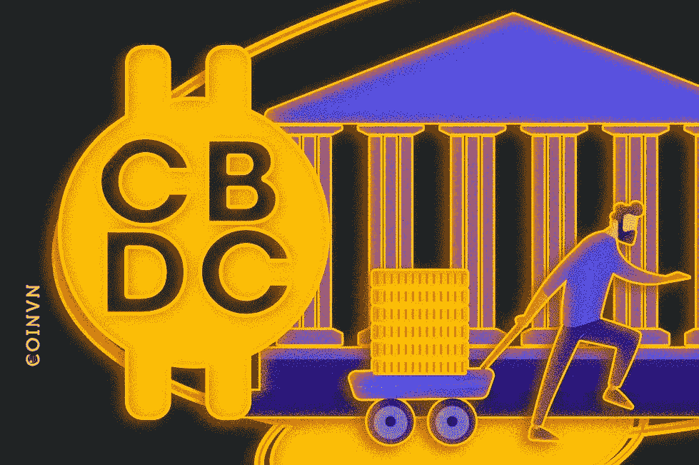
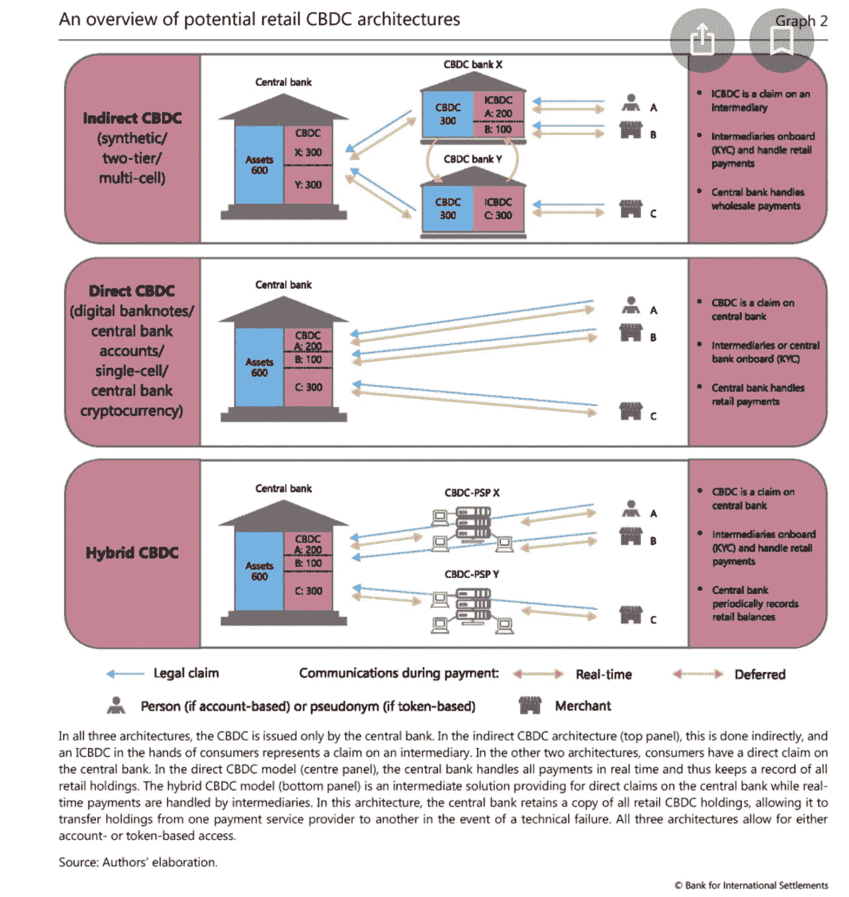

# 找出中央银行数字货币(CBDC)是你的朋友还是敌人？

> 原文：<https://medium.com/coinmonks/are-central-bank-digital-currency-your-friend-or-enemy-8ce4a77d9770?source=collection_archive---------19----------------------->

coinvn

不管我们喜欢与否，央行数字货币即将到来。

国际清算银行的一项调查表明，全球 90%的中央银行，包括英国银行和美国美联储，都在进行 CBDC 研究。

当这些政府控制的数字货币推出时，它们可能是继智能手机或我们最糟糕的噩梦之后发生在我们身上的最好的事情。

因此，了解 CBDC 并提前做好准备变得很重要。

这篇文章将向你展示 CBDC 的好处(相对于现金)以及使用 CBDC 的潜在危险或风险。

在此之前，让我们讨论 CBDC 和它最终将如何工作。

> 交易新手？试试[密码交易机器人](/coinmonks/crypto-trading-bot-c2ffce8acb2a)或者[复制交易](/coinmonks/top-10-crypto-copy-trading-platforms-for-beginners-d0c37c7d698c)

# 什么是 CBDCs？

CBDC 代表中央银行数字货币。顾名思义，它们是一个国家法定货币或纸币的数字表示，由中央银行发行。

法定货币是指一个国家作为法定货币使用的货币。例如美元、欧元、英镑、日元或奈拉。

值得注意的是，CBDC 的价值在任何时候都与基础法定货币的价值挂钩。因此，如果美国美联储决定发行一种 CBDC——数字美元或电子美元，1 单位的电子美元将永远与 1 单位的美元相同。

很容易将 CBDC 与银行存款混淆，因为两者都是电子化的。然而，这两者在实践中是不同的。银行存款由商业银行控制，而 CBDC 由国家最高银行单独发行和控制。这意味着，如果你银行账户里的钱出了问题，商业银行将承担责任，而在大多数情况下，中央银行将为 CBDC 的失败负责。

大多数国家基于分布式账本技术建立 CBDC(如区块链),以保持信任和透明度。由于加密货币也建立在区块链之上，许多人将它们相互比较。

# 央行数字货币(CBDCs)和加密货币一样吗？

尽管 CBDC 和加密都建立在分布式账本技术上，并且都作为法定货币，但这两种货币在许多方面是不同的。

去中心化的加密货币(如比特币和以太坊)不受监管，不受任何中央机构控制，而 CBDC 由中央银行发行和控制。

此外，加密货币交易是匿名的，用户不需要做验证就可以进行支付。但是，您需要身份验证才能访问央行数字货币。

最后，加密资产是不稳定的，没有保险，而央行数字货币是稳定的，无风险的，并由央行外汇储备中的资产支持。这意味着持有加密货币是有风险的，而央行数字货币提供了类似现金的安全性。

CBDC 会颠覆加密货币吗？

Explainer video about CBCD's threat to bitcoin

有很多理由相信，CBDC 不会对加密货币构成任何严重威胁。

首先，两者是两种不同的资产类别。虽然 CBDC 由政府控制和监管，但加密货币不受任何单一实体的监管。因此，自由市场和无许可货币倡导者将继续使用加密货币。

其次，CBDC 承诺的高效汇款和低费用交易已经由 crypto 实现。因此，与加密相比，它们并没有提供任何额外的价值或优势。

最后，加密的可用性不仅限于价值或货币转移。可编程加密货币(如以太坊、索拉纳等。)可用作智能合同、治理和公用事业令牌等应用程序。因此，如果有一天 CBDC 成为首选货币，加密资产将继续在其他领域发挥作用，永远不会被遗忘。

上述原因表明，CBDC 可能会在货币转账中使用加密技术，但它们永远不会取代加密货币，也不会威胁到加密货币的采用。

# CBDC(最终)将如何运作？

接下来是对 CBDC 最终可能如何运作的过度简化。你可以查看这个 [BIS 调查测试](https://www.bis.org/publ/qtrpdf/r_qt2003j.htm)来详细探索 CBDC 的设计。

根据调查，根据发行和银行在支付中的作用，存在三种可能的 CBDC 模式。其中包括:

*   直接 CBDC
*   间接 CBDC
*   混合 CBDC

CDCD design architecture

需要注意的是，在任何情况下，中央银行都会发行 CBDC，货币流通中会有两到三个参与者(中央银行、消费者和/或中间机构)

直接 CBDC 模型将中介排除在资金流动之外。中央银行直接向消费者发行数字货币，并执行其他关键活动。它每天记录和更新交易，处理付款，并负责现金到代币的兑换。中央银行也进行 KYC 验证，尽管它可以外包给第三方。由于中央银行对支付失败负责，直接 CBDC 模式提供了类似现金的安全性，但由于一个机构的繁重工作量，交易往往缓慢而低效。

间接 CBDC 模式涉及两个中央银行，可以比作当前的银行系统。中央银行向中介机构(私人机构)发行批发 CBDC，中介机构向最终消费者发行零售 CBDC。中央银行的主要作用是记录批发 CBDC 交易，而中介机构则负责核查、合规、信息传递、争议解决等。汇款往往没有摩擦，非常方便。唯一的问题是，在交易失败时，央行不能干预争议解决，因为他们没有交易记录。

混合 CBDC 模型利用了直接 CBDC 和间接 CBDC。因此，消费者直接从中央银行接收钞票，而中间人处理记录保存和客户管理。中介处理主要的支付结算、身份验证和记录保存。不过，中央银行也不时保留交易记录的副本，以备争议解决。这意味着用户仍然受益于直接 CBDC 模式的类似现金的安全性，而没有牺牲间接 CBDC 的便利性。

# CBDC 的好处是什么(相对于现金)？

如果设计得当，CBDC 对政府和储户都有好处。

中央银行数字货币对用户的一些好处是:

**金融普惠:** CBDC 消除了资金流动中的中介，让每个拥有智能手机的人都能直接从央行获得资金。由于信任问题和商业银行收取的高额费用，数百万不使用银行服务的人被排除在中介之外，这为他们提供了金融包容性。此外，CBDC 还将在没有商业银行的偏远地区提供银行服务，让数百万得不到充分服务的人获得金融普惠。

**高效汇款:** CBDC 将实现无摩擦汇款，允许用户以极低的成本在一个眨眼之间在本地和跨境发送和接收资金。此外，直接 CBDC 将使人们能够进入外汇市场，而无需通过资金管理公司。

**更好的财政政策:** CBDC 给予政府更多的经济控制权。与消费者的直接接触让央行对人们的收入、储蓄和支出模式有了更多的监督。这些数据使他们能够直接向用户征税，并制定更好、更明智的经济政策。

**欺诈检测和保护:**货币的数字化为政府提供了更好的关于货币所有权和使用的实时情报。这使他们能够有效地检测非法资金的使用，并打击欺诈和恐怖主义融资。

经济稳定:如果 CBDC 兑现承诺，更多人将使用本币进行本地转账和兑换，从而保持货币稳定，建立对政府的更多信任，提振经济。

# 央行数字货币的危险

meme

尽管政府将 CBDC 视为金钱的圣杯，但这种新的数字货币并非没有风险和担忧。以下是 CBDC 的一些潜在劣势:

**商业银行脱媒:**如果中央银行决定成为货币的绝对发行者和分发者，CBDC 将部分或完全削弱商业银行在货币流动中的作用。虽然商业银行的脱媒促进了有效的汇款，但也将导致许多工作岗位的流失。此外，它将权力集中在一个机构手中，使经济成为一个单一的失败点。

**缺乏隐私:** CBDC 意味着告别分别由现金和加密货币授予的隐私和匿名。尽管 CBDC 建在区块链，人们仍然需要身份验证才能发送大笔的钱。此外，货币的数字化使政府能够监控和跟踪货币流动的每一个细节。虽然金融监控有助于遏制非法资金转移，但这也意味着政府可以跟踪每个人如何使用他们的钱，这对非营利组织和活动人士来说可能是个问题。

**通货膨胀风险:**另一个未解决的问题是，发展中国家容易受到通货膨胀的影响。在目前的金融体系中，经济稳定是通过量化宽松和逐步投放现金来实现的。然而，央行数字货币的高流通速度有助于快速的资金分配。将数字货币的高流通速度与无限的 CBDC 供应和滥用权力的政府联系起来，你会很快注意到 CBDC 是一个伪装的恶性通货膨胀的工具。

安全漏洞:经济权力集中在一个机构手中，这使得 CBDC 容易受到黑客和不良分子的攻击。

**贷款困难:**人们自己保管 CBDC 的能力将导致商业银行和私人金融机构出现前所未有的资金短缺。这些机构将转向提高利率以实现盈亏平衡，从而使贷款更难借入和获得。

# 全球经济中的 CBDC:哪些国家正在考虑采用 CBDC？

截至 2022 年 3 月，从 [CBDC 追踪器](https://cbdctracker.org)收集的数据显示，近 75 个国家和货币机构正在致力于 CBDC 的前景。目前正在调查 80 多个 CBDC 项目。

大多数国家(52 个)仍处于研究阶段，他们试图研究什么是 CBDCs，如果他们想设计一个，并考虑 CBDCs 对其经济的影响。美国汉密尔顿项目是 CBDC 最热门的研究项目之一。

十(10)个 CBDC 项目已经从研究阶段进入概念验证阶段(理论原型)。其中包括日本、瑞典、香港和土耳其的中央银行。瑞典已经是世界上现金使用率最低的国家之一。因此，e-krona 在推出时就已经准备好被大量采用。

中国的 e 元和乌拉圭的 e 比索是现阶段最热门的数字货币。十几个 CBDC 项目正处于试点测试阶段，在现实生活环境中测试货币。到目前为止，数字人民币试点已经记录了超过 96 亿元的交易，超过 2100 万公民开通了数字人民币钱包。

巴哈马和尼日利亚联邦共和国是迄今仅有的启动 CBDC 的国家。巴哈马群岛[沙币](https://www.centralbankbahamas.com/news/public-notices/the-sand-dollar-is-on-schedule-for-gradual-national-release-to-the-bahamas-in-mid-october-2020?N=C)—2020 年 10 月推出的巴哈马群岛币的数字版本，成为世界上第一个运营的零售 CBDC。

整整一年后，尼日利亚中央银行推出了[e-Naira](https://www.cbn.gov.ng/currency/enaira.asp)——尼日利亚 Naira ( NGN)的数字版本，使 e-Naira 成为全球第二个 CBDC，也是非洲第一个合法支持的数字货币。

5 个 CBDC 项目已经尘埃落定。一些支持者回去加强努力，还有一些人放弃了。

# 结论

根据相关央行的设计和完整性，CBDC 可能是一项好的创新，也可能是一项糟糕的创新。

一方面，央行数字货币将促进快速高效的资金转移、更好的财政政策，并帮助政府追踪资金的非法使用。

然而，另一方面，CBDC 剥夺了我们像现金一样的隐私，并迅速成为政府用来调查我们的财务和干涉我们生活的工具。让我们不要从 CBDC 通胀风险、贷款可获得性的威胁和安全漏洞开始。

幸运的是，大多数 CBD 仍在建设中，我们有足够的时间为每一个结果做准备。最好的准备方式是继续做你的小调查，直到你得出结论。此外，您还可以将现金多样化，购买实物贵重物品，如房地产或黄金，以及购买替代货币，如加密币或稳定币。

同时，对你正在关注或支持的 CBDC 项目发表评论？

分享这篇文章并为之鼓掌，帮助其他人为金钱的未来做好准备。请给我一个关注来欣赏其他有趣的作品。