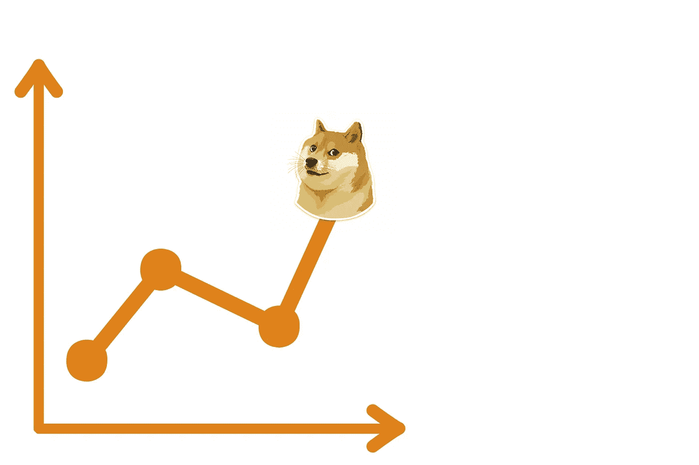

# DogeCoin(多格)和 Cardano(阿达)是这个时期的好投资吗？

> 原文：<https://medium.com/coinmonks/are-dogecoin-doge-and-cardano-ada-a-good-investment-in-this-period-b03bc6f495b7?source=collection_archive---------41----------------------->

# Dogecoin (DOGE)

Source photo [Graph Dogecoin Price — Free image on Pixabay](https://pixabay.com/illustrations/graph-dogecoin-price-price-hike-6271946/)

DOGE 的首字母缩写代表“每天只做好事”，它概括了 Dogecoin 的精神和宗旨。Memecoin 在 2021 年获得了前所未有的成功和声誉。Dogecoin 热潮可能已经消退，但它仍然保留着忠实的追随者。Dogecoin 最初的动力来自埃隆·马斯克，他公开…