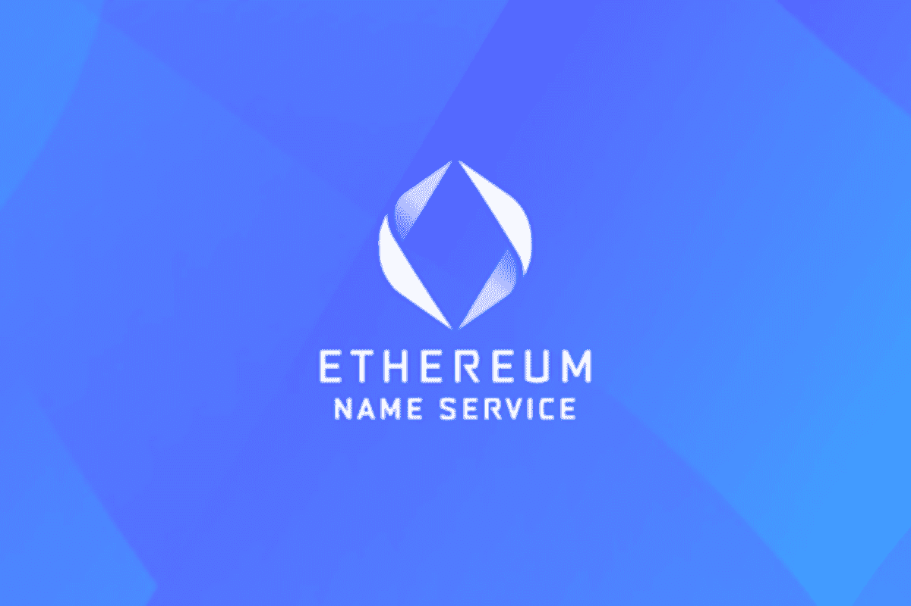
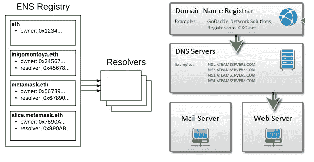
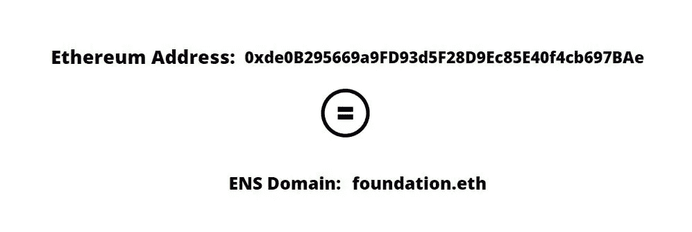

# ENS 域名值得大肆宣传吗？让我们来看看…

> 原文：<https://medium.com/coinmonks/are-ens-domains-worth-the-hype-lets-find-out-16aba8f1f971?source=collection_archive---------11----------------------->

以太坊领域最近被大肆宣传和曝光，那么这些领域是什么，除了作为 web3 先驱的翻转和伸缩之外，它们的用例是什么？

Web3 域不同于传统的域名系统(DNS)地址，例如(.com &。io)。标准 DNS 类似于电话簿，因为它存储公共网站及其 IP 地址以启用目录。相当基础又单调…

Web3 是读写信任网络，是互联网的第三个高级领域，由智能合约、NFT 和加密货币等区块链技术工具提供支持，实现了一个去中心化的网络，解放了互联网，并将权力从垄断的科技巨头转移到人民手中。

Web3.0 更安全、更易访问，因为它分布在计算机网络中。此外，web3.0 将域名从传统的域名系统(DNS)更改为 web3 域名(ENS)。

分散加密域不是以 IP 地址的形式提供人类可读的字符集合，而是作为加密钱包快捷方式的人类可读地址。这些 Web3 域名是有效的数字证书或不可替代的令牌(NFT ),可以在 MagicEden 或 OpenSea 等平台上交易。此外，Web3 域具有 Web3 域扩展，如(.加密。道和。eth)

它还表示一个加密钱包地址，允许你通过(ENS)发送资金，“将我的付款发送到 Toni.eth”比背诵一些不可能记住的 42 个字符的加密钱包地址更容易记住和执行。

# **ENS 及其工作原理**

ENS 域名的功能类似于传统域名，但它们可以创建分散的平台和网站，以及在区块链上存储数据或文件，这要归功于为整个过程提供动力的新的 web 3.0 基础设施。

以太坊名称服务(ENS)是一个新的域名系统，建立在以太坊网络之上，允许用户创建难忘的和唯一的地址或用户名。它利用以太坊智能合同来补充传统的 DNS，并管理域名注册和解析。在分布式生态系统中，ENS 允许用户为他们所有的钱包地址、分散的应用程序和网站创建一个单一的用户名。

ENS 使用三种类型的智能合同:注册中心、注册商和解析器。

**注册管理机构** —注册管理机构是 ENS 的上层合同，负责存储所有域名及其相关的解析器智能合同。它还规定了注册和维护. eth 域名的程序，例如谁可以注册一个域名，域名有效期多长，如何续费等等。

**注册商** —注册商是允许用户注册和管理的协议。eth 域。它管理域名，并允许用户根据标准创建子域。永久注册服务商和注册服务商控制者的概念使域名持有者能够外包其域名。同时，有两种类型的注册商:拍卖和开放。

**解析器** —解析器是一个允许以太坊地址映射到. eth 域名的合同。当用户在浏览器或钱包中输入地址或用户名时，解析器会返回相应的以太坊地址。域名所有者部署解析器合同，该合同可以被更新以改变映射。简而言之，解析器保存了名称到记录的映射。

# web3 域名有什么好处？

**它提供对用户在线身份的完全控制—** 与通常由大公司或组织拥有的传统域名不同，web3 域名可以由个人或团体拥有。它允许用户通过使用 NFT 形式的唯一标识符，使用他们的域名来更个性化地代表他们自己或他们的品牌。

**它们比传统域名便宜得多—** Web3 域名不需要集中的注册商，也不涉及任何中间商，因此具有成本效益。

**它们更安全—** 由于 web3 域存储在区块链上，任何人都不能修改或删除它们，这使它们成为托管敏感数据或开发抗审查应用程序的理想选择。它们也更能抵御黑客和其他攻击，因为它们没有单点故障。

**它们更具私密性—** 与频繁使用个人数据进行注册的传统域名不同，web3 域名可以匿名注册。用户的身份不会与他们的域名相关联，这给了他们更大的在线隐私。

*   **它们是面向未来的—** 随着互联网变得更加分散，web3 域名将会变得更加流行。

# ENS 使用案例

**·加密钱包:**ENS 支持所有加密货币，因此可用于交易和存储加密钱包。

**分散式网站和应用:**ENS 域可用作 dApp 或网站的网址，类似于标准 URL，但没有 DNS 服务器。

**防审查信息:**使用 ENS 注册的电子邮件地址，用户可以向其他用户发送加密信息。邮件将存储在区块链上，只有收件人能够解密。

**·令牌交换:**因为两个令牌都由各自的 ens 域名表示，所以两个用户可以交换它们，而不需要集中交换。

**·名称注册:**类似于注册一个(DNS)域名，任何名称(公司名称、品牌名称等。)可以在 ENS 上注册。

**身份管理:**ENS 可用于独立管理数字身份和头像，让用户能够控制自己的数据。

**声誉系统:**ENS 可以用来建立一个分散的声誉系统，允许用户根据他们的互动来相互评价。

**证书:**ENS 可用于分散发布和验证证书，允许用户在不需要中央机构的情况下保证证书的真实性。

# 结束语

通过将不方便的字母数字代码替换为人类可读的用户名，ENS 在减少区块链技术的技术性方面发挥了重要作用。此外，简化用户体验将鼓励更多的技术采用和 web3.0 的诞生

> 交易新手？尝试[加密交易机器人](/coinmonks/crypto-trading-bot-c2ffce8acb2a)或[复制交易](/coinmonks/top-10-crypto-copy-trading-platforms-for-beginners-d0c37c7d698c)