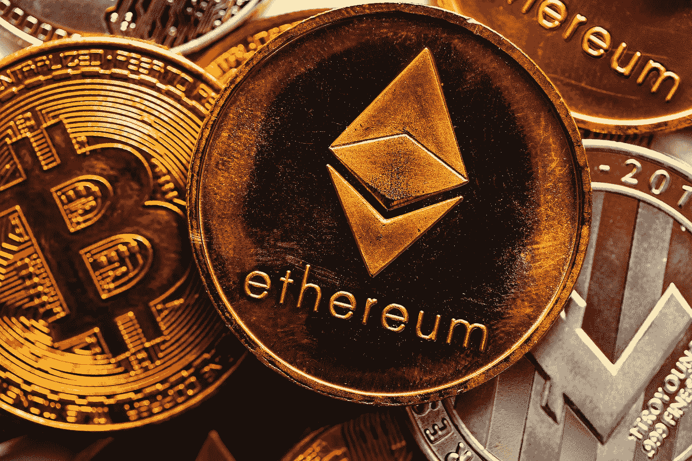

# 以太坊(ETH)和比特币(BTC)现在是好的投资吗？

> 原文：<https://medium.com/coinmonks/are-ethereum-eth-and-bitcoin-btc-a-good-investment-right-now-4e0f308d9c66?source=collection_archive---------23----------------------->

Source photo [Btc Bitcoin Cryptocurrency — Free photo on Pixabay](https://pixabay.com/photos/btc-bitcoin-cryptocurrency-currency-6272696/)

# 以太坊

以太坊是仅次于比特币的第二大加密货币，有时甚至超过了比特币。去年以太坊基础设施升级时，流通中的以太网令牌数量上限约为 1.2 亿个。作为更新的结果，网络能够处理更多的…