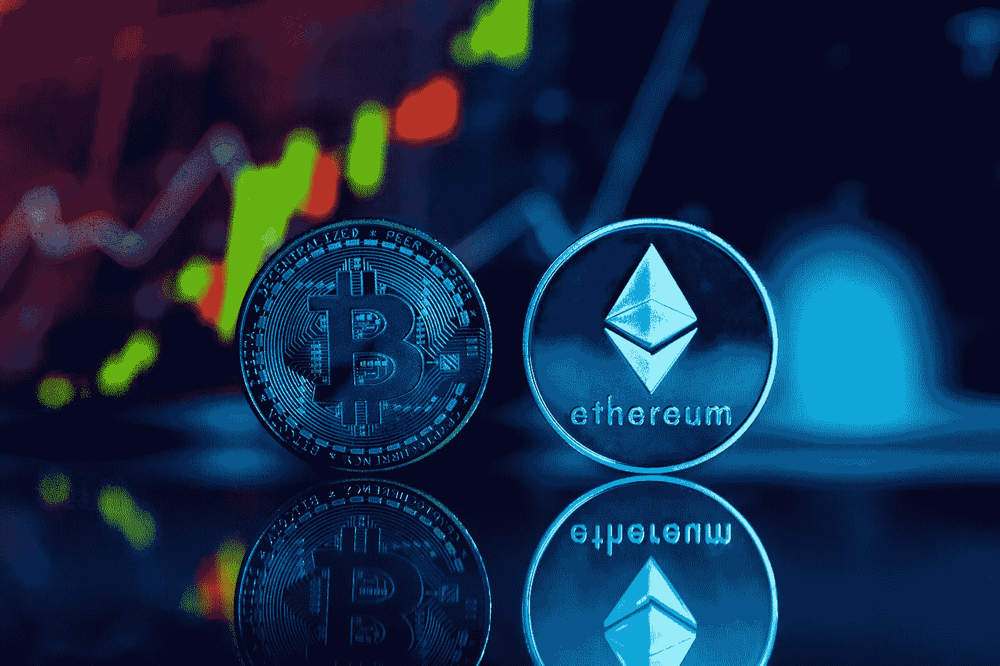

# 以太坊(ETH)和比特币(BTC)现在是好的投资吗？

> 原文：<https://medium.com/coinmonks/are-ethereum-eth-and-bitcoin-btc-a-good-investment-right-now-7ffbdfc43d8c?source=collection_archive---------20----------------------->

Source photo [Blue White and Green Star and Moon and Star Print Ribbon · Free Stock Photo (pexels.com)](https://www.pexels.com/photo/dark-laptop-internet-technology-14354107/)

# 以太坊

因此，以太坊是智能合约的先驱平台。尽管经历了加密寒冬，一项名为“合并”的重大升级还是在 9 月份成功地在网络上实施了。它将加密货币的区块链网络从消耗大量能源和资源的验证工作转变为更高效的工作…