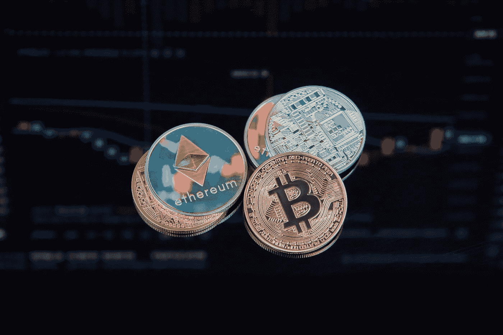

# 以太坊(ETH)和比特币(BTC)在今天 12 月 28 日是一个好的投资吗？

> 原文：<https://medium.com/coinmonks/are-ethereum-eth-and-bitcoin-btc-a-good-investment-today-28th-of-december-ac036c07e8be?source=collection_archive---------26----------------------->

Source photo [Coins with Cryptocurrencies Symbols on the Background of Graphs · Free Stock Photo (pexels.com)](https://www.pexels.com/photo/coins-with-cryptocurrencies-symbols-on-the-background-of-graphs-7267598/)

# 以太坊

合并更新成功后，以太坊的工程师们正在努力进行下一轮升级，代号为上海，最早可能在 2023 年 3 月发布。上海将使持有人能够解除这种赌注以太坊，并提取赌注奖励，给以太坊用户更多的选择。