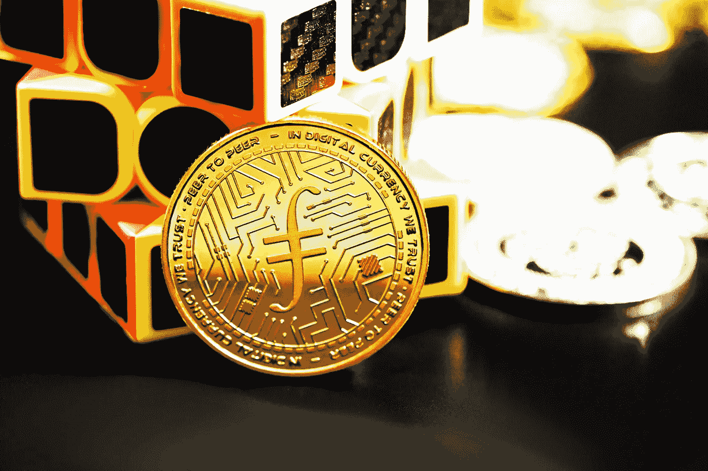

# Litecoin 和 Filecoin 是好的投资吗？

> 原文：<https://medium.com/coinmonks/are-litecoin-and-filecoin-a-good-investment-884bd87d700c?source=collection_archive---------31----------------------->

Source photo [HD photo by Kanchanara (unsplash.com)](https://unsplash.com/photos/TU1XHpTfcvg)

# 莱特币

当价格下跌时，莱特币是一种很好的投资加密货币，因为它仍然是市场上最有价值的货币之一。它是通过比特币区块链的一个分叉建立的，是市场上最早的密码之一。经过一段时间的稳步改善，今年到目前为止已经明显倒退。然而，LTC 已经显示出一种…