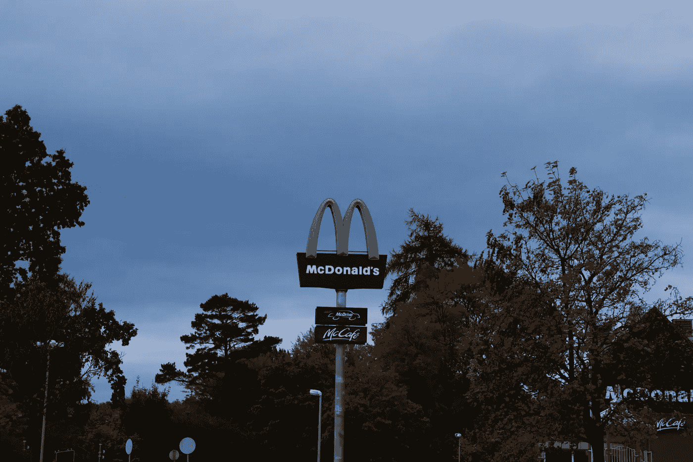

# 麦当劳(MCD)和强生(JNJ)的股票是好的投资吗？

> 原文：<https://medium.com/coinmonks/are-mcdonalds-mcd-and-johnson-johnson-jnj-stocks-a-good-investment-b0d3ccf4dade?source=collection_archive---------18----------------------->

# 麦当劳(MCD)

Source photo [Free Mcdonald’s Image on Unsplash](https://unsplash.com/photos/e6eYVSx0zk8)

麦当劳(纽约证券交易所代码:MCD)可能是更广泛的非必需行业中一个有吸引力的选择，尽管事实上本周购买的大多数股票都集中在防御性的市场理念上。由于廉价刺激假说，美国最知名的公司之一麦当劳成了赢家。至…