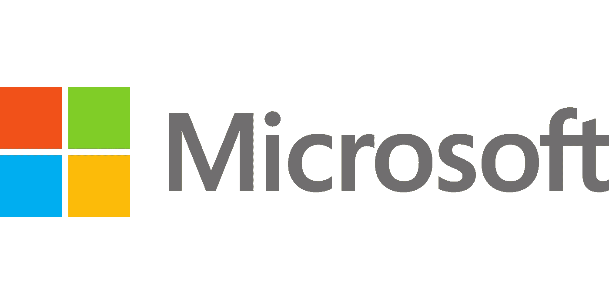

# 微软(Microsoft)和 Alphabet 的股票是好的投资吗？

> 原文：<https://medium.com/coinmonks/are-microsoft-msft-and-alphabet-googl-stocks-a-good-investment-880d51a6dc7e?source=collection_archive---------11----------------------->

# 微软(MSFT)

Source photo [Microsoft Ms Siglă — Grafică vectorială gratuită pe Pixabay](https://pixabay.com/ro/vectors/microsoft-ms-sigl%c4%83-afaceri-80658/)

今年以来，微软(纳斯达克股票代码:MSFT)的股价已下跌超过 25%，这使得投资者折价收购该公司成为一个难得的机会。即便如此，复苏似乎已经开始成形。微软(MSFT)的股票在一个多月的时间里上涨了 17%。