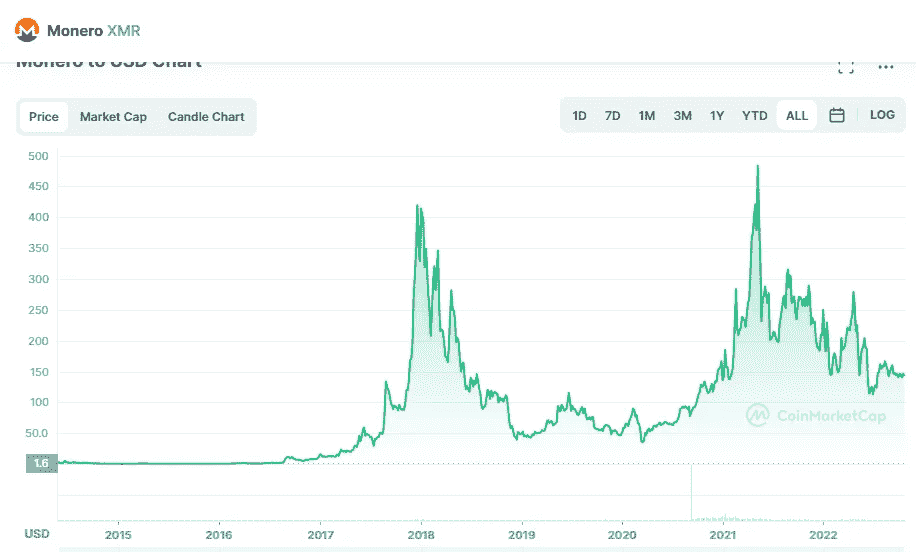

# Monero (XMR)和 Stellar (XLM)是好的投资吗？

> 原文：<https://medium.com/coinmonks/are-monero-xmr-and-stellar-xlm-a-good-investement-1e50297cd527?source=collection_archive---------13----------------------->

# 莫内罗(XMR)

Source photo [Monero price today, XMR to USD live, marketcap and chart | CoinMarketCap](https://coinmarketcap.com/currencies/monero/)

诞生于 2014 年的加密货币和区块链技术 Monero 被广泛认为是以隐私为中心的加密货币市场的领导者。与比特币一样，它显著利用了区块链技术，同时通过“环形签名”和“隐形地址”来加强该技术，以确保所有网络交易保持机密。