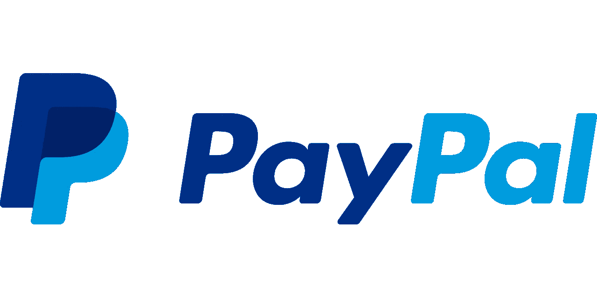

# Paypal (PYPL)和 Visa 的股票是好的投资吗？

> 原文：<https://medium.com/coinmonks/are-paypal-pypl-and-visa-stocks-a-good-investment-2332ab88ab69?source=collection_archive---------12----------------------->

# 贝宝(PYPL)

Source photo [Paypal Siglă De Brand A — Grafică vectorială gratuită pe Pixabay](https://pixabay.com/ro/vectors/paypal-sigl%c4%83-de-brand-a-plati-784404/)

据 PYMTS 报道，PayPal(纳斯达克代码:PYPL)及其子公司 Venmo 占所有黑色星期五交易的 34.9%。

PayPal 第三季度销售额为 68.5 亿美元，同比增长 11%，每股利润为 1.15 美元，高于去年同期的 0.93 美元。