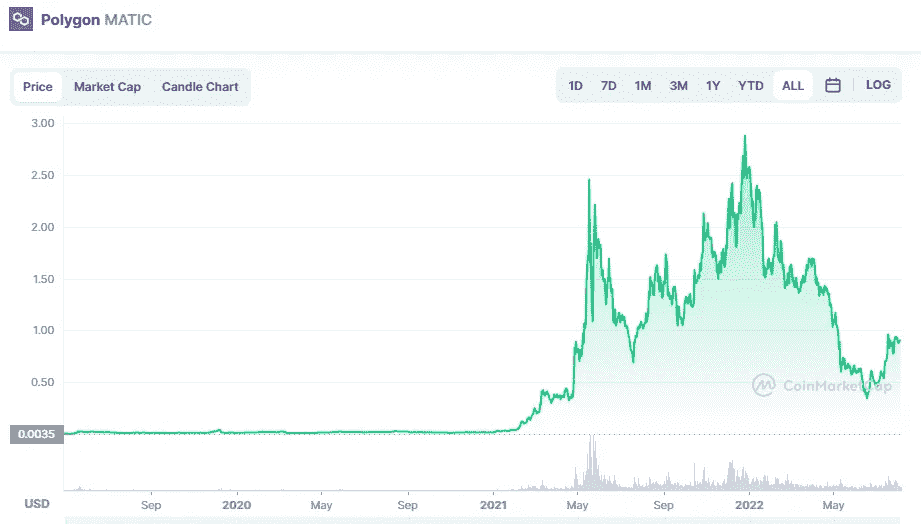

# 多边形和点是好的投资吗？

> 原文：<https://medium.com/coinmonks/are-polygon-matic-and-polkadot-dot-a-good-investement-4eb9967034a6?source=collection_archive---------11----------------------->

# 多边形(MATIC)

Source photo [Polygon price today, MATIC to USD live, marketcap and chart | CoinMarketCap](https://coinmarketcap.com/currencies/polygon/)

Polygon 第一次成为一种分散的加密货币，使用自己的区块链，其 MATIC 令牌在以太坊总账上进行交换。出于这个原因，Polygon 是专门为以太坊的侧链打造的。以太坊的高安全性协议也可以用来帮助开发 dApps 和智能合约…