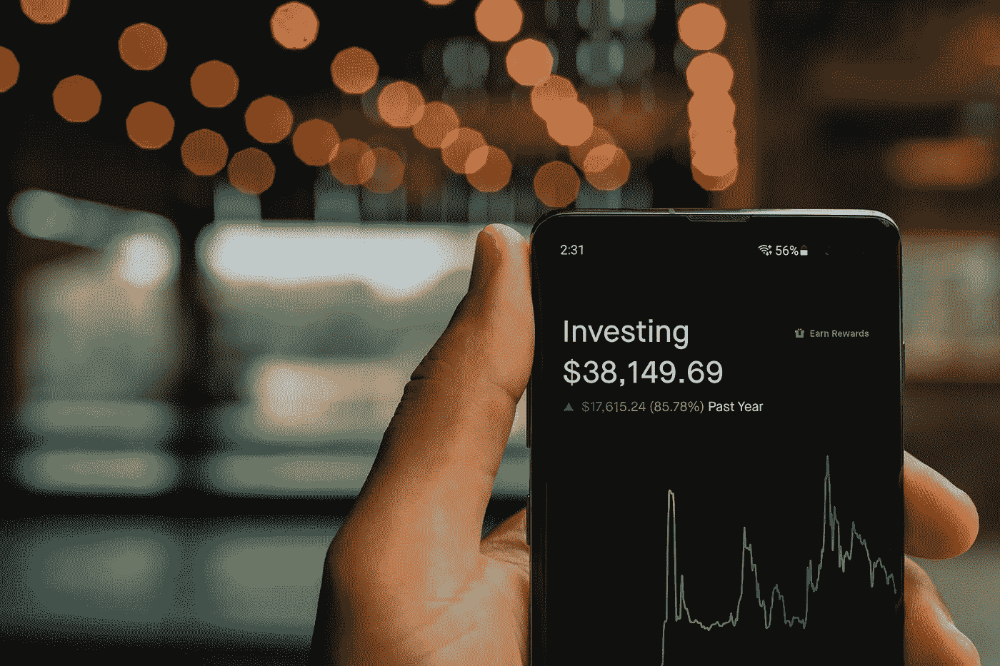

# Ripple (XRP)和 Bitcoin(BTC)是好的投资吗？

> 原文：<https://medium.com/coinmonks/are-ripple-xrp-and-bitcoin-btc-a-good-investment-today-6th-of-july-83f8f3d8fc4c?source=collection_archive---------22----------------------->

Source photo Unsplash.com

# 涟漪(XRP)

它现在价值 0.323839 美元，在过去 24 小时内上涨了 0.5%。一周 4%，一个月 18%，一年 50%。

一个低的 RSI 和 30 天移动平均线显示了 XRP 现在有多便宜。虽然 RSI 在过去的一两周内有所上升，但这可能是因为 Ripple 正在等待来自…