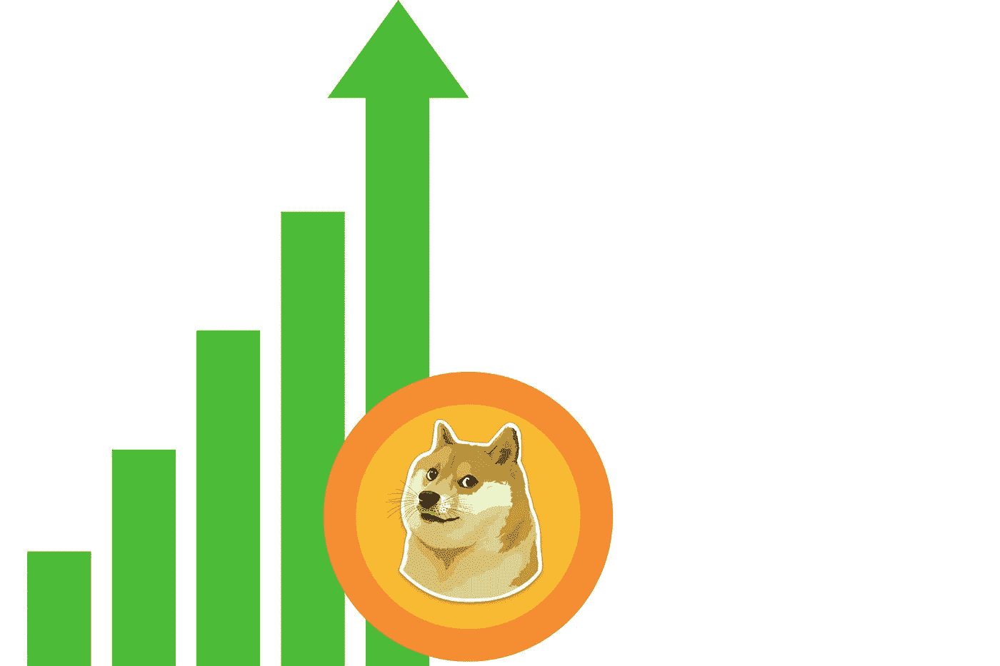

# 2023 年柴犬和 DogeCoin 还算好投资吗？

> 原文：<https://medium.com/coinmonks/are-shiba-inu-and-dogecoin-still-good-investment-for-2023-ca27e839273a?source=collection_archive---------31----------------------->

Source photo [Dogecoin Creșterea Prețului — Imagine gratuită pe Pixabay](https://pixabay.com/ro/illustrations/dogecoin-cre%c8%99terea-pre%c8%9bului-dogecoin-6256417/)

# 柴犬(SHIB)

很难否认柴犬不是有史以来最好的迷因硬币。在 2021 年加密货币牛市的背景下，柴犬的价格上涨了近 48，000，000%。

最近柴犬大踏步前进。柴犬不仅已经成为市值最高的加密货币，它还…