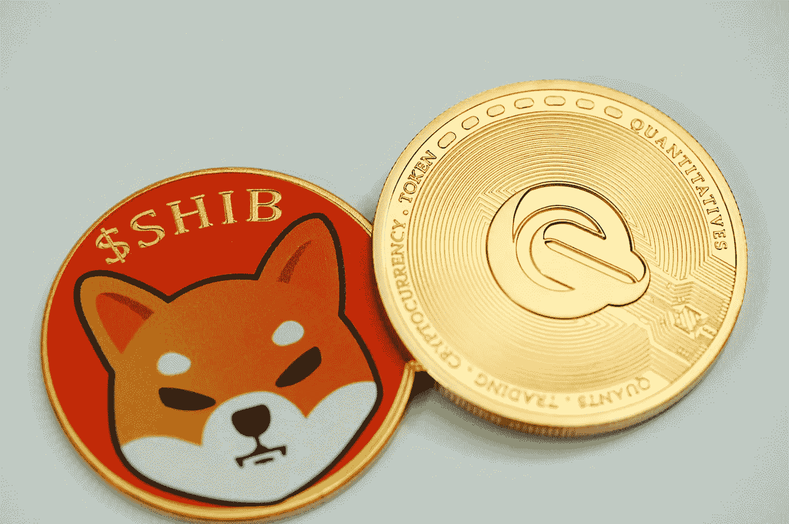

# 2022 年 11 月柴犬(SHIB)和 DogeCoin (DOGE)是好的投资吗？

> 原文：<https://medium.com/coinmonks/are-shiba-inu-shib-and-dogecoin-doge-a-good-investment-in-november-2022-cd3bbb37ee70?source=collection_archive---------10----------------------->

Source photo [HD photo by Traxer (unsplash.com)](https://unsplash.com/photos/aL7xbjJDZMc)

# 柴犬(SHIB)

由于其同名，柴犬(SHIB)品种已经获得了专门的粉丝群。使用以太坊(ETH)网络，meme-crypto 使用户能够从全球任何地方接收和存储令牌，同时不受审查。