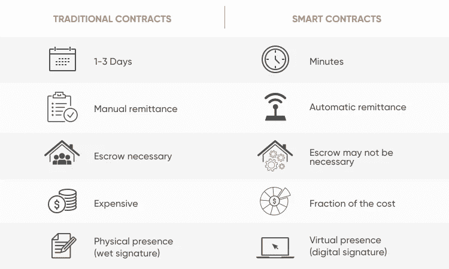

# 智能合约安全吗？

> 原文：<https://medium.com/coinmonks/are-smart-contracts-safe-ba94a4ef83d7?source=collection_archive---------12----------------------->

让我们从两个没见过面的人之间的交易开始。

我们听说过这样的故事，其中一方在失败后没有履行他们的赌注。假设两个网上的足球爱好者在一场正在进行的比赛中打了一个赌，赌输的一方要支付一定的金额，但最终赢了一方。解决这个问题的一个方法是有一个第三方，球迷 A 和球迷 B 将在比赛开始前把钱交给第三方，第三方将在比赛结束时把钱给获胜者。但是如果第三方带着钱跑了呢😭😭

这在网上交易中很常见，也是大多数人不接受与陌生人签订金钱协议的原因。

如果有一种方法可以让双方达成协议，而如果其中一方不符合合同标准，交易将无法完成，该怎么办…

让我们快速看一下什么是智能合约，然后回到我们的场景。

**什么是智能合同？**

智能合约是存储在区块链上的一组预定义条件(或协议),当且仅当函数调用方满足这些条件时，才会执行智能合约

> 交易新手？在[最佳加密交易](/coinmonks/crypto-exchange-dd2f9d6f3769)上尝试[加密交易机器人](/coinmonks/crypto-trading-bot-c2ffce8acb2a)或[复制交易](/coinmonks/top-10-crypto-copy-trading-platforms-for-beginners-d0c37c7d698c)

**智能合约的特征**

1.  智能合约是不可变的:在部署到区块链后，它们不能被更改或改变
2.  智能合同是透明的:它们发布到区块链，任何人都可以阅读
3.  智能合约是用简单的术语编写的:开发人员倾向于使他们的代码库更小更简单，因为这使得部署成本更低。**在区块链部署智能合约成本高昂*

Difference between Smart contracts and Traditional contracts (also the benefits of smart contracts)

现在回到我们的场景，如果我们要使用智能合约提高双方之间的信任级别，预定义的条件将是:

如果 A 队赢了这场比赛，A 将得到 5 美元，否则 B 将得到 5 美元

如果游戏以平局结束，A 和 B 将各得到 2.5 美元。

现在，A 和 B 都将他们的钱存入智能合约(在本例中，每个将为 2.5 美元)，一旦匹配结束，智能合约将根据匹配结果执行交易(没有任何人提醒它该做什么)…酷吧？

我认为这也很酷，如果在线交易者可以实现这一点，我会很高兴😁，我是那些由于不可预见的骗局而不在网上买东西的人之一。

但现在问题仍然出现在用户中，智能合约安全吗？

仅在加密领域，2021 年就有近 20 亿美元遭到黑客攻击。

我知道使用智能合约会有两种损失

**智能合约错误:**有一个我喜欢用的流行说法，它说:

> “聪明的合同和写合同的人一样聪明”。

让我们再次使用我们的赌博场景

想象一下，如果编写合同的开发人员在部署合同时没有编写函数，该函数告诉合同根据哪一队获胜将钱转移到 A 队或 B 队，但他编写了一个函数来处理比赛以平局结束的情况。

如果 A 队最终获胜，智能合约不会做任何事情，因为它没有被告知如果 A 队获胜要做什么。让我们也记住，智能合同是不可变的，所以一旦部署就不能更改，也许开发者将不得不支付 5 美元😀。

**智能合约黑客:**是的智能合约可以被黑😪。如果智能合约包含一个错误(代码错误)，黑客就更容易得手，这就是为什么智能合约开发者需要在将代码上传到区块链之前彻底检查它们

> 应用程序错误不仅会让攻击者窃取金钱，还会影响应用程序的不同功能…

那么回到“智能合约安全吗”这个问题？

根据你刚刚读到的内容，我想听听你对这个问题的想法或答案。(在意见征询环节)