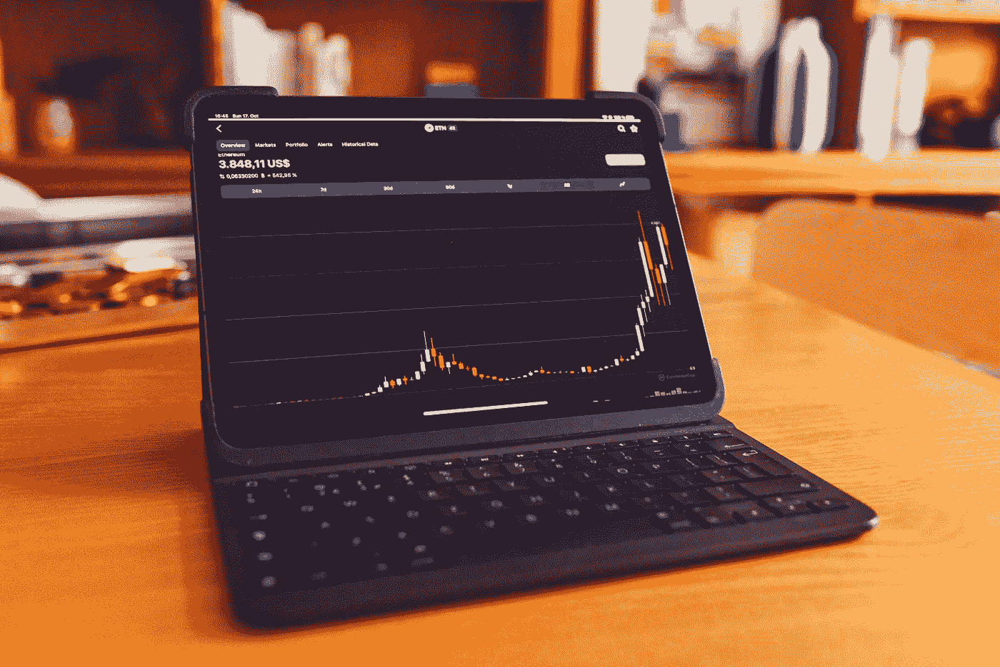

# 索拉纳(SOL)和卡尔达诺(ADA)是 7 月份的好投资吗？

> 原文：<https://medium.com/coinmonks/are-solana-sol-and-cardano-ada-a-good-investment-in-july-a9aaeab3545c?source=collection_archive---------23----------------------->

Source photo Unsplash.com

# 茄属植物

由于以太坊的缓慢，投资者将被吸引到索拉纳而不是以太坊本身(SOL-USD)。使用该系统，每秒 65，000 次交易在理论上是可能的。这使得它成为以太坊继承者宝座的竞争者。索拉纳的真实 TPS 数值一直稳定在 2000 左右。有了交易…