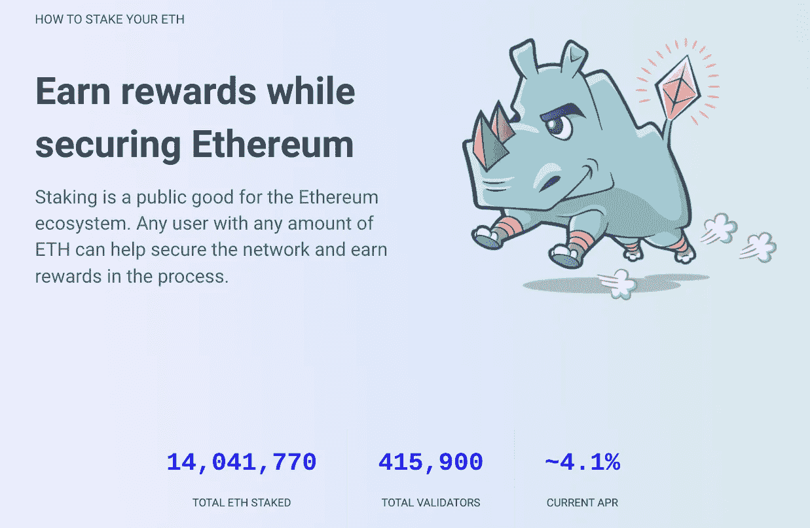

# 气候索赔附加到未来的 ETH '合并'合法吗？

> 原文：<https://medium.com/coinmonks/are-the-climate-claims-attached-to-coming-eth-merge-legit-24653b250583?source=collection_archive---------29----------------------->

Image Credit: [Valentin Kold Gundersen](https://www.flickr.com/photos/128502164@N07/)

几个月来，我一直在抨击加密货币市场的能源密集型商业模式，尤其是创造迄今为止最具生产力的加密产品所涉及的能源消耗；它的不可替代令牌，或 NFT。事实上，我上周报道过这个话题，是关于蒂芙尼公司推出的 NFTtiffs 和 18k 金吊坠，这些吊坠只提供给目前的隐朋克 NFT 所有者。正如我在那篇文章中总结的那样，1250 万美元购买了大量的碳补偿，但我们真的会相信购买碳补偿或风力补偿会阻止气候变化吗？

也许我在蒂芙尼的帖子里有点害羞？也许我隐瞒了一些有趣的事情；从气候变化的角度来看，加密技术的发展真的可以改变现状吗？你听说过以太坊(ETH)即将与*合并*的传闻吗？显然，在 9 月份，ETH 将从目前高能耗的区块链验证方式(工作证明)转变为能耗降低 99%的利害关系证明(PoS)方式。

Prysmatic Labs [的 ETH 协议开发人员 Terence Tsao 说](https://spectrum.ieee.org/the-merge-heralds-cryptos-climate-friendly-future)“合并后，以太坊将使用至少 99%的能源，这更接近解决一个重要的批评，即加密对环境的影响。以太坊渴望权力的日子很快就会屈指可数。”

从 ETH 的能源使用量中减去 99%就相当于在当前对抗气候变化的战争中取得了重大胜利。你知道吗，以太坊(ETH)目前的区块链设置，即工作证明模型，每年的碳足迹[相当于香港的](https://www.geekwire.com/2022/amazon-vet-flips-nft-model-on-its-head-creates-a-climate-friendly-marketplace-for-digital-art-sales/)规模，或者剑桥大学有一个[能源消耗追踪器](https://ccaf.io/cbeci/index)，根据追踪器，比特币每年消耗的能源比芬兰、比利时或菲律宾还多。

这似乎有点多，是吧？但是，通过将 ETH 和 all crypto 转移到一个利益证明模型中，加密行业不仅可以消除这一可怕的气候变化污点，还可以鼓励消费者更深入地采用数字货币。

“当期待已久的合并发生时，我们可能会看到更多有环保意识的用户，”曹说。

## **什么是股权证明？**

从技术上讲，股权证明(PoS？！)被 Ethereum.org 定义为“*一种类型的* [*共识机制*](https://ethereum.org/en/developers/docs/consensus-mechanisms/) *被区块链用来实现分布式共识。在工作证明中，矿商通过消耗能源来证明他们的资本处于风险之中。在股权证明中，验证者明确地将以太形式的资本投入到以太坊的智能合约中。*”

当我第一次读到这个定义时，我立刻又读了一遍，又一遍。这就像从金融角度阅读一门外语。这个定义还指出，“*这个被支撑的以太然后作为抵押品，如果验证者行为不诚实或懒惰，它可以被摧毁。*

根据 ETH 的说法，[通俗地说，PoS 模式提供了以下好处。](https://ethereum.org/en/upgrades/merge/)

*   *更高的能效*
*   *降低进入门槛，降低硬件要求*
*   *降低集中化风险*
*   *由于能源需求较低，为鼓励参与，需要发放较少的 ETH*
*   *与工作证明相比，对不当行为的经济处罚使 51%风格攻击对攻击者来说成本成倍增加*

联邦理工学院声称*合并*将会降低上述要点中的准入门槛，但现实是准入门槛相当高。为了成为一个验证者，你必须向保证金合同中存入 32 ETH(58，938 美元)，然后在他们的私人电脑上运行三个独立的软件，好的软件并不便宜。当他们这么做的时候，我建议增加第四个软件——反洗钱和 KYC 软件解决方案。它也不便宜，但是它会使验证者的生活变得容易得多。

在 PoS 模型中，验证者在确定不诚实或懒惰行为投资者行为方面承担大量责任。然而，就像气候变化一样，为了遏制这一趋势，我们所有人都必须承担一定程度的个人责任。也就是说，监管对个人 ETH 投资者来说是一个很大的负担，他们也是密码爱好者，只是为了帮助发展 ETH 社区和/或影响气候变化而承担这些验证者的角色。当然，作为验证者有经济上的原因(见下图中的年利率%),但与在一个基本上是前沿的市场中作为验证者所获得的满足感相比，这些似乎是苍白的。

如果你想注册成为验证者，或者想了解更多，只需[点击这里](https://ethereum.org/en/staking/)。我认为，那些敢于冒险的人不仅会从充当验证者中获得经济上的好处，还会在精神上认识到，他们正在支持一种分散的金融形式，这种形式不会耗尽地球的能源供应，也不会用过量的碳排放污染她的大气。*合并*是创新的缩影——利用技术解决我们自己无法解决的人类问题。POS 解决方案非常智能，应该应用于当今使用的每一种加密货币硬币。

*   结束

> 交易新手？试试[密码交易机器人](/coinmonks/crypto-trading-bot-c2ffce8acb2a)或[复制交易](/coinmonks/top-10-crypto-copy-trading-platforms-for-beginners-d0c37c7d698c)