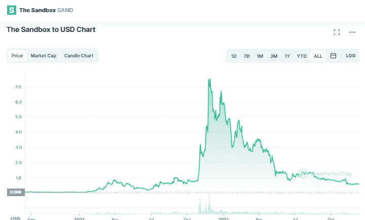

# 沙盒(SAND)和 Axie Infinity (AXS)是好的投资吗？

> 原文：<https://medium.com/coinmonks/are-the-sandbox-sand-and-axie-infinity-axs-a-good-investment-e91beb73d46b?source=collection_archive---------27----------------------->

# 沙箱(沙子)

Source photo [The Sandbox price today, SAND to USD live, marketcap and chart | CoinMarketCap](https://coinmarketcap.com/currencies/the-sandbox/)

选择一个现实生活中的沙盒，沙盒中的玩家可以在 3D 虚拟世界中创建他们喜欢的任何东西。为了方便起见，我们将 NFT 称为“沙箱”，实际上代表了数百个独立的数字地块。在沙盒中，沙子代币可以用来购买土地和其他游戏资产…