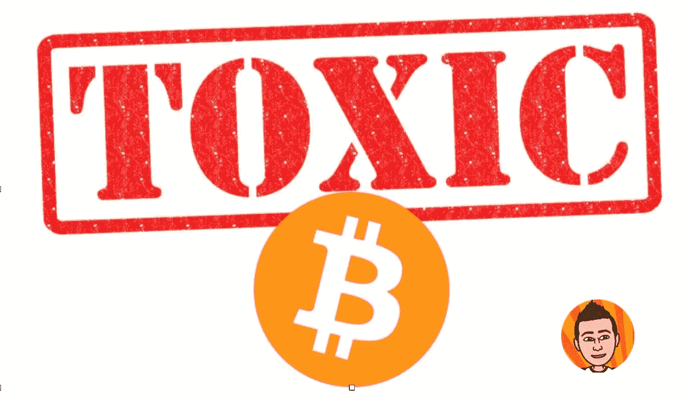

# 比特币正在被极大主义摧毁吗？

> 原文：<https://medium.com/coinmonks/are-toxic-maxis-poisoning-bitcoin-22fa4b7949b1?source=collection_archive---------19----------------------->

似乎每当你上网处理密码的时候；你会遇到两组人。比特币马克西派，他们认为比特币是最好的，人们应该只拥有比特币。他们认为所有其他的硬币都是“狗屎硬币”最铁杆的比特币最大化主义者通常被称为有毒的最大化者。还有一群在 crypto 工作的人不是这样的。他们倾向于…