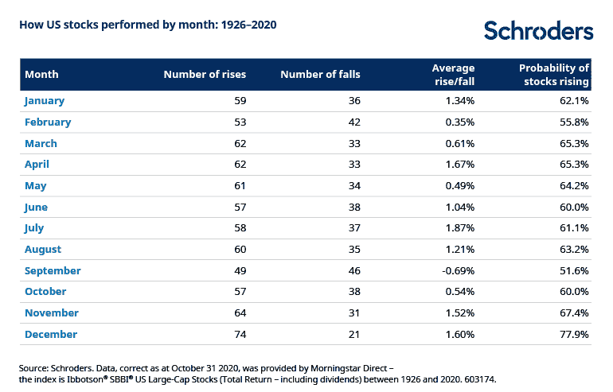
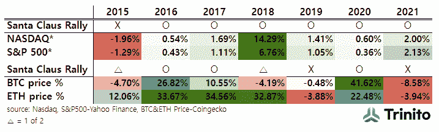

# 我们今年会有秘密圣诞老人集会吗？

> 原文：<https://medium.com/coinmonks/are-we-going-to-get-crypto-santa-claus-rally-this-year-2ab6d2588cfc?source=collection_archive---------14----------------------->

经过一年来一系列的熊市催化剂和看不到明显的牛市事件后，投资者和交易者转向善良的老圣诞老人寻求年终礼物。因此，我们研究了这个想法，看看它是否可能在加密。

## 什么是圣诞老人集会？

圣诞老人的概念可以宽泛地定义为“由于圣诞节假期前后的日历效应，股票市场出现反弹。”

Image created by [DALL·E 2](https://openai.com/dall-e-2/)

股票市场真的会在年底反弹吗？是啊！几乎一百年的历史研究都是这么说的。施罗德研究显示，自 1926 年以来，美国股市 12 月份有 77.9%的时间录得正回报。

[US Stocks Monthly Performances 1926–2020, Schroders]

## **中的*怎么样？***

我们以比特币和以太坊为例。我们将圣诞老人集会期定义为 12 月 22 日至 1 月 2 日，并将比特币和以太坊的表现与 2015 年以来的市场基准进行了比较，如下所示。如果日期在周末，则使用第二天的收盘价。

[Bitcoin Christmas Performances 2015–2021, Trinito]

我们使用纳斯达克和标准普尔 500 的收盘价，以及 CoinGecko 的 00:00:00 UTC 比特币和以太坊价格。

自 2015 年以来，比特币有 43%的时间录得正回报，以太坊有 71%的时间录得正回报。在同一时期，纳斯达克和 S&P500 在 86%的案例中取得了正回报。样本量很小，过去的数据不能代表未来的表现，但比特币和以太坊的圣诞老人集会命中率低于传统股票市场。在比特币和以太坊之间，以太坊出现圣诞老人集会的几率高了 28%p。

## **时代的市场情绪**

**2017:比特币创历史新高——**尽管美联储加息，比特币和以太坊全年保持上涨。密码市场仍然主要由零售驱动，市场的兴奋可以被视为密码市场的茶杯中的风暴。

**2018 年:比特币已死——**比特币创下了其交易历史上最糟糕的日历年表现之一，被许多专家宣布已死，并被放回一个由小众计算机工程极客和自由主义者组成的不起眼的地方。美联储在 2018 年下半年四次加息，标准普尔 500 指数从年中峰值下跌超过 15%。

**2019:降息—** 比特币暴跌，2019 年中期反弹的涨幅超过一半。在特朗普和 Xi 政府执政期间，美中贸易战全年都在升级，而标准普尔 500 指数创下历史新高。

**2020 年:印钞和大规模采用—**12 月，比特币打破了 2017 年创下的前期高点。在美联储高通胀货币政策的背景下，机构投资者进入加密市场的预期隐约可见，美联储为应对新冠肺炎危机印刷了 3 万亿美元。许多专业投资者开始将加密视为一种新的技术/宏观资产类别。

**2021 年:美联储鹰派支点——**经过抛物线反弹，在短短一年内成为 3 万亿美元市值的资产类别，4 倍，加密市场令人兴奋，挤满了散户日内交易者和后来者。美联储在猖獗的通货膨胀问题上的立场，并宣布未来的鹰派货币政策。

## 【2022 年 12 月

2022 年，宏观范式向鹰派政策的转变继续全面展开。12 月，美联储再次确认了其反对通胀的强硬货币政策立场。日本央行上调了 10 年期目标利率，引发了历史性的市场反应。

持续了一整年的流动性紧缩和信贷危机仍在继续。币安、泰瑟和 DCG 是少数几个财务状况受到投资者质疑的公司。

认为任何市场都会永远上涨或下跌，这对任何投资者都没有帮助。如果一个价格持续下跌很长时间，它会找到一个愿意积累的买家，开始新的市场周期。我们已经看到 2022 年密码市场全年都在下滑，在 2021 年的兴奋期之后也是如此。流动性危机和信贷紧缩将许多过度杠杆化或管理不善的参与者挤出了市场。不管年底的短期日历效应如何，加密市场迟早会在某一点触底。

由 Trinito 投资主管 SungPil Huh 撰写，Trinito 合伙人 Jiyon Kim 供稿。

#圣诞#圣诞节#加密货币#比特币#以太坊#牛市#熊市# marketcycle #科技#加密

**链接**

[https://www . schroders . com/en-GB/uk/intermediary/insights/Santa-rally/](https://www.schroders.com/en-gb/uk/intermediary/insights/santa-rally/)

[https://www . Forbes . com/sites/qai/2022/12/14/theres-a-a-779-chance-of-a-a-Santa-rally-in-December 根据历史/](https://www.forbes.com/sites/qai/2022/12/14/theres-a-779-chance-of-a-santa-rally-in-decemberaccording-to-history/?sh=667b4bf774e0)

[https://www . CME group . com/open markets/finance/2020/the-history-of-the-Santa-Claus-rally . html](https://www.cmegroup.com/openmarkets/finance/2020/the-history-of-the-santa-claus-rally.html)

[https://www.investopedia.com/terms/s/santaclauseffect.asp](https://www.investopedia.com/terms/s/santaclauseffect.asp)

https://www.nasdaq.com/market-activity/index/comp

【https://finance.yahoo.com/quote/%5EGSPC/ 

[https://www.coingecko.com/](https://www.coingecko.com/)

**免责声明**

这不是投资建议，仅供参考。您不应将任何此类信息或其他材料理解为法律、税务、投资、财务或其他建议。

> 交易新手？尝试[加密交易机器人](/coinmonks/crypto-trading-bot-c2ffce8acb2a)或[复制交易](/coinmonks/top-10-crypto-copy-trading-platforms-for-beginners-d0c37c7d698c)
> 
> 多样化的密码持有，了解币安的选择
> 
> 加入 Coinmonks [电报频道](https://t.me/coincodecap)和 [Youtube 频道](https://www.youtube.com/c/coinmonks/videos)获取每日[加密新闻](http://coincodecap.com/)

# 另外，阅读

*   [复制交易](/coinmonks/top-10-crypto-copy-trading-platforms-for-beginners-d0c37c7d698c) | [加密税务软件](/coinmonks/crypto-tax-software-ed4b4810e338)
*   [网格交易](https://coincodecap.com/grid-trading) | [加密硬件钱包](/coinmonks/the-best-cryptocurrency-hardware-wallets-of-2020-e28b1c124069)
*   [密码电报信号](/coinmonks/top-3-telegram-channels-for-crypto-traders-in-2021-8385f4411ff4) | [密码交易机器人](/coinmonks/crypto-trading-bot-c2ffce8acb2a)
*   [最佳加密交易所](/coinmonks/crypto-exchange-dd2f9d6f3769) | [印度最佳加密交易所](/coinmonks/bitcoin-exchange-in-india-7f1fe79715c9)
*   [面向开发者的最佳加密 API](/coinmonks/best-crypto-apis-for-developers-5efe3a597a9f)
*   最佳[密码借贷平台](/coinmonks/top-5-crypto-lending-platforms-in-2020-that-you-need-to-know-a1b675cec3fa)
*   [免费加密信号](/coinmonks/free-crypto-signals-48b25e61a8da) | [加密交易机器人](/coinmonks/crypto-trading-bot-c2ffce8acb2a)
*   [杠杆代币的终极指南](/coinmonks/leveraged-token-3f5257808b22)