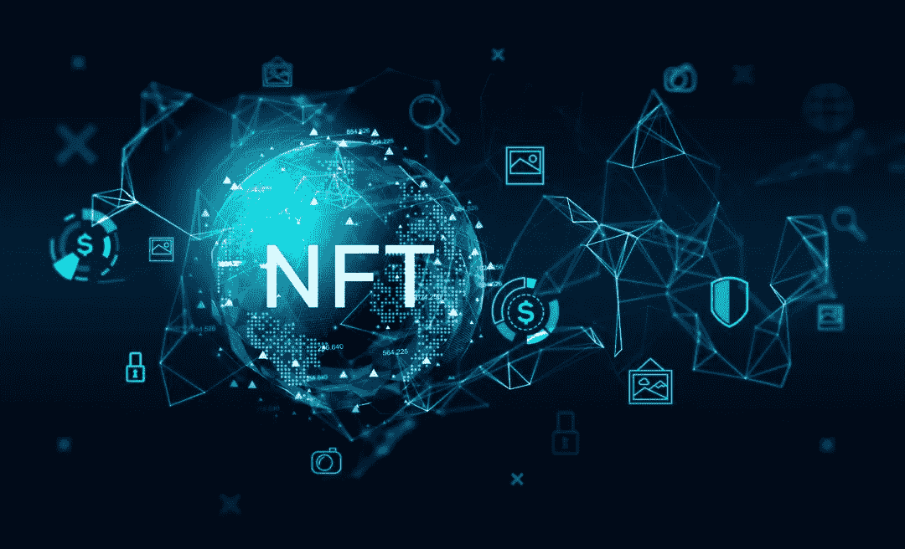

# 我们为 NFT 主流化做好准备了吗？

> 原文：<https://medium.com/coinmonks/are-we-ready-for-an-nft-mainstreaming-185af1c795f1?source=collection_archive---------26----------------------->

不可替代令牌是加密货币中的一个细分市场，一直以来都受到业内外人士的不同意见。自从它在 2021 年初被提到最前沿以来，对于它们的可接受性似乎没有一个均匀的意见。

虽然有些人认为这只是一个很快就会过去的狂欢，但其他人对其潜力感到强烈，认为它将如何改变不同的行业，并进一步为跨部门的流程带来问责制。

最近，NFT 的用例出现了高峰，成功地从静态图像(JPEGs)和数字艺术过渡。今天，NFT 在体育、供应链(流程跟踪)、房地产(细分的 NFT 和数字所有权)和管理等领域都有用例。

根据长期以来取得的成果，我们是否可以说，我们已经准备好将 NFT 纳入主流？这篇文章的目的是看看最近非功能性测试的事件，如果我们在全球范围内采用非功能性测试，得出一个结论。

# 一些值得注意的事件

我将把我的注意力从更受欢迎的事件上转移开，例如宇迦实验室收购 Meebit 和 Crypto Punks，在这里我将讨论一些接近真实世界的事件，并涉及著名的合作伙伴和有影响力的组织。

我讨论的两个事件中的第一个是由世界水上运动组织机构 FINA 发起的。早在 6 月，就在第 19 届世界游泳锦标赛开幕前，FINA 宣布将向打破世界纪录的运动员颁发 NFT 奖。该公司宣布，这项工作将与匈牙利数字艺术家 Krizbo 合作完成。

作为这一承诺的证明，意大利游泳运动员 Thomas Ceccon 和匈牙利游泳运动员 Kristof Milak 因实现这一里程碑而被授予[有史以来第一个 NFT 奖](https://nftnewstoday.com/2022/06/28/world-record-breaking-swimmers-receive-nfts-along-with-50000-in-prizes/)和 5 万美元奖金。

这标志着 NFTs 的发展、采用和主流化的一个重要的全球里程碑。这一里程碑的意义远远超过它在 NBA 的采用，因为它标志着一个国际组织首次进军 NFT。

第二件值得注意的事情发生在克里斯蒂亚诺罗纳尔多和币安最近的合作中。罗纳尔多已经是世界上最受欢迎的足球运动员之一，为英格兰、西班牙和意大利的一些顶级球队效力过。通过合作，预计将发布新的 NFT 系列，进一步建立球员和他的粉丝之间的联系，并展示他最具标志性的表演。

虽然这看起来很正常，但这里的要点在于克里斯蒂亚诺·罗纳尔多在 20 多年的职业足球生涯中积累的全球球迷基础，以及这如何能够超越大多数球迷的大众接受(通过购买和转售)。

这还不算币安如何成功地为意大利足球俱乐部 SS 建立了 NFT 票务中心。拉齐奥，连同它与波尔图的现有关系，以及巴西和阿根廷足协。

# 尚未展开

国际足球协会联合会(FIFA)和加密项目之间正在进行一场浪漫史，这可能最终导致 NFTs 的采用。虽然这还不在考虑范围之内，但国际足联支持加密的立场在最近已经很明显了。

首先，该机构与 Crypto.com 合作，成为其在 T2 的官方加密交易平台，并成为 2022 年卡塔尔世界杯的赞助商。此外，国际足联最近与区块链平台摇摆不定，阿尔格兰德与阿尔格兰德宣布作为其官方区块链和钱包解决方案平台。阿尔格兰德还有望成为国际足联在北美和欧洲的官方赞助商，以及 2023 年女足世界杯的官方赞助商。

尽管尚未明确表态，但全球足球机构跳上 NFT 列车只是时间问题。

# 结论

在全球范围内采用非功能性测试在很大程度上取决于具有全球影响力的机构和组织的采用率。FINA 和国际足联已经为这种可能性奠定了基础，这个梦想成为现实只是时间问题。