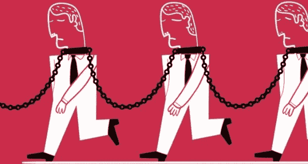

# 你被剥削完了吗？

> 原文：<https://medium.com/coinmonks/are-you-done-being-exploited-yet-7ffc8e2ae2c7?source=collection_archive---------40----------------------->

无剥削未来的解决方案！

如果你有一部手机，你已经看到了足够多的媒体证据，证明了过去 50 年来社团主义雇主从工人身上致富。华尔街的股东享受了所有的好处，仅仅是因为他们用一些假的法定货币换取了股票。却从不贡献任何有价值的东西。为什么我们允许资本“投资者”像吸血鬼一样，从企业中榨干工人和客户创造的所有价值？

是时候结束裙带社团主义者对人类的剥削了！显而易见，世界各地的政府不再是人民的公仆，而是企业的公仆！如果你怀疑这一观察，看看任何政府预算，看看钱去了哪里。想要更多的证据，看看是谁在资助政客的事业！是社团主义者拥有我们的政府！

既然我们已经确定了问题和敌人是谁，那么让我们继续讨论解决方案。

C3 联盟是世界上第一个 Web 3.0 合作协会。我们的使命是结束全球贫困和人类剥削！我们如何完成这项任务很简单。**我们通过合作资本社区共同拥有**。

你可能正在为最后一句话挠头。所以我来详细说明一下。想象一下…

第一阶段:我们创建一个移动应用程序，它有一个会员对会员的资本交易市场(想想 Coop 版本-Ebay+UpWork+AirBnb)，一个安全的会员加密钱包(想想-信用合作社账户，但用于加密资产)，以及一个标记会员经济活动(赞助)的造币厂。将所有这些加在一起，您就拥有了 C3 联盟，这是世界上第一个使用区块链技术的合作法律结构，便于成员共同拥有它。

第二阶段:一旦我们完成了移动应用程序，我们就要着手消除邪恶的社团主义者！我们称之为我们的 [#Corp2Coop](http://corp2coop.com) 转化策略。通过使用合作社的法律结构和非营利基金会，我们可以为中小型公司转化为成员所有的合作社创造有利的机会。

[【C3P】发起人池](http://c3alliance.social/c3p)是我们如何通过创建一个合作资本投资者池来资助[社区发展项目](https://c3alliance.medium.com/we-all-want-a-better-tomorrow-ea19805042a1)来结束人类剥削。如收购[经济适用房、](https://c3alliance.grooveblog.com/post/the-ultimate-solution-for-affordable-housing)平价食品、职业培训企业等。要了解更多关于[C3P]推广机会的信息，请访问[C3Alliance.Co/C3P](http://C3Alliance.Co/C3P)

第三阶段:将它推向全球！我们可以在全世界发展合作资本社区。我们的 C3 社区将通过为全世界带来食物、住所和工作机会来结束全球贫困！任何有手机的人都可以进入我们的社区并成为会员。

如果您愿意加入我们的使命，请考虑向**C3 联盟基金会[捐赠](http://c3alliance.co/donate)。该基金会是一个总部设在德克萨斯州/美国的 501(c)3 慈善机构，特许用于社区发展项目。[捐赠页面](http://c3alliance.co/donate)**

**请考虑加入我们的 [Coop 社区电子邮件摘要](http://c3alliance.co/digest)以接收更新。订阅[C3Alliance.co/Digest](http://c3alliance.co/digest)**

**我们的主页是[C3Alliance.Co](http://c3alliance.co)**

> **交易新手？尝试[加密交易机器人](/coinmonks/crypto-trading-bot-c2ffce8acb2a)或[复制交易](/coinmonks/top-10-crypto-copy-trading-platforms-for-beginners-d0c37c7d698c)**