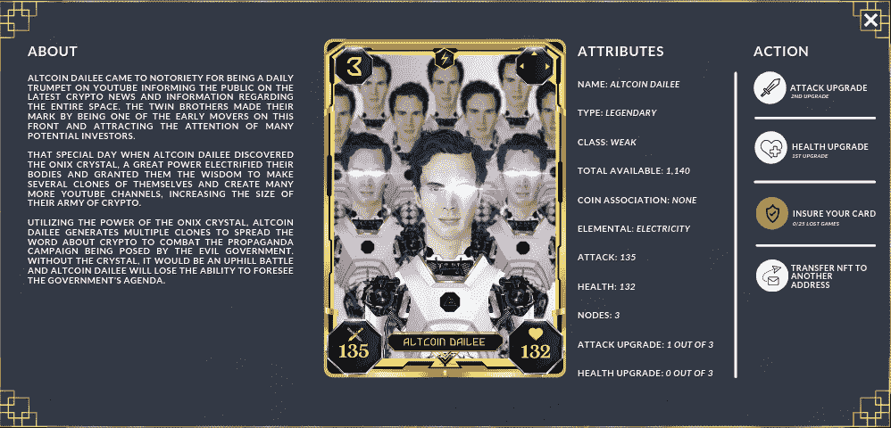
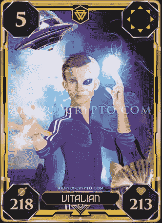

# 加密大军——2022 年将推出新的“玩即赚”NFT 游戏

> 原文：<https://medium.com/coinmonks/army-of-crypto-new-play-to-earn-nft-game-coming-in-2022-2bd3de2bc001?source=collection_archive---------11----------------------->

2022 年 7 月 8 日

# 密码交易纸牌游戏大军

开发工作仍在继续，即将发布的《密码大军》(Army of Crypto)是一款在 Onixcoin 区块链上推出的交易卡游戏，专为独立游戏开发者设计。这个游戏使用区块链社区的杰出人物作为每个角色的灵感，以及军队背后的故事。游戏的主题是基于政府和加密军队之间的激烈战斗，谁应该控制数字经济和这一革命性技术的发展方向，集中或分散或两者兼而有之。游戏中的每个角色都有一个独特的故事、艺术作品、能力和统计数据，这些都将由一张存储在区块链网络上的数字收集卡以不可替代的令牌(NFT)的形式来表示。NFT 的所有权被记录在区块链的分布式账本中(*这个过程通常被称为* ***铸币*** )，可以由所有者进行转让，允许 NFT 进行出售和交易。

游戏将是免费的，每个玩家都可以通过完成每天的竞技场挑战来获得随机的一副牌，以赚取游戏中的货币(赫兹)。作为免费玩家使用的牌组中的牌不是 NFTs，不能出售或交易。免费玩的用户将有数量有限的竞技场战斗，他们可以赚取赫兹。每天你都有机会通过参与竞技场来赢取赫兹。然后，您可以使用赫兹来换取 ONIX(*ONIX coin 区块链的原生币*)来购买自己的高级卡牌，以增加您的权力。

拥有高级可收集卡(NFT)可让您访问游戏中的更多功能，例如传奇战役，您可以赢得更多赫兹代币，以及每场战役下注/下注最多 2 张高级卡(NFT)的机会。NFT 卡可以升级，以增加统计数据和提高战斗中的成功率。将有几个成就，每个球员可以完成，以赚取奖励和赫兹。赫兹代币可以换成 ONIX，ONIX 可以用来从 Onixcoin 市场购买高级卡副，或者换成您想要的货币。

> 交易新手？尝试[加密交易机器人](/coinmonks/crypto-trading-bot-c2ffce8acb2a)或[复制交易](/coinmonks/top-10-crypto-copy-trading-platforms-for-beginners-d0c37c7d698c)

该游戏还将有一个独特的功能，从 twitter 平台上选择的信息将被提取到游戏中，并内置聊天功能，以便与朋友交流。该数据将用于查看在给定日期哪些硬币/代币有趋势，以在硬币/代币有趋势的给定时间段内给你的加密大军增加统计数据。您可以使用聊天功能轻松主持战斗并邀请您的朋友来玩。

这些战斗可以是私人的，而进入需要密码，密码由发起者设置。当隐私未设置时，任何符合要求的人都可以加入战斗。战斗按“类型”分类，包括士兵、将军和传奇，你需要拥有一张与“战斗类型”相关的可收集的卡片，例如传奇，才能进入战斗。魔法卡是第四种卡，它们可以在战斗中给你的军队带来急需的优势。找到正确的卡牌组合来创造一个胜利的战略将需要创造力和经验。

Alpha 版本将于 2022 年第四季度发布，用于网络浏览器，Onixcoin Marketplace 将于第三季度推出，用于购买和交易“加密大军”的高级收藏卡(NFT)。您可以通过关注 AOC 社交平台上的 [Twitter](https://twitter.com/thearmyofcrypto?s=20&t=hraKwD5cAH7ANydw72gDIA) 、 [Instagram](https://www.instagram.com/armyofcrypto/) 、 [Discord](https://discord.gg/22RrdfK9Bb) 、 [Telegram](https://t.me/armyofcrypto) 和 [Reddit](https://www.reddit.com/user/Onixcoin_Blockchain) 或[on exco in 网站](https://onixcoin.io/)或 [Medium](/@onixcoin_blockchain) 了解更多信息。

加入 [Onixcoin 社区](https://t.me/onixcoin_io),尽早接触加密游戏大军，并有机会在 Onixcoin 市场的首次 NFT 发布中被列入白名单。Onixcoin 区块链通过为首次用户精心设计的用户界面/UX，为游戏提供了一个负担得起、快速和安全的网络。Onixcoin 区块链混合使用比特币的核心安全功能以及 EVM 的智能合约功能，为游戏平台提供完美的平衡。你可以在没有任何锁定期的情况下持有你的 ONIX 来被动赚取，锁定期可以随时撤销。您目前可以使用 BTC、LTC、USDC、USDT 或 ETH 在 [Xeggex 交易所](https://xeggex.com/markets)或[区块链金融 P2P 交易所](https://blockchainfinancial.com/exchange?offset=&all=&type=&minor=ONIX&market=&pclass=)购买 ONIX。

观看 youtube 上对 Onixcoin 首席执行官的采访，谈论 Onixcoin 平台和即将推出的内容创作者“ [CRYPTO with KLAUS](https://www.youtube.com/c/FamilyHobbiesandCards) ”的加密游戏大军。随着即将出台的法规和恶劣的经济条件导致市场情绪大幅下降的消息传出，Onixcoin 认为这是一个机会，可以让他们低头专注于发展，因为他们知道大多数不良行为者将被淘汰，从而为真正的项目留下一个在该领域获得积极曝光的公平机会。区块链游戏已经存在，我们才刚刚开始真正的创新之旅。区块链游戏/元宇宙将是散户投资者采用加密技术的主要驱动因素，Onixcoin 很高兴参与这一进程。