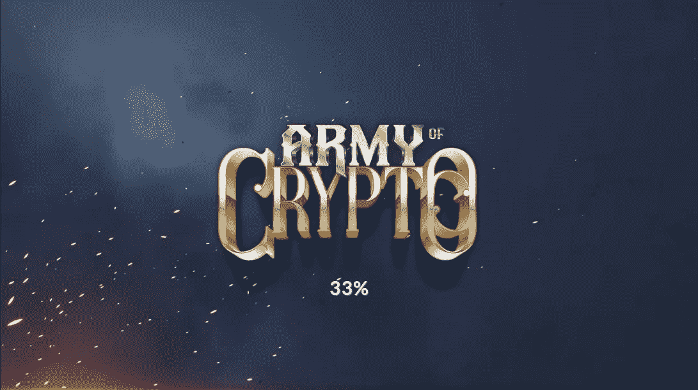
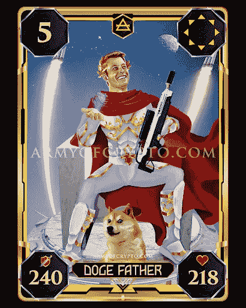
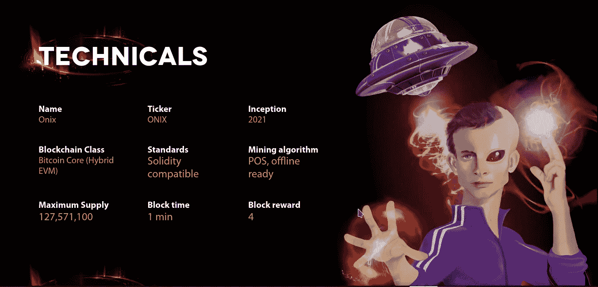
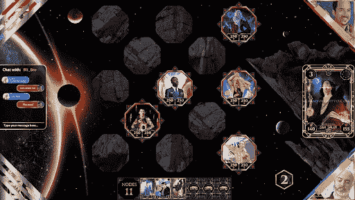
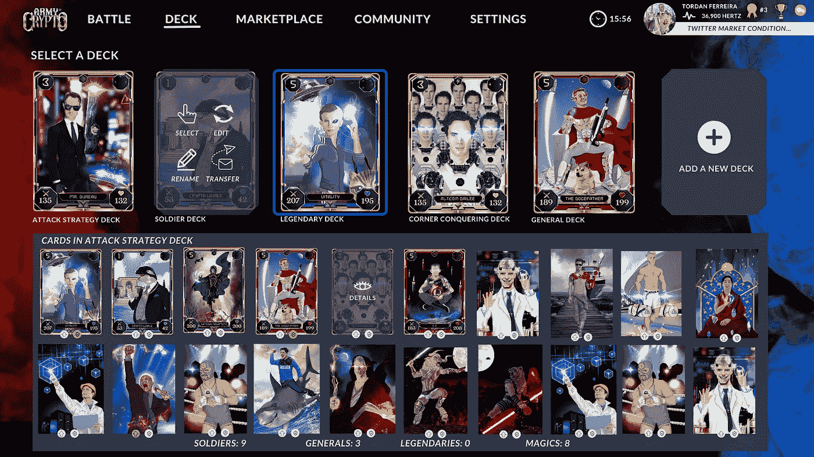
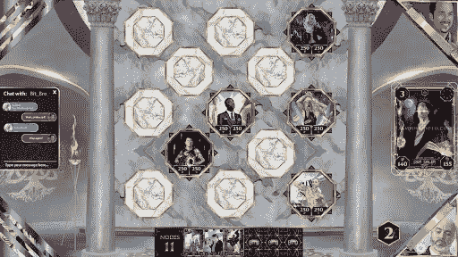
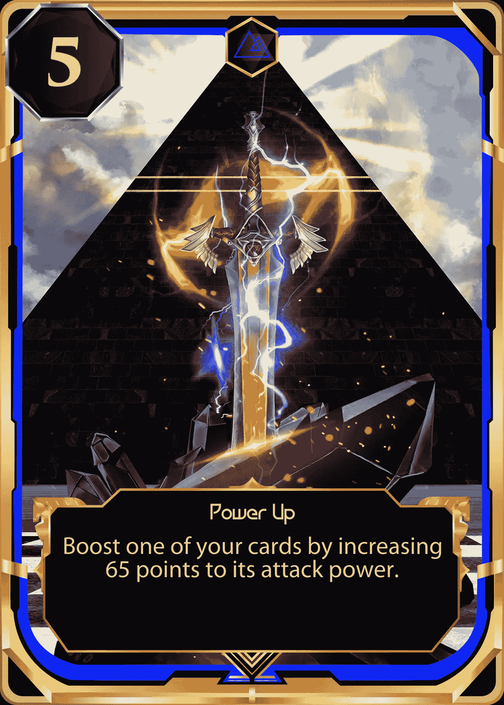
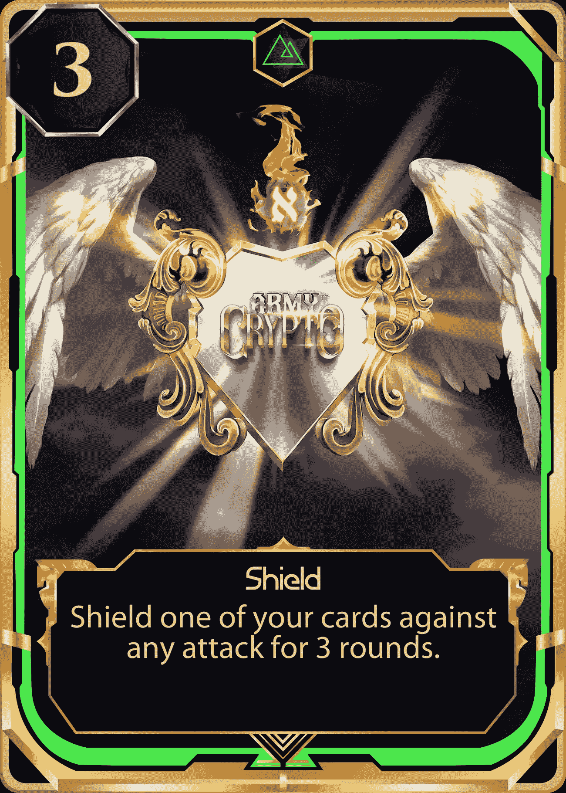

# 加密交易卡游戏大军将点亮 Web3 游戏空间

> 原文：<https://medium.com/coinmonks/army-of-crypto-trading-card-game-set-to-light-up-the-web3-gaming-space-48e16f2f5fc1?source=collection_archive---------44----------------------->

# 什么是密码大军？

《加密大军》是一款新的角色扮演交易卡牌游戏，基于政府和人民之间争夺加密经济控制权的故事。故事开始于未来，政府已经控制了区块链网络，人民面临着一场重新获得经济自由的艰苦斗争。游戏中的几个角色是基于真实世界的人物，如埃隆·马斯克、迈克尔·塞勒、查尔斯·霍金森等。当两个人道主义者开始寻找躲避全球经济衰退的避难所时，一个神秘的声音将他们带到了一个陌生的地方，故事发生了转折。在探索新的地点时，人道主义者看到埋在泥土下的东西闪闪发光。当他们中的一个弯下腰去把它挖出来时，在接触到碎片时，一股能量涌入他的身体，揭示了被认为早已被遗忘的大量古代知识和力量。这个碎片就是 Onix 晶体。有了这种新的力量，难民和秘密部队可以向政府开战。

# 它是建立在哪个区块链上的？

Army of Crypto Game Board

《密码大军》建立在专门为独立游戏设计的 Onixcoin 区块链之上。区块链通过实施比特币核心安全功能以及利用以太坊虚拟机(EVM)的快速和可负担的交易来提供可靠的安全性。Onixcoin 区块链拥有最实惠的 NFT 部署铸造费用和连锁 NFT 市场，吸引了许多独立游戏开发商。这个平台是区块链游戏的主流，许多独立开发者正在利用 xcoin 提供的机会。

# 游戏规则是什么？

# 甲板结构和规则

这副牌至少由 12 张攻击卡组成。玩家选择 12 张攻击卡后，他最多可以选择 8 张魔法卡，每副牌最多 20 张。

士兵:最多 12 张牌

常规:最多 4 张卡

传奇:最多 2 张卡

魔法:最多 8 张卡

附言:魔法必须被限制在每类 2 个。

本质上，玩家只能和 12 名士兵进行一场战斗，没有任何将军、传奇或魔法。

# 游戏的第一个动作

游戏的主人总是正面，因为加入游戏的玩家总是反面。抛硬币，结果呈现给双方玩家。胜利者迈出第一步。

Army of Crypto Game Board

向玩家展示他牌组中的所有士兵，然后他选择三张士兵牌放在棋盘上。玩家将轮流把每张牌面朝下放在棋盘上。每个玩家放了 3 张牌后，游戏开始。

所有的牌都放在棋盘上后，骰子点数最高的玩家先开始游戏。然后，他从他的牌组(盲注)拿到 3 张牌，并拿到一个节点(魔法力)。有了这些，他就可以分析他手中的牌以及已经放在棋盘上的牌，根据他的策略选择最好的棋步。

# 如何在战斗中获得节点

玩家每轮将获得 1 个节点

召唤 1 名士兵需要 1 个节点

召唤 1 个将军需要 3 个节点

召唤 1 个传奇人物需要 5 个节点

使用魔法所需的节点数量在卡片上有详细说明

如果玩家击败了对手的牌，他将根据他击败的牌获得节点奖励。例:1 个败兵= 1 个奖励节点，1 个败将= 3 个奖励节点，1 个败将= 5 个奖励节点。

# 战斗的一般规则

游戏的主要步骤是:

玩家可以在棋盘上放一张牌(只能放一张)

玩家可以攻击

玩家可以移动

玩家可以通过

玩家可以使用魔法

“通过”只能在任何其他操作之前使用。

这些动作的组合也是可能的，除了移动和攻击或者攻击和移动。

# 卡片如何在棋盘上移动

一张牌可以在棋盘上按照箭头移动。该卡将从其原来的位置移动到一个箭头指向的空槽中。

PS:移动可以根据魔法卡来调整，总是按照箭头的方向。

# 魔法卡片

每轮牌可以使用一个以上的法术。如果一张牌被冻结，玩家可以用盾牌魔法保护它。

玩家可以使用任意多的魔法，只要他们有足够数量的节点。

每当一张卡攻击另一张有一个箭头朝后的卡时，就会触发一次反击，导致两张卡都受到伤害。

如果在一次反击后，两张卡都没有生命值，两张卡都将进入密室，两位玩家都将获得被击败的卡的节点。

# 传球规则

只要手里没有 6 张牌，玩家就可以通过他们的回合。一旦玩家达到手中牌的最大数量(6)，他有义务做一些除了通过他的回合之外的动作。

如果玩家一的回合刚刚开始，他手里已经有 6 张牌，他在该回合不会得到一张新牌，但会得到一个节点。

PS:玩家每过一次自己的回合，也会得到一个笔记。

一旦生命值被击败，卡牌将进入密室。

玩家可以看到对手在室内的牌

一旦玩家从房间中救出任何一张牌，这张牌仍然需要休眠一轮。

只有在使用魔法卡时，卡片才会被放回棋盘。根据魔法卡的规格，一些从密室中拿回来的卡的生命值和力量会下降。

当一个玩家击败了对手所有的攻击卡，他就赢得了这场战斗。获胜的玩家总是比他的对手拥有更多的“攻击卡”。

每场战斗的总回合数是 25(可能会改变)。当所有回合结束时，棋盘上剩余的牌将自动相互对战。玩家 A 的生命和力量总和将与玩家 b 的生命和力量总和对抗。

PS:总数将根据棋盘上的牌来计算，不包括手中剩余的牌。

如果在最后一场比赛后，双方都击败了对方，那么这场比赛被认为是平局，没有 NFT 可以退出。然而，两位玩家都分享了赫兹的奖励。

PS:必须查看游戏日志，确定游戏是否玩过。如果游戏日志的结论是这不是一个真实的游戏，那么玩家不会得到任何奖励，比赛也被取消。

“玩赢”模式将遵守以下规则:

赢得比赛的玩家将获得 20 赫兹的奖励，输的玩家将获得 10 赫兹的奖励。

玩家每天可以赚取的最大赫兹数是 100 赫兹。

PS:必须查看游戏日志，确定游戏是否玩过。如果游戏日志的结论是这不是一个真实的游戏，那么玩家不会得到任何奖励，比赛也被取消。

# 免费游戏模式

玩家将被允许玩“免费游戏模式”，在这种模式下他们不会使用 NFTs。在这种模式下，电脑会生成一副弱/中/强士兵和弱魔法师的牌。这些卡是托管在服务器上的，这使得他们可以在相同的模式下与其他玩家战斗。

## 免费游戏模式的详细信息:

玩家不会在免费模式下使用真正的 NFT 来玩游戏。每当玩家以这种模式进入战斗时，他会获得由服务器随机生成的卡片，这允许他们进行比赛。PS:比赛结束后，玩家不能保留任何卡片。因此，每当一个玩家进入一场比赛，一套新的卡会在比赛期间发给他。

用户可以用非 NFT 的基本卡玩游戏，因此他们不能出售或升级任何卡。

用户每赢一场比赛就赢得 10 赫兹。

输掉游戏的用户将获得 5 赫兹的奖励。

每天的总奖励是 50 赫兹。在同一天获得 50 赫兹后希望继续玩的玩家将不再得到奖励。

用户可以进行赫兹赌博

免费游戏模式将自动加入(这些游戏不会在大厅中列出)。

一旦两个玩家准备好开始战斗，就会出现一条消息，询问他们是否愿意与赫兹打赌。如果一个玩家选择下注，另一个玩家会得到通知，并被询问他是否愿意匹配相同的金额、加注或拒绝下注。他的输入将被呈现给他的对手，对手将根据收到的答案进行确认。

我们将只为选择玩免费模式的用户显示广告！

PS:必须查看游戏日志，确定游戏是否玩过。如果游戏日志的结论是这不是一个真实的游戏，那么玩家不会得到任何奖励，比赛也被取消。

# 项目背后的开发者是谁？

密码游戏大军背后的主要开发者是一个 6 人小组和其他兼职独立游戏开发者。[亚历杭德罗·卡瓦列罗(游戏引擎首席开发人员)](https://www.linkedin.com/in/alejandro-caballero-8b68a645/)、[托丹·j·b·费雷拉(首席开发人员)](https://www.linkedin.com/in/tordan-bendinelli-ferreira-216b2a67/)、安东尼·塞维多(首席游戏设计师)[瑞安·赖特(游戏设计师&顾问)](https://www.linkedin.com/in/ryan-ceo/)、[罗德里戈·洛佩兹·桑托斯(平面设计师)](https://www.linkedin.com/in/rodrigo-lopez-santos-2a983915b/)和[特里梅因·史密斯(视频游戏编剧)](https://www.linkedin.com/in/tremaine-smith-b17164195/)是 AOC 团队的核心成员。该团队拥有多种技能，其中不少成员分别在 Web2 和 Web3 领域拥有丰富的经验。

# 你如何参与这个项目？

Army of Crypto 将于 2022 年第四季度初推出 Alpha，愿意成为该项目的早期支持者的人可以查看该团队提供的社交平台。电报组的链接可以在[这里](https://t.me/armyofcrypto)找到，discord 服务器可以在[这里](https://discord.gg/22RrdfK9Bb)找到。您还可以加入 Onixcoin 社区，赢取原生 ONIX 币，用于在 2022 年第三季度晚些时候从 ONIX coin 市场购买所有卡包。洋葱区块链的电报链接可以在这里[找到](https://t.me/onixcoin_io)，网站链接可以在这里找到[。](https://onixcoin.io/)

*原载于*[*https://onix coin . io*](https://onixcoin.io/army-of-crypto-trading-card-game-set-to-light-up-the-web3-gaming-space)*。*

> 交易新手？尝试[加密交易机器人](/coinmonks/crypto-trading-bot-c2ffce8acb2a)或[复制交易](/coinmonks/top-10-crypto-copy-trading-platforms-for-beginners-d0c37c7d698c)