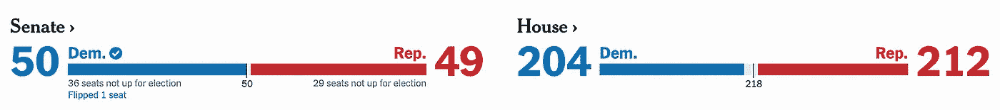
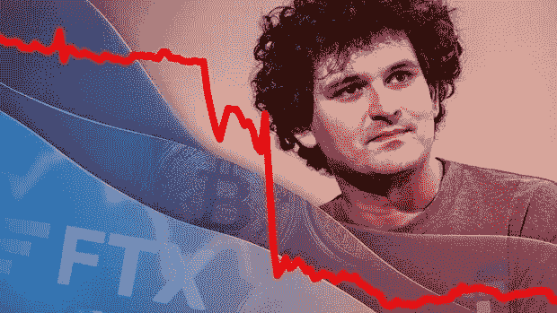
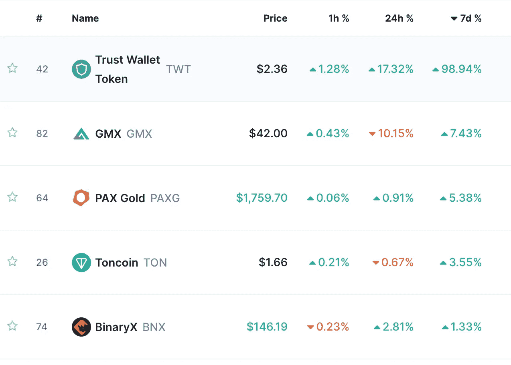

# 在 Web3 世界里

> 原文：<https://medium.com/coinmonks/around-the-web3-world-b7ef98f09c15?source=collection_archive---------44----------------------->

*   🌐在 web3 世界里
*   💣FTX 崩溃
*   🔐储量证明
*   💰本周硬币
*   📰热门阅读
*   🙏🏻感激…

# 🌐在 web3 世界里

*   尽管周四的 CPI 数据显示同比通胀率放缓，但与 9 月份相比，10 月份美国人的三大支出(住房、交通和食品)有所上升。
*   10 月份整体 CPI 低于预期，我们应该期待美联储[降低利率](https://www.nytimes.com/2022/11/02/business/federal-reserve-interest-rates-inflation.html#:~:text=The%20Fed%20made%20clear%20in,push%20to%20constrain%20the%20economy.)增长。
*   FTX 的[崩溃导致了比特币期货市场的大规模清算。](https://www.coindesk.com/markets/2022/11/12/the-epic-collapse-of-sam-bankman-frieds-ftx-exchange-a-crypto-markets-timeline/)
*   较小的实体以创纪录的速度购买了 dip。
*   BTC 已经陆续从交易所退出；这是过去两年趋势的延续。
*   2022 年中期选举[结果](https://www.nytimes.com/interactive/2022/11/08/us/elections/results-key-races.html):
*   **-众议院结果:还剩 19 场比赛来决定控制权**
*   **-CNN 预测，民主党将继续控制参议院**

众议院和参议院构成政府的立法部门。它们与行政和司法部门相互作用，实施制衡，保持所有三个部门的运作，防止任何一个部门滥用权力。

Yaro on Tech、Blockchain 和 Web3 是一份读者支持的出版物。为了接收新帖子和支持我的工作，考虑成为一个免费或付费用户。

# 💣FTX 崩溃

仅仅九天之后，SBF 的密码帝国就崩溃了。11 月 2 日，Coindesk [发布了](https://research.ark-invest.com/e3t/Ctc/I1+113/c3nSf04/VVW_fZ1m4PfPN2B7Fr_vjTT9W1-ywb14SmyszN6J4pXZ5nCVhV3Zsc37CgRwSW1jS6X96HGG2pW6kSGf_7pl9gBW1HtfNF81dqrwW1vvb227PJNHjVyPd2v5_-3qFW79mSDj226wBSW48q-WG41pqG9W7QBgBk78VD_8W3LJ-DG7_LmtTW40b22m95ykZLVbx6g74F0DWgW1wlk0711cY5WW58HzJL3xfL6yW5vyMq54_zc9qW454-5k24t4V9VzhtZs7HcRZkW5_YQLZ8PwcRRW6N8KY83XzKjbW6rCRRY9264FgW3CVZbF2B0C0BW2_JZjJ3T2d0LN3PlCD3BZ826W3sGKc03_1JM4W2-dQ6k2dH0SxW1fMMdd3wPF_1W8t43193bysbxW7dzff81WYkFVW1Z2XST7PhtX7V2MrwJ3rwZMQW95F5bm628_xjW4Tpy1j2_D3NMW7PSqfF4Fs72DW7B3cw02Jx7-8W3YCjlf237twNW83wvKc92LfqhW6pzfj63dtqvx3mXf1)泄露的资产负债表信息，披露了阿拉米达的大量非流动性资产——包括约 50 亿美元的 FTX 本地交易所代币 FTT——以及约 80 亿美元的负债。奇怪的是，阿拉米达据称对 FTT 的敞口大于其流通供应量。很快就清楚了，FTX 和阿拉米达的关系比公众所知的更为密切。

FTX 的竞争对手币安[宣布](https://research.ark-invest.com/e3t/Ctc/I1+113/c3nSf04/VVW_fZ1m4PfPN2B7Fr_vjTT9W1-ywb14SmyszN6J4pYy3q3nJV1-WJV7CgC-XW5H9stc6RdxHYW8mT0Qc7z0WMgW8QrKRN7YhTkmW57Cm827YWS5PVf0TZl4j0tcqW7_zDRr8FM1CnN8RH2hDyqRlkVnGh414sNC1jW9kKYt-1fNHV2W7BPX7m1Fwz5rN1DJc7QG0-kkW31c6d94YK9CsW2JG1Cd3nSGCRW4zyzlM2d5tq2W7s1SPN1j75MmW8Rf-fr3GbSF-W40rYxk8PyczZW5mMrmv8nzWZ5N81S1ZGM4-mCW5bzWbp8lgbvFW2SWFnf6jyr8fW7xHl2H46rJS0Vg1qDm8H4TCBW8VtXzr1zZP8F38kb1)正在清算 FTT，这是它去年退出的 FTX 一项风险投资中的一笔可观的头寸。挤兑就这样开始了。随着 FTX 的崩溃，在几经周折后，CZ 宣布有兴趣收购 FTX，以避免其破产，但几小时后撤回了这一提议，导致 FTX 的灭亡。

这一破坏性事件在整个秘密世界引起了反响。它的损害刚刚开始显现，因为 FTX 在财务上卷入了几个集中的交易所，并暴露于许多区块链协议，包括 BlockFi、Solana、Skybridge Capital、宇迦实验室、Voyager 和名单上的许多其他公司..

**为什么这很重要:**投资者和用户已经损失了 500 多亿美元。FTX 的负责人萨姆·班克曼·弗里德(Sam Bankman-Fried)用投资者的钱玩赌场游戏，并认为自己能够逃脱惩罚。不幸的是，这些由业内德高望重的领导人引发的悲剧事件仍在继续发生，它们给这个透明和民主本应成为支柱的行业造成了巨大的破坏。现在，人们期待着更多的监管，对密码行业的希望和信任已经丧失，那些在财务上不受影响的人正在从密码中取钱或取消投资计划。

# 🔐储量证明

FTX 的灭亡以及 Terra/ Luna 生态系统的崩溃，以及随后 Celsius 和 Three Arrows Capital 的破产，将一项据称将恢复人们对加密系统信心的协议带到了前线。

随着竞争对手 FTX 交易所的崩溃，紧张情绪开始在加密社区蔓延，主要的加密交易所[币安](http://binance.com/)披露了其储备的细节。

根据币安目前透露的信息，截至 11 月 10 日，交易所持有的数字资产如下:

*   475k [BTC](https://ycobitcoin.com/)
*   4.8 米 [ETH](https://ycobitcoin.com/)
*   17.6 亿 USDT
*   21.7b BUSD
*   601 米 USDC
*   58 米 BNB

> 总体而言，在撰写本文时，这些加密资产的当前市值接近 710 亿美元。

其他**交易所向所有用户发送了大量电子邮件，分享投资者和用户的资金是如何安全的，不会被用于投资任何交易所项目。尽管如此，我们必须非常小心，因为这不会是加密领域的最后一次崩溃。此外，黑客攻击比以往任何时候都更加频繁，资不抵债已经成为该领域的一个常见问题，正如我们上面提到的，监管机构已经准备好介入并将加密纳入传统银行监管，他们有许多借口这样做。**

查看 Balaji Srinivasan 的推文，了解更深入的观点:

[Balaji @balajis](https://twitter.com/balajis/status/1592222763816583169)

[准备金和负债证明是连锁会计更一般目标的一个子集。如果所有标记的交易都在链上，您可以自动生成现金流、损益表和资产负债表。这也是可以公开证实的。在块管理器中向下钻取。](https://twitter.com/balajis/status/1592222763816583169)

# 💰本周硬币

[Trust Wallet Token，或 TWT](http://trustwallet.com/) ，是一个简单的 BEP-20 实用令牌，为 Trust Wallet 用户提供一系列好处和激励。Trust Wallet 本身是一个移动加密货币钱包，支持数十种流行的本地资产，此外还有以太坊、币安和 [TRON](https://coinmarketcap.com/currencies/tron/) 区块链上的流行代币。

> *随着 FTX 交易所的崩溃，支持自保管加密钱包信托钱包的令牌随着用户逃离交易所而飙升。*

[分享](https://yarocelis.substack.com/p/will-defi-be-regulated?utm_source=substack&utm_medium=email&utm_content=share&action=share&token=eyJ1c2VyX2lkIjo4NzI4NzQyLCJwb3N0X2lkIjo4MDA4MzMzNywiaWF0IjoxNjY3MTc0NDI5LCJleHAiOjE2Njk3NjY0MjksImlzcyI6InB1Yi0yODIwMjIiLCJzdWIiOiJwb3N0LXJlYWN0aW9uIn0.C81cUJ8Y1qum-eXUC33tUVOk_UChL_PElDd80H9571w)

# 📰热门阅读

*   [CZ 计划行业协会与全球监管机构沟通](https://www.theblock.co/post/186789/cz-plans-industry-association-to-communicate-with-regulators-worldwide?utm_source=cryptopanic&utm_medium=rss)
*   [山姆·班克曼-弗里德的秘密游说遗产困扰华盛顿](https://protos.com/sam-bankman-frieds-crypto-lobbying-legacy-haunts-washington/)
*   [FTX 危机导致大型加密对冲基金破产](https://u.today/major-crypto-hedge-fund-underwater-due-to-ftx-crisis)
*   [未知实体在 BTC 累积 2400312823 美元后成为现存最大的比特币鲸鱼:链上数据](https://dailyhodl.com/2022/11/14/unknown-entity-becomes-largest-bitcoin-whale-in-existence-after-accumlating-2400312823-in-btc-on-chain-data/)
*   [“仅仅”4%——如今秘密裁员的数量有多重要](https://ambcrypto.com/just-4-how-significant-in-number-are-crypto-layoffs-these-days/)
*   [倪星处理倒汇后，Visa“监控”FTX 局势](https://blockworks.co/news/visa-monitoring-ftx-situation-after-nixing-deal-with-felled-exchange/)
*   [BlockFi 称平台暂停将继续](https://www.theblock.co/post/186802/blockfi-says-platform-pause-will-continue?utm_source=cryptopanic&utm_medium=rss)

> 交易新手？试试[加密交易机器人](/coinmonks/crypto-trading-bot-c2ffce8acb2a)或者[复制交易](/coinmonks/top-10-crypto-copy-trading-platforms-for-beginners-d0c37c7d698c)