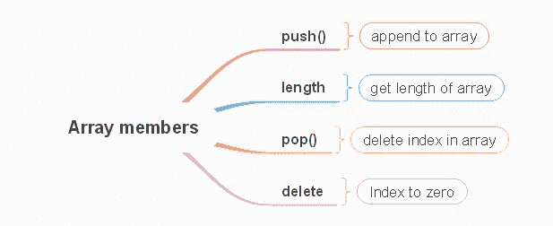

# 从零到英雄

> 原文：<https://medium.com/coinmonks/arrays-in-solidity-from-zero-to-hero-96780d3f08?source=collection_archive---------45----------------------->


# 数组

*   同类型的值类型组[10，20，30，40，50]
    -固定大小数组 uint[5]myArray
    -动态数组 uint[]myArray
    -一维数组
    -多维数组

```
// SPDX-License-Identifier: GPL-3.0
pragma solidity >=0.7.1 <0.9.0;
contract myarray{uint[6] ipadPrice=[1000,2000,3000,4000,5000,1000];  // fixed size 
integer array with 6 elementsuint[]  macPrice=[1100,2100,3100]; // dynamic arrayuint[2] ipadProPrice=[1500,2000]; //one dimensional fixed size arrayuint[] macProPrice=[2000,2500,3000]; //one dimensional dynamic arrayuint[2][2] ipadAirPrice; // multi dimensional fixed-size arrayuint[][] ipad8Price; //multi dimensional dynamic arrayuint[2][] iphone8Price; // multi dimensional mixed siza arrayuint[][2] iphone11Price; // multi dimensional mixed siza arrayuint[][][][] macBook; // four multi dimensional dynamic array upto15string[] macbook2; // array of stringbool[] macbook3; // array of bool
}
```

当在数组中使用不同类型时

```
// SPDX-License-Identifier: GPL-3.0
pragma solidity >=0.7.1 <0.9.0;
contract myArray{uint[] error1=[1,true,"ahmed"];
//Unable to deduce common type for array elements
}
```

向维度数组添加值

```
// SPDX-License-Identifier: GPL-3.0
pragma solidity >=0.7.1 <0.9.0;
contract myArray{uint[][]ipadAirPrice=[[uint(1200),1400,1600,1800],[uint(8),6,8,4]];}
```

注意手动将子数组的第一个元素转换为通用类型是多么的必要，因为 Solidity 试图将数组中的小数字(8，6，8 ^ 4)用作`uint8`，将大数字(1200，1400 等)用作下一个可以容纳它们的类型，也就是`uint16`。由于`uint8`和`uint16`不兼容，你需要至少将每个子数组的第一个元素转换成一个公共元素，这样你就可以让 Solidity 知道每个子元素的类型。Solidity 编译器还不够智能来处理这个问题。也许在未来，会的。

# 数组成员



*   push()接受一个元素并添加到数组的末尾

```
// SPDX-License-Identifier: GPL-3.0
pragma solidity >=0.7.1 <0.9.0;
contract myArray{uint[] public ipadProPrice=[1000,1100,1200,1300,1400,1500];
string [] public appleProduct=["ipad","macbook","iphone"];function addToPrice(uint addIpadPrice) public{
ipadProPrice.push(addIpadPrice);
}function addToAplle(string memory newAplleProduct) public{
appleProduct.push(newAplleProduct);
}function addToPrice() public{
ipadProPrice.push()=5;
}function addToAplle() public{
appleProduct.push()="ipadAir";
}
}
```

您不能推入固定大小的数组，因为它已经固定，并且内存已经分配给它。如果要推送，就需要使用动态数组。动态数组没有固定的大小，可以包含数字，并保持增长。

```
pragma solidity >=0.7.1 <0.9.0;
contract myArray{
    uint[] public ipadProPrice =[1000,1100,1200,1300,1400,1500];

    function addToPrice(uint _addToPrice) public{
       ipadProPrice.push(_addToPrice);
    }
}
```

*   长度数组具有包含元素长度成员

```
// SPDX-License-Identifier: GPL-3.0
pragma solidity >=0.7.1 <0.9.0;
contract myArray{uint[] public ipadProPrice=[1000,1100,1200,1300,1400,1500];
string [] public appleProduct=["ipad","macbook","iphone"];function getLength() public view returns(uint){return ipadProPrice.length;
}function getLengthS() public view returns(uint){return appleProduct.length;
}
}
```

*   可以使用 pop 方法从数组中移除 pop()项，该方法移除最后一个索引并调整长度
*   仅动态数组中的 pop 方法

```
// SPDX-License-Identifier: GPL-3.0
pragma solidity >=0.7.1 <0.9.0;
contract myArray{uint[] public ipadProPrice=[1000,1100,1200,1300,1400,1500];
string [] public appleProduct=["ipad","macbook","iphone"];function getLength() public view returns(uint){
return ipadProPrice.length;
}function getLengthS() public view returns(uint){
return appleProduct.length;
}function popMethod() public{
ipadProPrice.pop();
appleProduct.pop();
}
}
```

*   删除成员不删除索引(索引为零)

```
// SPDX-License-Identifier: GPL-3.0
pragma solidity >=0.7.1 <0.9.0;
contract myArray{uint[] public ipadProPrice=[1000,1100,1200,1300,1400,1500];
string [] public appleProduct=["ipad","macbook","iphone"];function deleteMethod() public {
delete ipadProPrice[1];
}
}
```

# 访问数组中的元素

*   您需要在方括号之间指定索引

```
// SPDX-License-Identifier: GPL-3.0
pragma solidity >=0.7.1 <0.9.0;
contract myArray{uint[]  ipadProPrice=[1000,1100,1200,1300,1400,1500];
string []  appleProduct=["ipad","macbook","iphone"];uint public accessElement=ipadProPrice[5];
string public accessElementS=appleProduct[1];
}// SPDX-License-Identifier: GPL-3.0
pragma solidity >=0.7.1 <0.9.0;
contract myArray{uint[]  ipadProPrice=[1000,1100,1200,1300,1400,1500];
string []  appleProduct=["ipad","macbook","iphone"];function getIpadPrice() public view returns(uint){
return ipadProPrice[2];
}function getAppleProduct() public view returns( string memory){
return appleProduct[1];
}
}
```

访问多维数组中的元素

```
// SPDX-License-Identifier: GPL-3.0pragma solidity >=0.7.1 <0.9.0;
contract myArray{uint [][] ipadPriceRam =[[uint(1000),1200,1300],[uint(8),16,32]];string [][] appleProduct=[["ipad","macbook","iphone"],["airpod","typec","headphone"]];function getIpadPriceRam() public view returns(uint){
return ipadPriceRam[1][2];
}function appleProductAccess() public view returns(string memory){
return appleProduct[1][0];
}function accessTwoArray() public view returns(uint,uint){
return(ipadPriceRam[0][0],ipadPriceRam[1][0]);
}
}
```

# 特殊数组


solidity special array

字节数组
-字节和字符串的变量是特殊数组
-字节是动态数组可以保存任意数量的字节
-字节 4 固定大小数组/便宜得多
-字节类似于字节[]但字节更便宜
-只能运行长度和弹出操作
-不能运行推送操作

```
// SPDX-License-Identifier: GPL-3.0
pragma solidity >=0.7.1 <0.9.0;
contract specialArray{bytes public appleProduct= "ipad"; //any nunmber of bytes
bytes4 public newApple="ipad"; // four bytes only
bytes32 public name="mahmoud ibrahim elsayed"; //upto 32 bytesfunction access() public view returns(bytes1){ // index in array
return appleProduct[1];
}function getLength() public view returns(uint){ // get length
return appleProduct.length;
}function popArray()public{
return appleProduct.pop();
}
}
```

# 字符串数组

*   基于动态的动态数据类型
    -字符串不允许长度
    -字符串不允许索引访问
    -字符串不具有操作功能，但有第三方字符串库你也可以通过它们的 keccak256 散列来比较两个字符串

```
// SPDX-License-Identifier: GPL-3.0
pragma solidity >=0.7.1 <0.9.0;
contract stringArray {
string apple="ipadPro";function accessString(uint _index) public view returns(string memory) { //Index access for string is not possiblereturn apple[_index];
}
}
```

字符串没有长度属性，应该转换成字节

```
// SPDX-License-Identifier: GPL-3.0
pragma solidity >=0.7.1 <0.9.0;
contract stringArray {string apple="ipadPro";
function getLength() public view returns(uint){ //error
return apple.length;
}
```

# 字符串到字节

```
// SPDX-License-Identifier: GPL-3.0
pragma solidity >=0.7.1 <0.9.0;
contract stringArray {string apple="ipadPro";
bytes stringToBytes=bytes(apple);function getLength() public view returns(uint){ //error
return stringToBytes.length;
} 
```

# 比较两个字符串

```
// SPDX-License-Identifier: GPL-3.0
pragma solidity >=0.7.1 <0.9.0;
contract stringCompare {function compareString(string memory _firstName) public pure returns(bool) {if(keccak256(abi.encodePacked(_firstName))==keccak256(abi.encodePacked("mourad"))){
return true;
}else{
return false;
}
}
}
```

数组[1，-1]无效，因为第一个索引的类型是 uint8，而第二个索引的类型是 int8，要使它工作，您可以使用[int8(1)，-1]

# 函数输出数组

```
// SPDX-License-Identifier: GPL-3.0
pragma solidity >=0.7.1 <0.9.0;
contract arrayOutput {uint [] ipadPrice=[1000,2000,3000];function outputArray()public view returns(uint[] memory){
return ipadPrice;
}
}
```

如何获得数组中最大的元素——实度

```
// SPDX-License-Identifier: GPL-3.0
pragma solidity >=0.7.1 <0.9.0;
contract arrayOutput {uint [] ipadPrice=[1100,1200,1300,1400,1500];
function getMaxPric() public view returns(uint){uint i;
uint maxPrice=0;for(i=0;i<5;i++){
if(maxPrice<ipadPrice[i]){
maxPrice=ipadPrice[i];
}
}
return maxPrice;
}
}
```

实性和映射中的多维数组

```
// SPDX-License-Identifier: GPL-3.0
pragma solidity >=0.7.0 <0.9.0;
contract arrayMapping{mapping(address => string[][])  getInfo;function addNameJop(string memory name, string memory jop) public{
getInfo[msg.sender].push([name, jop]);
} function getNameJop() public view returns(string [][] memory){
return getInfo[msg.sender];
}
}
```

数组示例合同检查数组中的价格

```
//SPDX-License-Identifier: GPL-3.0
pragma solidity >=0.7.0 <0.9.0;
contract ipadPrice{uint256 [] ipadPriceInShop=[1000,2000,5000,4000,6000,10001,3000,250000];function checkIpadPrice(uint thePrice) public view returns(bool){
bool trueprice = false;
for(uint i=0;i<7;i++){
if(ipadPriceInShop[i]== thePrice){
trueprice=true;
}
}
return trueprice;
}
}
```

数组示例检查真实名称-比较两个字符串

```
//SPDX-License-Identifier: GPL-3.0
pragma solidity >=0.7.0 <0.9.0;
contract forLoopTest{string[] className=["ahmed","mourad","mahmoud","hamza"];
function findclassName(string memory checkName) public view returns (bool){bool isCheckNamecorrect=false;
for(uint i=0;i<4;i++){if(keccak256(abi.encodePacked(className[i]))==keccak256(abi.encodePacked(checkName))){
isCheckNamecorrect=true;  
        }
}
return isCheckNamecorrect;
}
}
```

数组示例

```
// SPDX-License-Identifier: GPL-3.0
pragma solidity >=0.7.1 <0.9.0;
contract MyContract {
uint256[]  data;function write(uint256 entry) public {
data.push(entry);
}function read() public view returns(uint256[] memory) {
return(data);
}
}
```

> 交易新手？试试[加密交易机器人](/coinmonks/crypto-trading-bot-c2ffce8acb2a)或者[复制交易](/coinmonks/top-10-crypto-copy-trading-platforms-for-beginners-d0c37c7d698c)