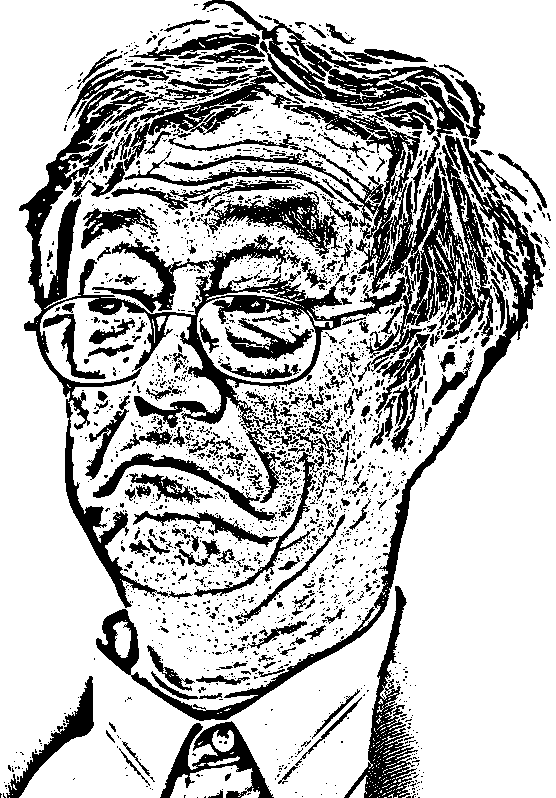
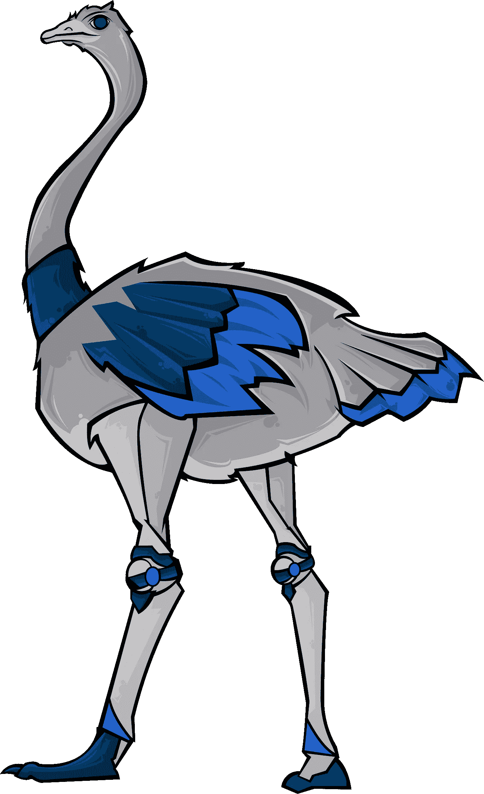

# 艺术和区块链技术

> 原文：<https://medium.com/coinmonks/art-and-blockchain-technology-bd00e9e7d5bf?source=collection_archive---------44----------------------->

就其本质而言，艺术具有个人审美和存在结构。因此，原创的概念是艺术的基石之一。*艺术家*接受分享一种原创的知识，同时转移他的视角，他用自己的*视角*、*选择*和*偏好*创造的世界观到他的艺术中。在这一点上，这一宝贵财富的生产和劳动价值也考虑了一种个人价值。艺术作品和艺术家之间出现了许多问题，这些问题在现代生活中是可以共享和分配的。在这一点上，产生了各种**解决方案**方法和替代方案，并在这个问题上进行合作。其中一个问题是对区块链技术带来的艺术的理解。

**区块链**技术被定义为一种适用于*安全*共享为基本途径的*无*中心化结构的数据记录机制。区块链技术不断地更新 T21，发展自己，作为一群普通参与者的数据共享和各种交易的新中心而闻名。这些*区块链*能够以简单流畅的方式，通过各种云服务，从多个中心进行交易，对数据进行批量处理、分发和加密。所有这些数据都用*加密*散列、完美的**唯一**标识符链接并分割成块。这里最重要的一点是，它是唯一真正的信息和交易中心。由于这个中心，它防止数据*未授权*复制，并最大化数据*安全性*。

*现有* *数据*未经各方共同同意和决定，不得更改。通过这种方式，欺诈产品被**阻止**。有问题的区块链可以共享，但不能修改。如果出现任何干预，区块链的所有参与者都会收到警告，并采取必要的干预措施。

## 区块链和 NFT

像许多人一样，你可能想知道最近 NFT 是什么。NFT 概念的缩写表示为“不可替代的令牌”。事实上，NFT，也可以表达为加密货币的*类型*，可以代表有价值的*资产*，不同于其他类型的加密货币，除了经典定义。例如，可以存在于数字环境中并且属于一个人的商品可以被分类为 NFT。在这个意义上，NFT 将价值视为商品或产品，而不是加密货币。它们与加密货币相似的一个主要原因是，NFT 也与位于区块链的*结构相关，如比特币或以太坊。NFT 主要来自*可收集的*物品。例如，过去非常流行的扑克牌，在数字环境中可以被视为 NFT。NFT 与加密货币的另一个不同之处在于，每个 NFT 都是独一无二的，可以进行不同的设计。*

**NFT 收藏品**在数字环境中出售，并引起了极大的关注，包括所有在虚拟环境中生产的商品，并可在其上获得所有权*权利*。然而，数字艺术在所有这些中所占的份额相当大。使用 NFT 技术的数字艺术品的所有权和销售意味着**艺术家**可以用不同的方式评估他们的*未来*作品。

除了*数码艺术*，著名的时尚和配饰品牌也将其产品转化为 NFT 项目。比如**雅各布** & **Co** 。该品牌发布的 NFT 手表给人留下了深刻的印象。以 NFT 的身份购买手表的收藏者享受着远离身体磨损和风险而获得产品的乐趣。此外，*可以用货物的物理状态保护*货物免受风险。

## 区块链和艺术

NFT 转变为一个巨大市场的**优势**和它的*去中心化*尤其吸引了艺术界的注意。许多**艺术家**支持区块链和 NFT，因为这将消除中间人，并在*创作者*中拥有作品的全部所有权。从这个意义上说，第一个脱颖而出的艺术群体是插画师。包含*创意*的艺术内容、社会讯息、图纸一一发布。尽管一开始就有个别作品脱颖而出，但由于区块链的技术，这些系列作品得以问世。
除了收藏，一些画家将自己的作品符号化，冒充 NFT 出售。这也导致了一场新的关于区块链和艺术的讨论。
一些艺术家仅仅是为了虚拟世界而创作作品。也就是说，它将现实世界中没有实体对应物的非功能性食物出售。其中一些以数百万美元的价格售出，而另一些则没有达到预期价值。

> 交易新手？在[最佳加密交易](/coinmonks/crypto-exchange-dd2f9d6f3769)上尝试[加密交易机器人](/coinmonks/crypto-trading-bot-c2ffce8acb2a)或[复制交易](/coinmonks/top-10-crypto-copy-trading-platforms-for-beginners-d0c37c7d698c)

所有这些发展**加强了**的观点，即*区块链*和*艺术*不能融合在一起，而且尽管是分散的，作品仍将被大公司控制。尽管如此，一些画家继续他们的工作来保持区块链技术的活力。比如，当代艺术最重要的代表之一达米安**赫斯特**，就开始通过记号化的方式把自己的作品当成 NFT 来卖。他通过**焚烧**销毁了这些画作，它们是出售的 NFTs 的真实等价物。因此，该作品只成为其所有者的财产。出售后，赫斯特烧掉了他总价值 1000 万英镑的画。

## 区块链和音乐

这个主要围绕视觉的市场也吸引了音乐界的注意。音乐制作人，他们用声音来表演他们的艺术，就像插图画家一样，带着更自由、完全的产权和获得充分的劳动报酬等因素转到了区块链。虽然有些艺术家只在区块链上分享他们的新作品，但随着元宇宙技术的出现，也有音乐制作人给 T42 举办虚拟音乐会。

音乐 **NFTs** 带来了很多好处，尤其是对粉丝来说。比如说；在现实世界中，花大价钱就能买到的专辑或音乐已经变得更加实惠。这为人们收集他们喜爱和追随的艺术家的作品铺平了道路。此外，世界著名的 *DJ 3LAU* ，音乐 NFTs 的最大支持者之一，已经为**区块链**发行了专辑和歌曲。
在重要名字带领下崛起的音乐 NFTs，随着**音乐 3.0** 开始被更多采用。艺人们相信，随着*音乐 3.0* 的传播，音乐人的产权不仅在**虚拟世界**会得到改善，在*真实*世界*世界*也会得到改善。

## 区块链和 3D 游戏

继音乐和绘画之后，**游戏产业**开始聚焦区块链。由于这些游戏 99%都是基于 NFT，NFT 的交易量自然也呈爆炸式增长。人们开始购买各种 NFT 来体验他们都投资并喜欢的游戏。虽然成功的项目为他们的玩家提供了丰厚的收入，但他们也给了玩家利用 *DeFi* 工具赚取被动收入的机会，而不管游戏如何。*游戏*中的 NFT 和其他 NFT 一样有一定的稀有性。最稀有的 NFT 拥有游戏中的高级功能，数量很少，并且有能力在未来变得更有价值。然而，在一个不断变化的领域，如我们在文章开头提到的游戏，随着时间的推移，不同类型的 NFT 被开发出来，因为不可改变的数据会给玩家带来问题。其中之一，**动态** **NFT** ，如今几乎占据了其市场的半壁江山。另外，考虑到最近一年发布的游戏数量以及未来几年预计发布的游戏数量，可以预测 2 年内*动态*NFT 数量将超过*静态*NFT 数量。

在回答问题之前"**什么是动态 NFT？**、**什么是 NFT** ？”让我们再检查一遍这个问题。NFT 是一个不可变的令牌，它证明并确认存储在区块链上的数字资产的唯一性。*另一方面，dNFT* 或动态 NFT，正如你从它的名字可以理解的，意味着数字资产可以在特定条件下改变。
**动态 NFTs** ，是上一期的趋势，通过在区块链注册的智能合约中增加一些参数，可以改变部分数据。在这里，“增加智能合约”部分很重要。也就是说，并非所有包含 GIF、3D 或动画的 NFT 都是 dNFTs。要成为动态 NFT，必须对智能协定中包含的元数据进行更改。即将公布的 3D、高质量、*创造性地*设计的*游戏*也将为**区块链**和 art 与 dNFT 功能的合作做出重大贡献。

## 最后一句话

鉴于所有这些信息，如果有必要**重新评估***区块链*技术和*艺术*的概念，区块链适合安全共享的**分散的**注册区可以为基于**技术的艺术**创造一个新的领域。尽管被视为保护各类企业、信息和数据共享的安全选择的技术在许多领域脱颖而出，尤其是在金融领域，但它也给其他领域带来了希望。有了 Blockchain 技术，艺术作品从创作之日起就可以在数字环境中保留其所有信息和特征。在这些交易中，作品的买卖和版权交易可以在没有任何第二人或中间人的情况下以受保护的方式进行。作为区块链技术和艺术现代化的结果而出现的发展已经开始以新的*发展*而出名，旨在保护艺术家、艺术作品和作品的价值。鉴于这些发展，作者**可以超越必须披露其私人生活，即他们有权保持**匿名**。只能从一个点访问基于工作的病历报告和文档。该系统最重要的发展和积极的特点是由于复杂的*加密*技术，可以完全保持工作*安全*。此外，任何**分散的**销售点，即市场，构成了**艺术品*和*买方*的安全****购物点。***

*****作** [**鸵鸟。俱乐部**](https://ostrich.club/) ，我们希望*通过为各个*艺术分支*创建不同的、**独特的**和*分散的* **社交媒体平台**，为*艺术分支*带来和**艺术家**应得的价值。****

*****多学点** *关于 [**鸵鸟。**俱乐部](https://ostrich.club/?source=about_page-------------------------------------)。****

*****务必**到*查看*出 [**白皮书**](https://ostrich-club.gitbook.io/ostrich.club/?source=about_page-------------------------------------) 。***

***[**加入&关注鸵鸟俱乐部渠道。**](https://linktr.ee/ostrichclubcoin?source=about_page-------------------------------------)***

******

> ****加入 Coinmonks* [*电报频道*](https://t.me/coincodecap) *和* [*Youtube 频道*](https://www.youtube.com/c/coinmonks/videos) *了解加密交易和投资****

# ***另外，阅读***

*   ***[印度的加密交易所](/coinmonks/bitcoin-exchange-in-india-7f1fe79715c9) | [比特币储蓄账户](/coinmonks/bitcoin-savings-account-e65b13f92451)***
*   ***[OKEx vs KuCoin](https://coincodecap.com/okex-kucoin) | [摄氏替代品](https://coincodecap.com/celsius-alternatives) | [如何购买 VeChain](https://coincodecap.com/buy-vechain)***
*   ***[币安期货交易](https://coincodecap.com/binance-futures-trading)|[3 commas vs Mudrex vs eToro](https://coincodecap.com/mudrex-3commas-etoro)***
*   ***[如何购买 Monero](https://coincodecap.com/buy-monero) | [IDEX 评论](https://coincodecap.com/idex-review) | [BitKan 交易机器人](https://coincodecap.com/bitkan-trading-bot)***
*   ***[CoinDCX 评论](/coinmonks/coindcx-review-8444db3621a2) | [加密保证金交易交易所](https://coincodecap.com/crypto-margin-trading-exchanges)***