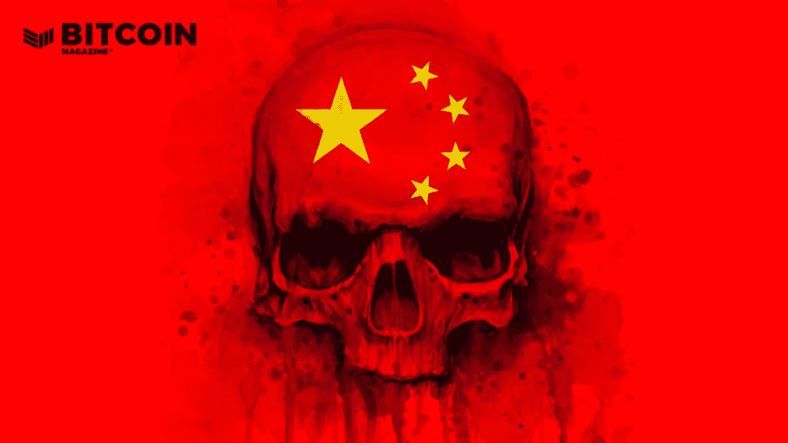
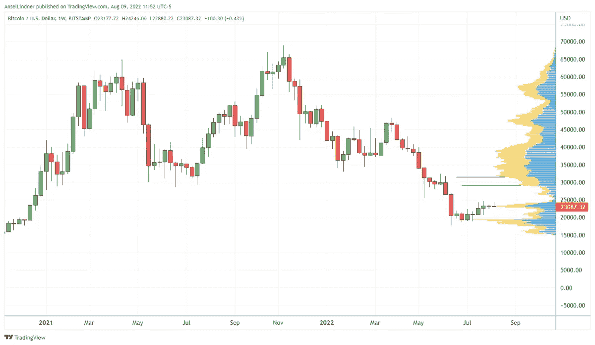
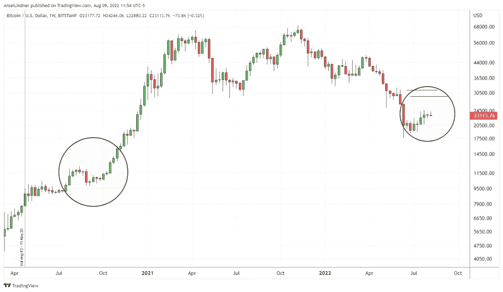
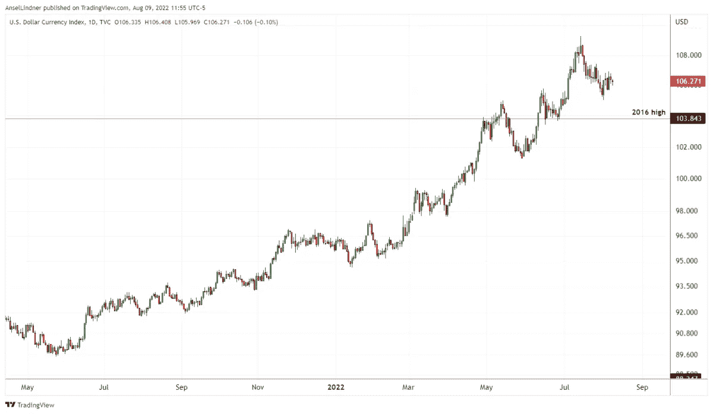
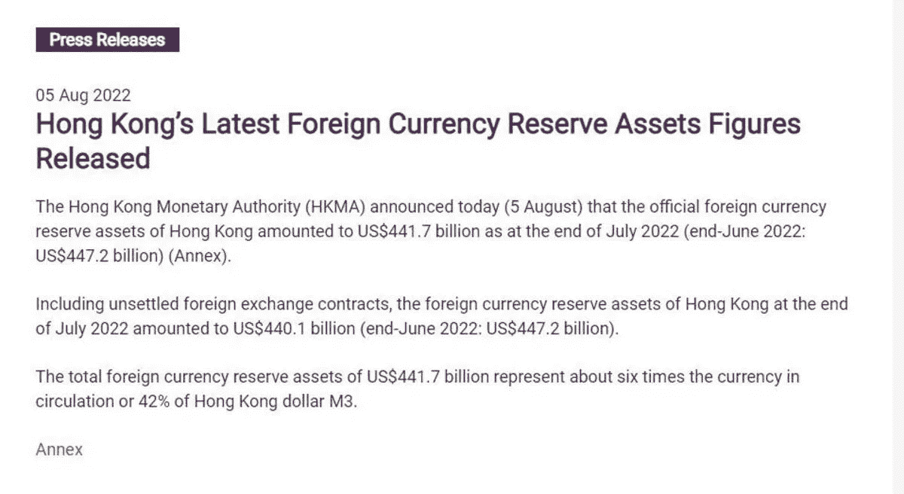
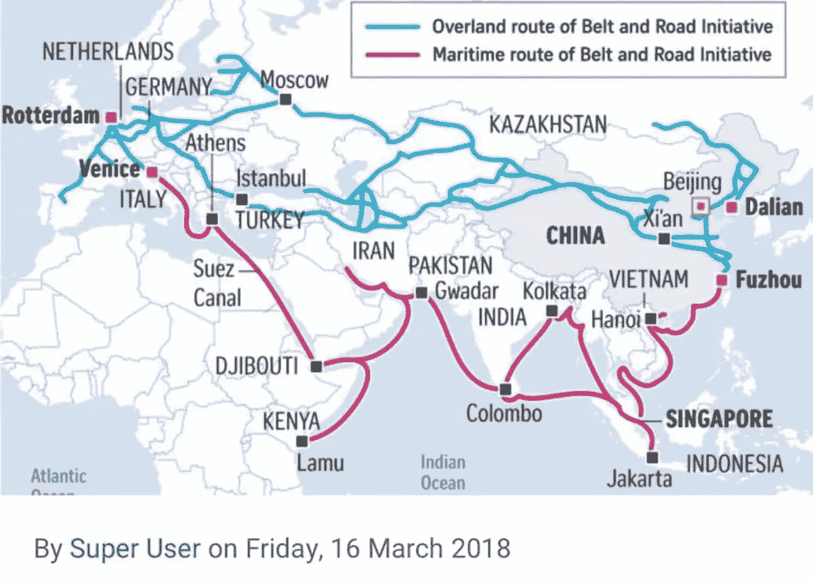
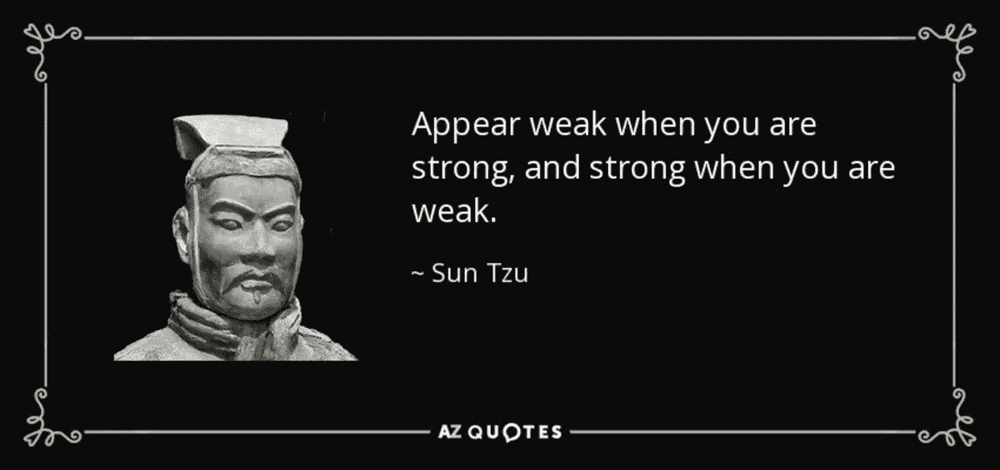

# 随着巴基斯坦、台湾和中国濒临崩溃，世界需要比特币

> 原文：<https://medium.com/coinmonks/as-pakistan-taiwan-and-china-reach-the-brink-the-world-needs-bitcoin-fade4896ebbd?source=collection_archive---------52----------------------->

巴基斯坦、台湾和中国正在发展的宏观经济危机凸显了宏观经济的缺陷和对比特币的需求。

“美联储观察”是一个宏观经济播客，符合比特币的反叛本性。在每一集里，我们都通过考察全球宏观经济的时事来质疑主流和比特币叙事，重点是央行和货币。

*在这一集的《美联储观察》中，CK 和我浏览了几个图表，给出了比特币、美元和港元的最新市场信息。接下来，我们审视了巴基斯坦日益恶化的局势，并提出了这样一个问题:这是下一个斯里兰卡吗？最后，我们讨论了台海局势，我读到了几个重要的片段，一个来自中国外交部长王毅，另一个来自智库专家王文。*

*的音频听众可以跟着这里的* [*幻灯片一起*](https://docs.google.com/presentation/d/1KcQNFqM_MwSrupbCzrmpRzvgdAFzFgEgKekq9R9pL50/edit?usp=sharing) *。*

*别忘了看看 YouTube 上的“* [*美联储观看剪辑”频道*](https://www.youtube.com/channel/UCys2N5ZksgYc4gUDt4u9oQA) *。*

[**在 YouTube 上看这一集**](https://youtu.be/dZu5XUS1Uzs) **或者** [**隆隆**](https://rumble.com/v1hchxi-the-euro-is-breaking-and-bitcoin-fixes-this-fedwatch.html)

**这里听插曲:**

*   [**喷泉**](https://fountain.fm/episode/9741733289)
*   [**苹果**](https://youtu.be/dZu5XUS1Uzs)
*   [**Spotify**](https://open.spotify.com/episode/4oiV6FskNJkq84m1eIJPhi)
*   [**谷歌**](https://podcasts.google.com/feed/aHR0cHM6Ly9iaXRjb2lubWFnYXppbmUubGlic3luLmNvbS9yc3M/episode/MWFkZDRjMjYtNTA5NS00ZTBhLTlkY2MtNzJhMTg0MGNmOWQz?sa=X&ved=0CAUQkfYCahcKEwi42OX0ueL5AhUAAAAAHQAAAAAQAQ)
*   [**Libsyn**](https://bitcoinmagazine.libsyn.com/ecb-recognizing-the-stakes-and-jackson-hole-preview-fed-109)

# 比特币和其他货币

我们从比特币的周线图开始。我们在过去的几个节目中已经这样做了，因为这是一个用比特币来锚定我们的对话的好方法。正如你在下面看到的，价格一直非常稳定，相对于右边的量价比指标来说，价格一直处于观望状态。

*The bitcoin price has been very stable*

如果我们缩小范围，上一次类似于今天的周线蜡烛是在 2020 年 9 月/10 月，就在怪物从 10，000 美元涨到 40，000 美元之前。当然，我们不是说它会像那样再次发生，但这是可能的。

*The bitcoin price today looks similar to when it experienced a monster rally in 2020.*

美元指数(DXY)是我们关注的另一种主要货币。我相信几乎每集查美元都很重要，因为这是比特币的主要竞争。

目前看起来确实已经见顶，但没有迹象表明它会崩溃。相反，未来几年，美元最有可能在 100 以上形成一个新的上升区间。这与 2015 年至 2021 年如何形成新的更高区间类似。

*Source for above images:* [*bitcoinandmarkets.com*](https://www.bitcoinandmarkets.com/)

我补充一点，强势美元对比特币不是利空。或许，最初，强势美元与较低的比特币相关，但在美元稳定在较高区间后，这是比特币传统上上涨的时候。

以下是香港金融管理局网站截图。每个月，中国都会发布外汇储备统计数据，用以稳定人民币汇率。上周，我推测维持港元与 HKD 的联系汇率制度正迅速消耗其外汇储备。然而，根据这篇新闻稿，7 月份中国仅动用了略高于 1%的外汇储备来维持联系汇率。这意味着 HKD 有可能在几年内保持联系汇率制(如果它愿意的话)。

*Source:* [*HKMA*](https://www.hkma.gov.hk/eng/news-and-media/press-releases/2022/08/20220805-4/)

# 处于边缘的巴基斯坦

巴基斯坦正在发展的局势与斯里兰卡最近的崩溃有许多共同之处。在播客中，我提到了 i5w 参与世界经济论坛(WEF)。巴基斯坦获得了数亿美元的资金，用于改造农业部门和增加国家公园。

*Source:* [*Twitter*](https://twitter.com/ImranKhanPTI/status/1370978114415833090?t=B18QwKyOQuSaCeJ7Vt6-kg&s=19)

巴基斯坦和斯里兰卡之间的另一个相似之处是，中国资金在过去十年中发挥了重要作用。斯里兰卡失去了对其主要港口的控制，因为它无法偿还中国的贷款，现在巴基斯坦背负着大约 200 亿美元的中国和中国公司的高息贷款。

巴基斯坦的预算只剩下两个月了，它正拼命地寻求新的贷款人。中国拒绝了，阿拉伯国家正在三思，唯一可以求助的地方是回到国际货币基金组织。这意味着严厉的紧缩。

或许，不足为奇的是，斯里兰卡和巴基斯坦都是一带一路(BRI)的重要节点。

*Source:* [*Asia Green*](https://www.asiagreen.com/en/news-insights/the-belt-and-road-initiative-and-the-rising-importance-of-china-s-western-cities)

正如我在许多场合说过的，BRI 注定要失败。中国正试图让一些地方和路线在经济上变得可行，而长期的历史并没有做到这一点。无论多少钱都无法颠覆几千年的文化和亿万年的地理。

BRI 的一个重要环节又一次被中国中央计划者破坏了。

# 台湾/中国局势

*Source:* [*AZ Quotes*](https://www.azquotes.com/quote/548120)

几天来，我一直在讨论佩洛西的情况和中国的反应。

在这一集的“美联储观察”中，我读到了一位著名的中国部长和一位中国智库专家的一些摘录。你可以在这里阅读[王毅的全部评论。就这篇文章而言，他多次重复“一个中国”，并称美国是试图改变现状的一方。他还对现任台湾总统蔡英文出言不逊。他说她“背叛了祖先”在另一个翻译中，我听到易的原文评论也表明她背叛了她的祖先(和她的种族)。](https://www.fmprc.gov.cn/eng/zxxx_662805/202208/t20220806_10736474.html)

我接下来读到的评论来自中国人民大学重阳金融研究院执行院长、中美人文交流研究中心执行主任王文。[你可以在这里阅读他和其他几个人的评论。他试图解释为什么中国的反应如此软弱，以及中国不应该挑起与美国的武装冲突，直到它能够“在经济实力方面超过美国，获得与美国相当的金融和军事实力，并发展出压倒性的能力来对抗国际制裁。”](https://www.chinatalk.media/p/elite-china-copes-with-pelosis-visit)

听起来很遥远。我只是建议读者不要陷入关于台湾和中国的恐惧诱饵言论。他们是孙子的弟子，孙子说:“当你软弱时，要表现得坚强。”文还引用《孙子兵法》:

*“A major military clash with the U.S. is not the goal of China’s foreign policy, nor is it the path to a better life for the common people. Recall what Sun Tzu wrote in ‘The Art Of War’: ‘Do not act unless there is something to gain 非利不动; do not use military force without the certainty of victory 非得不用; do not go to war unless the situation is critical 非危不战.’”*

我们结束了播客，讨论了即将发布的 CPI 数据和其他与比特币相关的事情。

这是安塞尔·林德纳的客座博文。表达的观点完全是他们自己的，并不一定反映 BTC 公司或比特币杂志的观点。

*原载于 2022 年 8 月 30 日*[*https://bitcoinmagazine.com*](https://bitcoinmagazine.com/markets/pakistan-taiwan-china-need-bitcoin)*。*

> 交易新手？尝试[加密交易机器人](/coinmonks/crypto-trading-bot-c2ffce8acb2a)或[复制交易](/coinmonks/top-10-crypto-copy-trading-platforms-for-beginners-d0c37c7d698c)