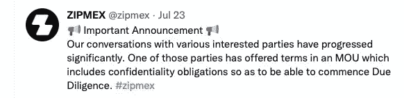

# 亚洲加密交易所 Zipmex 在贷款给 Celsius 和 Bable Finance 后，正在商谈出售

> 原文：<https://medium.com/coinmonks/asian-crypto-exchange-zipmex-in-talks-to-sell-after-lending-money-to-celsius-and-bable-finance-617e1232695a?source=collection_archive---------56----------------------->

亚洲市场加密交易所 Zipmex 陷入了困境。该公司上周冻结了部分提款，需要筹集至少 5000 万美元才能修复资产负债表！在向陷入困境的加密公司 Babel Finance 和 Celsius Network Ltd .提供贷款后，Zipmex 正在谈判出售其公司的一部分。Zipmex 周日在推特上表示，一个感兴趣的当事方已经“提出了条件”，但他们没有公布感兴趣的买家的身份。

## ZipMex 的贷款之手适得其反

不幸的是，Zipmex 帮助 Celsius 和 Babel Finance 的决定适得其反。Celsius 的财务困境产生了多米诺骨牌效应。

> “筹资目标大致相当于 Zipmex 对 Babel 和 Celsius 的总敞口，分别为 4800 万美元和 500 万美元。在数字资产价值 2 万亿美元的暴跌之后，高度互联的加密借贷市场出现了一连串违约，导致 Zipmex 脱轨。——【Bloomberg.com 

这一消息可能会震惊加密界，因为 Zipmex 是为数不多的表现良好的交易所之一。DeFi 市场迅速扩大，在许多国家都有销售。

## DeFi 的下一步是什么？

Zipmex 的情况提醒我们，加密行业仍然非常年轻，而且不稳定。交易所努力跟上需求，并经常做出冒险的决定来维持运营。下一个 go-under 会是什么样的 DeFi 平台，我们会在 DeFi 领域看到什么样的变化？这是 12%- 15% APY 终结的开始吗？

Zipmex 的决定可能会对密码行业产生重大影响。如果 Zipmex 出售，这将是另一家在加密熊市中破产的 DeFi 公司。这可能引发多米诺骨牌效应，导致更多交易所被出售或关闭。你如何看待 Zipmex 寻求资助的决定？下面评论！

您的组织需要加密货币和区块链写入器吗？如果是这样，[今天就在这里联系我](https://www.fiverr.com/share/Z21Xdl)——我可以帮助你了解所有最新的行业新闻！

> 交易新手？尝试[加密交易机器人](/coinmonks/crypto-trading-bot-c2ffce8acb2a)或[复制交易](/coinmonks/top-10-crypto-copy-trading-platforms-for-beginners-d0c37c7d698c)