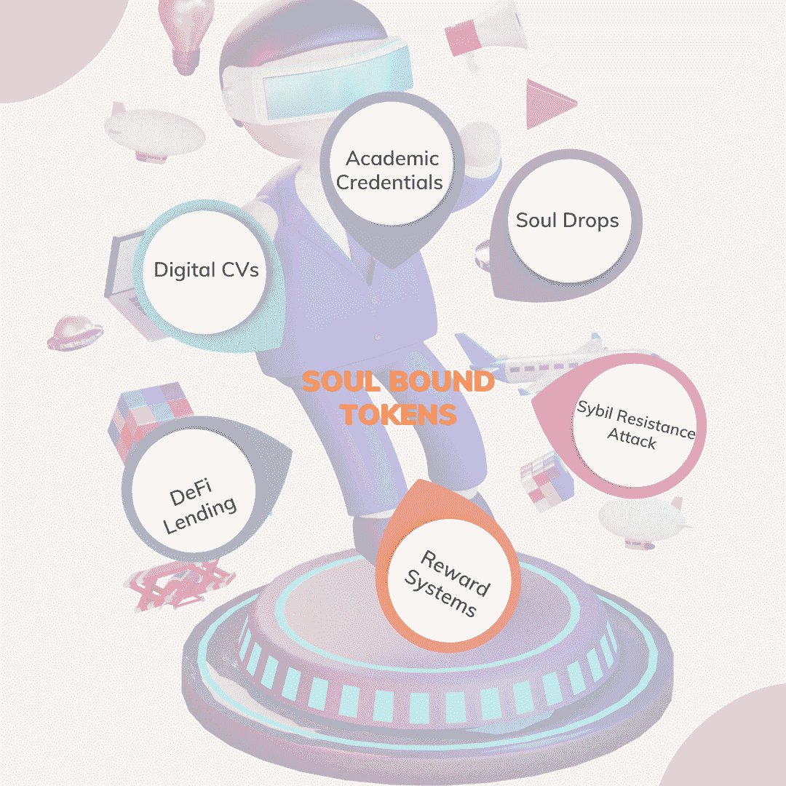

# 灵魂绑定令牌-下一个重大创新？

> 原文：<https://medium.com/coinmonks/asoulbound-tokens-the-next-big-innovation-5d703641ea52?source=collection_archive---------17----------------------->

当你看到灵魂这个词时，脑海中浮现的可能是人的生命。但在这种情况下，它在某种程度上是真实的。灵魂绑定令牌是一个人或其身份的数字表示。

web3 空间正在迅速发展，尽管此时它似乎是一个以金融为中心的行业。随着灵魂绑定令牌的引入，这种说法越来越受欢迎。

## 什么是灵魂绑定令牌？

以太坊创始人 Vitalik Buterin 在 2022 年 1 月的一篇博客文章中首次提出。

试图解决不可替换令牌的局限性。

他提出了个人独有且不可转让的数字资产的概念。

术语“灵魂”是相当模糊的，但是描述了个体的表征的特性。

2022 年 5 月，在由[以太坊](http://ethereum.org)创始人 Vitalik Buterin 和他的同事发表的[论文](https://papers.ssrn.com/sol3/papers.cfm?abstract_id=4105763)中，灵魂绑定令牌被描述为不可转让的数字令牌，在一个去中心化的社会中代表社会身份。

> 灵魂绑定令牌将代表用户的身份、从属关系、承诺，甚至是去中心化社会(DeSoc)中的凭证。

非金融交易通常被过度金融化，因为普通 NFT 持有者希望通过交易或转手获利。

如果有一种类型的 NFT 永远不能转让或出售呢？

嗯，这就是为什么灵魂绑定令牌是不可转让和不可出售的 NFT。它们被无限期地放在钱包里。

## 为什么我们需要灵魂绑定令牌？

在一个去中心化的社会中，确定信息片段最有效的方法是它们是否在链上。

遵循灵魂绑定令牌的整体目的，即在一个去中心化的世界中建立一个身份。迫切需要能够证实关于区块链的这一信息。

例如，在一个分散的社会中，雇主如何核实其雇员的证书？

答案当然是由一个组织以证书的形式发给个人的灵魂绑定令牌。

像 [Alchemy](https://www.alchemy.com/) 、[e collance](https://www.ekolance.io/)、 [metaschool](https://metaschool.so/) 这样的教育平台会给学生颁发证书作为 NFT，这些证书是作为 SBT 代币颁发的，每个人都有自己的专属，不可转让。

Vitalik 论文中引用的一个简单例子是一个实施所谓的 [POAP](https://poap.xyz/) “出席证明协议”的项目。POAP 是一种标准，项目可以通过它发送代表接收者亲自参与某个事件的想法的 NFT。

## 灵魂绑定令牌的用例

灵魂绑定令牌在许多不同方面都很重要，包括。

**DeFi Lending** -在通过协议分配贷款的情况下，现在只需查看您以前的信用评分就可以授予信任，无抵押贷款可以通过利用不同社区中灵魂的实时交互来发放。

**Sybil 抵抗攻击** - Sybil 攻击是刀币投票中最值得注意的系统风险之一。怎么会？一个特定的个人可以购买大约 51%的 DAO 令牌来获得对协议治理的控制。最重要的是，大多数 DAO 令牌持有者不具备确保关键决策的专业知识。

灵魂绑定代币将根除这一点，因为其不可转让的性质将禁止任何个人购买能够影响重大决策的代币。

Soul drops-Soul bound token 可以解决这个问题，它可以根据用户灵魂的 SBT 的细节和分析来确保空投。Vitalik Buterin 在白皮书中清楚地概述了 SoulDrop 的概念。例如，专注于增强可持续性的项目可以确保向灵魂空投治理令牌，令牌验证他们与各种可持续活动的关联。

想象一下，大学和学院向他们的学生发放证书，这将会改变游戏规则。这些证书是作为灵魂绑定的令牌发放的，是每个人特有的，不可转让。

**数字简历** -想象你现实生活中的简历，但这次是印在区块链上的 NFT，这使得合作者更容易验证个人的身份和经历。

**奖励系统** -追溯空投在推动区块链采用列车中至关重要，但使用灵魂绑定令牌，项目可以根据他们的灵魂绑定令牌奖励他们的用户，因为这将有效地衡量每个用户的参与，从而确保公平分配。

## 结论

灵魂绑定令牌是去中心化生态系统的游戏改变者，并将迅速改变区块链空间的世界观。

将数据数字化并将其纳入链中是推动全球采用的最有效方式之一。

如果你喜欢阅读这篇文章，请留下你对区块链科技的评论或问题。

你可以在 AdetolaO@hotmail.com 和我联系。

[Linkedin](https://www.linkedin.com/in/adetola-ogunsanya-7634901aa/)

[推特](http://www.twitter.com/adetolaogunsan1)。

> 交易新手？试试[密码交易机器人](/coinmonks/crypto-trading-bot-c2ffce8acb2a)或[复制交易](/coinmonks/top-10-crypto-copy-trading-platforms-for-beginners-d0c37c7d698c)
> 
> 多样化的密码持有，了解[币安替代品](https://coincodecap.com/binance-alternatives)
> 
> 加入 Coinmonks [电报频道](https://t.me/coincodecap)和 [Youtube 频道](https://www.youtube.com/c/coinmonks/videos)获取每日[加密新闻](http://coincodecap.com/)

## 另外，阅读

*   [复制交易](/coinmonks/top-10-crypto-copy-trading-platforms-for-beginners-d0c37c7d698c) | [加密税务软件](/coinmonks/crypto-tax-software-ed4b4810e338)
*   [电网交易](https://coincodecap.com/grid-trading) | [加密硬件钱包](/coinmonks/the-best-cryptocurrency-hardware-wallets-of-2020-e28b1c124069)
*   [密码电报信号](/coinmonks/top-3-telegram-channels-for-crypto-traders-in-2021-8385f4411ff4) | [密码交易机器人](/coinmonks/crypto-trading-bot-c2ffce8acb2a)
*   [最佳加密交易所](/coinmonks/crypto-exchange-dd2f9d6f3769) | [印度最佳加密交易所](/coinmonks/bitcoin-exchange-in-india-7f1fe79715c9)
*   [面向开发人员的最佳加密 API](/coinmonks/best-crypto-apis-for-developers-5efe3a597a9f)
*   最佳[密码借贷平台](/coinmonks/top-5-crypto-lending-platforms-in-2020-that-you-need-to-know-a1b675cec3fa)
*   [免费加密信号](/coinmonks/free-crypto-signals-48b25e61a8da) | [加密交易机器人](/coinmonks/crypto-trading-bot-c2ffce8acb2a)
*   [杠杆代币](/coinmonks/leveraged-token-3f5257808b22)终极指南