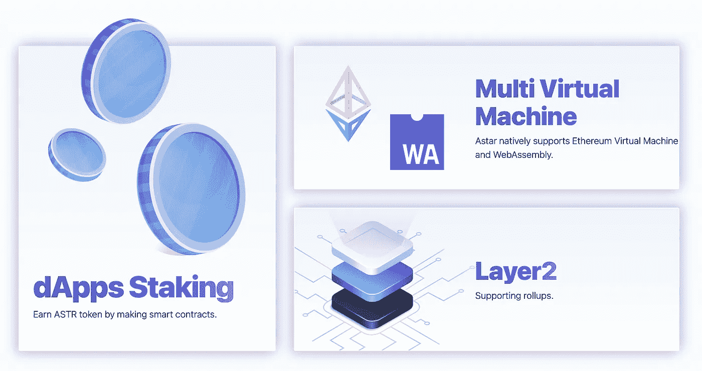
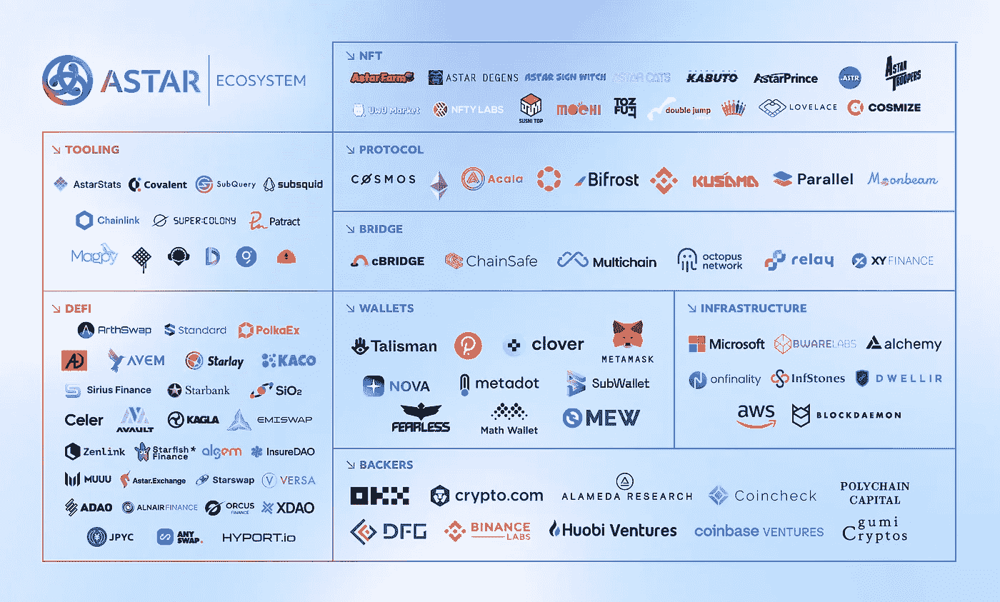

# Astar 日本实验室生态系统和协作

> 原文：<https://medium.com/coinmonks/astar-japan-labs-ecosystem-and-collaborations-fc202157e1a6?source=collection_archive---------32----------------------->

Astar Network Banner. Source: [astar.network](https://astar.network)

Astar 是 Polkadot 社区的多链智能合约平台，支持多种区块链、不同的二层解决方案和虚拟机。

该公司支持日本领先的区块链 Astar 网络，该网络将波尔卡多特生态系统连接到以太坊、宇宙和所有主要的第一层区块链。

Astar Ecosystem Main Participants. Source: [astar.network](https://astar.network)

网络的 Build2Earn 模型使构建者能够通过底层框架在分散的应用程序上编写和构建代码，从而获得收益:

> “在 Astar/Shiden 网络上，dApp 赌注就是开发 dApp 的开发者如何获得补偿。有了基本收入，开发者就可以继续建造和改进他们的 dApps。就其核心而言，dApp 赌注类似于对验证者的赌注，但在这种新的范式中，dApp 赌注者(也称为提名者)可以在他们想要支持的 dApp 上提名他们的 Astar/Shiden 令牌”

该公司发展迅速，并参与了多项合作，例如与微软和亚马逊的合作。

其他有趣的合作包括与建立在 Astar 网络基础上的[海星金融](https://www.notion.so/https-starfish-finance-715e475da5f742869de8ff0ab7e4aacb)，专注于 DeFi 和 NFT 世界的可能合并。在这个平台上，你可以在不出售 NFT 的情况下入股。

Astar 最近的另一个项目是与该国第二大港口城市福冈市的合作，旨在成为该国的 Web3 中心。根据这项合作，Astar 将与当地政府一起提供教育和开发新项目。

此外，日本移动电话运营商 NTT DOCOMO 已经与 Astar Network 签署了一项推广 Web3 的基本协议。这两家公司发起了一个社会问题解决项目，该项目利用“一个岛”的概念来应对区域振兴和环境问题。

> *💡在我们的“玩到赚”部分，您可以找到我们对 DEO 竞技场游戏***的观察。最近，它被扩展到 Astar 网络，以吸引更多的玩家。**

*顺便说一句，根据 Coincub 报告，日本是税收方面最不友好的国家之一。让我们希望这不会阻止日本的加密部门的发展。*

> *交易新手？尝试[加密交易机器人](/coinmonks/crypto-trading-bot-c2ffce8acb2a)或[复制交易](/coinmonks/top-10-crypto-copy-trading-platforms-for-beginners-d0c37c7d698c)*