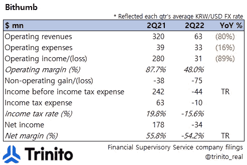
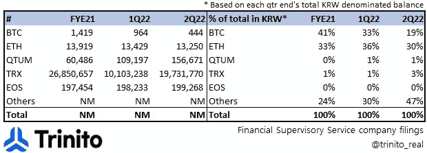
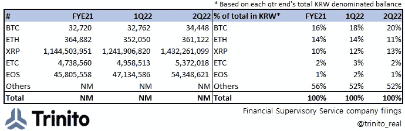

# 概览:Bithumb 2Q22

> 原文：<https://medium.com/coinmonks/at-a-glance-bithumb-2q22-5790db8564d2?source=collection_archive---------11----------------------->

**【损益表要点】**

Bithumb 于 8 月 25 日(KST)披露了 2022 年 H1 财务状况。

## **1) P & L**

*   按美元计算，Bithumb 的收入同比下降 80%;经汇率调整后(由于韩元对美元贬值)，同比跌幅仍为 78%。
*   OPEX 低于去年(-16%)，但不足以抵消顶线下降，导致营业收入同比下降-89%。**>**
    从去年的 87.7%下降到 48%。

    **>>>**OPEX 同比最大的削减来自 620 万美元的促销费用(2011 年第二季度占 OPEX 总额的 19%，2012 年第二季度占 OPEX 总额的 1%)。)
*   然而，底线转为红色，导致 3400 万美元的损失(-54.2%的净利润率)，主要受数字资产估值损失的影响(6400 万美元)，占非运营损失的 79%。

## 2) **Bithumb 的数字资产余额**

*   上表显示了 Bithumb 在每个季度末拥有的数字资产类型。
*   值得指出的是，Bithumb 的 BTC 余额去年占总数的 41%，在 1H22 下降到 19% ( 1，1,419 > 444 BTCs)，而 ETH #变化不大。与此同时，“其他”(由牌面上没有提到的代用币组成)部分几乎翻了一番，从 24%增加到 47%。 **>** 所以 Bithumb **在过去 6 个月里一直在抛售 BTC** ，而他们大部分时间都在持有其他替代币(可能是因为这些替代币的流动性比 BTC 低很多？).

## **3) Bithumb 客户的数字资产余额**

*   上表显示了 Bithumb 的客户在交易所存放(持有)的前 5 大数字资产(价值)。
*   我们在上一段提到了 Bithumb(交易所本身)出售 BTC，但在客户方面，发生了完全相反的情况。
    **>** 客户拥有并存放在 Bithumb 上的前 5 大数字资产的季度环比增长(多数情况下同比增长)
    **>>**【BTC】部分在过去 6 个月里从 16%增长到 20%
    **>>>**韩元计价的客户在 Bithumb 上的数字资产余额在过去 6 个月里下降了 62%，但粗略地说， 资产总数增加
    **>>>>**很难从这些数字中得出结论，但这可能是由于 **1)** 散户客户在市场调整期间增加了多头头寸(要么是为了降低他们的平均价格，要么是因为他们认为价格接近底部)和/或 **2)** 他们将持有的资产存放在交易所之外； 值得指出的是，对于韩国零售商来说，遵守韩国 CEXs 实施的旅行规则，现在很难提取资产。

## **4)估价及其他**

*   我们之前提到过[4 万亿韩元的 Bithumb 似乎很贵](https://link.medium.com/x4JS6E6tNsb)；在与不同的本地和海外同行(记者、机构投资者、加密投资者、CEX 员工、高管等)分享内容后。有趣的是，指出大多数当地(韩国)同行同意“昂贵”的部分，而外国人更可能说 4 万亿韩元(包括所有权)是一笔好交易。
*   根据场外股票交易平台的数据，1H22 后的结果显示，目前 Bithumb 的估计市值约为 8048 亿韩元。
*   如果我们只看市值，这看起来确实“便宜”，因为截至 2012 年 2 月 22 日，Bithumb 的净现金为 1.16 万亿韩元(因此目前市值小于现金余额)；Bithumb 的 D&A 每年约为 80 亿韩元，1H 的营业收入为 1229 亿韩元(其中 69%发生在 2012 年第一季度)。简单的年化 EBITDA 约为 2540 亿韩元，因此反映当前的市值和净现金余额 EV/EBITDA 似乎很便宜。
*   与此同时，如果我们使用 4 万亿韩元，根据最近的数据，EV/EBITDA 比率为 15.7 倍；现在人们可以说这是在跟踪的基础上，所以是不准确的，但如果我们看看比特币基地的估计，预测已经被下调，所以上面的年化 EBITDA 可能比现实更慷慨。
*   外国人可能忽略的另一个角度是，CEXs 现在归韩国 FSC(金融服务委员会)监管。这意味着交易所现在被视为金融公司。查看韩国“金融”公司的比率(每股收益/每股收益/PBR/净资产收益率/每股收益/息税折旧及摊销前利润)。一旦你处于韩国 FSC 的监管之下，并且你是一家“金融”公司，你就要服从一个更加严格的标准(因此降低了自由度，可能更难赚钱……)。

由 Trinito 联合创始人 Eric Yoo 撰写，Trinito 合伙人 Jiyon Kim 供稿。

**免责声明**

这不是投资建议，仅供参考。您不应将任何此类信息或其他材料理解为法律、税务、投资、财务或其他建议。

#比瑟姆#比特币基地#加密# CEX #估值# ETH # BTC #加密#数字资产#Upbit #POS

> 交易新手？试试[密码交易机器人](/coinmonks/crypto-trading-bot-c2ffce8acb2a)或者[复制交易](/coinmonks/top-10-crypto-copy-trading-platforms-for-beginners-d0c37c7d698c)